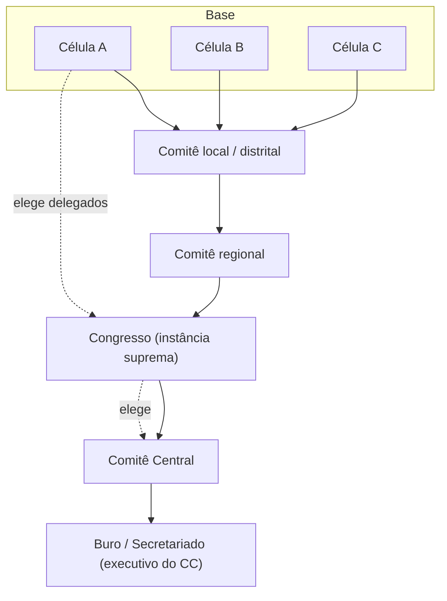

# 01 — Fundamentos leninistas da organização

| | |
|---|---|
| **Status** | rascunho |
| **Última atualização** | 2026-08-08 |
| **Depende de** | [00 — Visão](00-visao.md) |
| **Alimenta** | [02 — Modelo de domínio](02-modelo-de-dominio.md) |
| **Público** | todos ([conceitual]) |

> Este é o documento de fundamentação do projeto. Ele estuda **como as organizações leninistas se estruturavam** e produz uma **tabela de mapeamento** (Parte B) que traduz cada conceito histórico em um conceito do software. Toda entidade do [modelo de domínio](02-modelo-de-dominio.md) tem origem aqui.
>
> As citações remetem a fontes primárias amplamente disponíveis em tradução (o *Marxists Internet Archive* — marxists.org — mantém traduções em português e no original de quase tudo o que é citado). As datas seguem o calendário da época quando indicado.

---

## Parte A — Estudo histórico [conceitual]

A tradição que chamamos aqui de "leninista" é, antes de tudo, uma **teoria da organização**: a ideia de que a eficácia política de um coletivo não depende do número de simpatizantes, mas da **forma** como eles se organizam. É essa teoria da forma — não a conjuntura russa de 1900 — que interessa a um projeto de software. Estudamos abaixo os textos e as práticas que a constituíram.

### A.1 — O jornal como organizador coletivo

Em **"Por onde começar?"** (*Iskra* nº 4, maio de 1901), Lenin defende que um jornal de âmbito nacional não é apenas um meio de propaganda, mas o **instrumento que constrói a organização**:

> "O jornal não é apenas um propagandista coletivo e um agitador coletivo, é também um **organizador coletivo**."

O argumento, desenvolvido em **"Que fazer?"** (1902), é concreto e organizativo, não retórico. Para produzir e distribuir regularmente um jornal clandestino em escala nacional, é preciso montar uma **rede permanente de agentes**: correspondentes que enviam informes das fábricas e localidades, distribuidores que fazem o jornal circular, pontos de recepção, rotas de transporte. Essa rede — criada pela *necessidade prática* do jornal — **é** o esqueleto do partido. Lenin usa a imagem dos andaimes: o jornal é o andaime em torno do qual a organização se ergue.

Dois traços dessa concepção são decisivos para o nosso projeto:

1. **Fluxo bidirecional.** As informações **sobem** das células e localidades para a redação (o que está acontecendo na fábrica, no bairro, na greve); a linha, a análise e as orientações **descem** da redação para toda a rede. O jornal é o canal que faz a organização inteira pensar junto.
2. **O jornal como espinha dorsal, não como boletim.** A publicação central dá unidade política a grupos dispersos que, de outro modo, agiriam isoladamente.

### A.2 — Comitês, círculos e a divisão de funções

Na **"Carta a um camarada sobre as nossas tarefas de organização"** (escrita em 1902, publicada em 1903/1904), Lenin desce ao detalhe da estrutura local. O desenho é o seguinte: um **comitê** local dirige um conjunto de **círculos** (de fábrica, de distrito), e o trabalho é **especializado ao máximo** — grupos distintos para distribuição, para impressão, para transporte, para finanças. Cada grupo domina sua função e conhece apenas o necessário para executá-la.

Aparecem aqui dois princípios que reaparecerão no software:

- **Especialização de funções** dentro do organismo (a origem dos papéis de secretário, tesoureiro, agitador).
- **Compartimentação**: a estrutura é desenhada para que a queda de um círculo não derrube os demais — cada parte sabe só o que precisa.

### A.3 — Quem é membro? O debate do §1 (II Congresso, 1903)

No **II Congresso do POSDR** (Partido Operário Social-Democrata Russo, 1903), a disputa sobre o primeiro parágrafo dos estatutos — o que define *quem é membro do partido* — dividiu a organização:

- **Lenin**: é membro quem aceita o programa, sustenta o partido materialmente **e participa pessoalmente de uma de suas organizações**.
- **Martov**: bastaria aceitar o programa, sustentá-lo e prestar-lhe colaboração regular **sob a direção** de uma organização, sem necessariamente pertencer a uma.

Na votação do §1, **a fórmula de Martov venceu** (cerca de 28 votos a 22) — Lênin foi derrotado *neste* ponto. Os rótulos **bolchevique** (maioria, de *bolshinstvó*) e **menchevique** (minoria) surgiram **depois**, das votações sobre os **órgãos centrais** (redação da *Iskra* e CC), quando a saída dos delegados do *Bund* e dos "economistas" deslocou a maioria para o lado de Lênin — não do §1. (Vincular os nomes ao §1 é um atalho de manual que inverte, inclusive, quem ganhou a votação descrita.) Para o nosso projeto, o que importa é o conteúdo organizativo, que independe de quem venceu: **a distinção entre quem pertence a um organismo e quem apenas apoia** — a diferença que o software modela como **militante** vs. **simpatizante**.

### A.4 — Centralismo democrático

Reunificadas provisoriamente no **IV Congresso ("de Unificação", Estocolmo, 1906)**, as frações adotam nos estatutos o princípio do **centralismo democrático** (a expressão já circulava desde a Conferência de Tammerfors, dezembro de 1905). Seus componentes:

1. **Liberdade de discussão, unidade de ação.** Antes da decisão, discute-se amplamente; depois de decidido, todos executam — inclusive quem foi voto vencido.
2. **Eleição de baixo para cima.** Todos os órgãos dirigentes são eleitos pelas instâncias que dirigem.
3. **Prestação de contas periódica.** Os eleitos reportam-se regularmente a quem os elegeu e podem ser revogados.
4. **Decisões vinculantes de cima para baixo.** Uma vez tomadas segundo as regras, as decisões dos órgãos superiores obrigam os inferiores.
5. **Submissão da minoria à maioria** após a votação.

Este é o coração do que o projeto transforma em **arquitetura de fluxo de dados** (princípio P4): eleição e informes sobem; resolução vinculante desce; discussão precede o voto; mandato é temporário e revogável.

> **Ressalva histórica (importante).** O equilíbrio entre democracia e centralismo é **conjuntural**, não fixo. A fórmula "liberdade de crítica, unidade de ação" é de Lênin em **1906** (a lista de cinco pontos acima é uma codificação retrospectiva). Antes de 1905, na clandestinidade, o funcionamento era muito mais por **cooptação** que por eleição — em *Um passo adiante, dois passos atrás* (1904) Lênin defende explicitamente o "burocratismo" contra o "democratismo" e chama a democracia ampla sob repressão de "brinquedo inútil e nocivo"; a eleição de baixo para cima só se torna praticável com a (semi)legalidade de 1905. Ou seja: as organizações históricas **suspendiam** eleições sob repressão. O projeto implementa o polo **eletivo/democrático** como padrão (I3) — que corresponde às **condições legais**; um regime clandestino exigiria parâmetros distintos (ver [modelo de ameaças](06-modelo-de-ameacas.md) e a decisão em aberto sobre "regime legal/semilegal/clandestino").

### A.5 — As teses de organização da Comintern (III Congresso, 1921)

As **"Teses sobre a estrutura organizativa dos partidos comunistas, os métodos e o conteúdo de seu trabalho"** (III Congresso da Internacional Comunista, 1921) generalizam a experiência para os partidos de vários países. Três pontos são relevantes:

- **Obrigação geral de trabalho.** Todo membro deve ter uma **tarefa** concreta e participar de um organismo de base que se reúne com regularidade — não há membro "de carteirinha" inativo.
- **Relatórios regulares de baixo para cima.** A prestação de contas é rotina institucional, não excepcional.
- **Combinação de trabalho legal e clandestino**, com formas organizativas adequadas a cada um.

> **Ressalva.** O próprio Lênin, no **IV Congresso da Comintern (1922)**, criticou essas teses de 1921 como "russas demais", incompreensíveis e inaplicáveis fora da Rússia — fadadas, em suas palavras, a virar "letra morta". Universalizar a "obrigação geral de trabalho + relatórios" como invariante repete o erro que ele apontou; o projeto adota o mecanismo (M10) reconhecendo que é uma *escolha*, não uma verdade universal.

### A.6 — A bolchevização e a célula de fábrica (1924–1925)

Até meados dos anos 1920, a forma de base herdada da social-democracia era territorial (a seção do bairro). A **campanha de "bolchevização"** — deliberada no **V Congresso da Comintern (1924)** e detalhada na **Conferência de Organização / V Plenum Ampliado do Comitê Executivo (1925)** — muda a unidade de base para a **célula de empresa (de fábrica)**: o organismo se ancora onde as pessoas **trabalham e produzem**, não onde dormem.

A razão é organizativa: a célula de fábrica coloca a organização no ponto de maior poder social dos trabalhadores (o processo produtivo) e cria vínculos densos e cotidianos. As **células de rua/território** passam a ser a forma secundária, para quem não pode se organizar no trabalho.

**A célula torna-se, a partir daqui, a unidade de base por excelência** — é dela que o projeto extrai o princípio P1.

> **Ressalva.** A bolchevização de 1924–25 foi **inseparável** do processo de estalinização — subordinação dos partidos nacionais a Moscou e marginalização das oposições. O projeto extrai dela a **forma** organizativa (célula de base ancorada na produção), não o conteúdo político daquela conjuntura.

### A.7 — A pirâmide organizativa

Da célula ao topo, a estrutura é uma pirâmide de instâncias eleitas:

Leitura da pirâmide: as **células** elegem delegados aos **comitês locais**; estes aos **regionais**; o **congresso** — instância suprema, reunida periodicamente — é composto por delegados eleitos na base e **elege o comitê central**, que dirige entre congressos e mantém um **buro/secretariado** executivo. O poder **emana da base pela eleição** e **desce em decisões** entre um congresso e outro.

### A.8 — O buro de célula: funções

Uma célula não é um amontoado; tem um **buro** (direção) com funções especializadas — a divisão de trabalho de A.2 na menor escala:

- **Secretário** — coordena, convoca reuniões, mantém o vínculo com a instância superior.
- **Tesoureiro** — coleta a **cotização** (a cota de contribuição de cada membro) e presta contas.
- **Responsável de agitação e propaganda (agitprop)** — distribui o jornal, produz o boletim local, organiza a correspondência da célula com a redação.

### A.9 — Frações em organizações de massa

Onde os militantes atuam dentro de organizações mais amplas — sindicatos, cooperativas, associações, parlamentos —, agrupam-se em **frações**: núcleos que coordenam sua ação naquela organização externa **sob a disciplina** da sua própria organização. A fração é a forma de atuar num organismo que não é seu sem se dissolver nele.

### A.10 — A frente única

Diante da necessidade de agir com outras organizações sem se fundir a elas, a Comintern formula a tática da **frente única** — nas **Teses do CEIC (dezembro de 1921)** e no **IV Congresso (1922)**; o III Congresso (julho de 1921) deu a virada "às massas", mas não formulou a tática. A máxima associada — **"marchar separados, golpear juntos"** — é, na origem, um princípio **militar prussiano** (Moltke, *getrennt marschieren, vereint schlagen*) adotado no movimento, não uma cunhagem da Comintern. A ideia: organizações **independentes** firmam um **acordo entre suas direções** para uma ação comum, preservando cada uma sua estrutura, seu jornal e sua autonomia. É o modelo que o projeto adota para a **federação** entre servidores (doc 04).

> **Ressalva.** A frente única histórica não era só cooperação neutra: tinha uma dimensão **competitiva** (a frente "por baixo" visava disputar a base das outras direções). O mapeamento M12 usa apenas a face cooperativa; a face de disputa fica fora do escopo do software.

### A.11 — Konspiratsiya: a compartimentação clandestina

Operando sob repressão, o movimento desenvolveu uma disciplina de segurança — *konspiratsiya* — cujos elementos são notavelmente atuais:

- **Pseudônimos** (os *klichki*): a identidade real do militante é desnecessária para a atividade e perigosa se conhecida. Historicamente favoreciam-se identidades **múltiplas e rotativas**, não-correlacionáveis entre si. (Nota: "Lênin" e "Stálin" eram *noms de plume* estáveis, mais próximos de uma assinatura pública do que dos *klichki* clandestinos descartáveis.)
- **Need-to-know**: cada um sabe apenas o indispensável à sua tarefa — o corte de informação acontecia **dentro** da unidade, por função e por item.
- **Separação de aparelhos**: o aparato clandestino é isolado do trabalho legal.

A criptografia moderna permite implementar **parte** disso de forma mais forte que a disciplina pessoal — mas é preciso honestidade sobre o que o desenho atual **não** entrega (o [modelo de ameaças](06-modelo-de-ameacas.md) é a referência; este documento não deve prometer mais que ele):

> **Alinhamento com o doc 06 (evitar superpromessa).** (1) **Need-to-know:** o mecanismo de grupo dá compartimentação **entre** organismos (um organismo não lê o outro), mas **dentro** de um organismo todos os membros leem tudo — o oposto do corte intra-unidade histórico. Um infiltrado lê tudo o que sua célula vê ([doc 06 A2](06-modelo-de-ameacas.md)). (2) **Grafo de filiação:** o servidor conhece em claro quem é membro de quê (e o papel de cada um) — exatamente a "lista de filiação" que o [doc 00 §1](00-visao.md) chama de primeiro alvo da repressão ([doc 06 A3](06-modelo-de-ameacas.md)). A adoção de **credenciais de membro anônimas** ([ADR-0008](decisoes/adr-0008-mls-e-credenciais-anonimas.md)) é a correção em curso. (3) **Identidade:** o modelo dá a cada usuário **um** par de chaves estável — um identificador de correlação, ao contrário das identidades rotativas históricas. A não-vinculabilidade multi-persona não é entregue hoje (ver [doc 06](06-modelo-de-ameacas.md)).

### A.12 — A cotização como base material

Um último elemento, frequentemente esquecido: a **cotização** — a contribuição financeira regular dos membros, coletada pelo tesoureiro da célula. Ela não é detalhe administrativo; é a **base material da independência** da organização. Uma organização sustentada por seus membros não depende de financiadores externos. O projeto trata disso no doc 05.

---

## Parte B — Tabela de mapeamento (histórico → software)

Esta tabela é o artefato central do documento: cada conceito histórico da Parte A recebe um identificador **M#** e é traduzido em um conceito do software, que será especificado no [modelo de domínio](02-modelo-de-dominio.md). As referências "P#" apontam para os princípios do [doc 00](00-visao.md).

| # | Conceito histórico (Parte A) | Função original | Conceito no software | Princípio |
|---|---|---|---|---|
| **M1** | Célula de fábrica/território (A.6) | Unidade de base; vínculo com o local; delibera e elege | Entidade **Célula** — organismo-base (3–15 membros), tipável (trabalho/território/setor); delibera, elege delegados, coleta cotização | P1 |
| **M2** | Jornal / *Iskra* (A.1) | Propagandista, agitador e **organizador** coletivo | Módulo **Jornal**: publicações assinadas pelo órgão editor (descem) + **Correspondência** das células para a redação (sobe) | P5 |
| **M3** | Pseudônimo de partido / *klichka* (A.11) | Proteção da identidade real | **Identidade = par de chaves + pseudônimo**; o servidor não conhece PII | P2, P3 |
| **M4** | Centralismo democrático (A.4) | Método decisório | Ciclo de **Deliberação** (discussão → voto → resolução vinculante) + **Mandato** eleito, temporário e revogável; propagação descendente de resoluções | P4 |
| **M5** | Comitê e círculos; need-to-know (A.2, A.11) | Especialização + compartimentação | Árvore de **Organismos** + **criptografia de grupo por organismo** (cada organismo é um compartimento criptográfico: só seus membros leem seu conteúdo) | P1, P2 |
| **M6** | Militante vs. apoiador — §1 de 1903 (A.3) | Definir pertencimento | Distinção **Militante** (pertence a célula) vs. **Simpatizante** (acompanha o jornal público) | P1 |
| **M7** | Pirâmide célula→comitê→congresso→CC (A.7) | Estrutura de instâncias | Subtipos de **Organismo**: Célula, Comitê (local/regional), Congresso, Comitê Central/Direção, organizados em **árvore** com raiz na Organização | P1, P4 |
| **M8** | Buro de célula (A.8) | Divisão de funções na base | **Papéis** dentro do organismo: secretário, tesoureiro, agitprop | P1 |
| **M9** | Eleição de delegados; prestação de contas (A.4, A.5) | Poder emana da base; revogabilidade | **Mandato/Delegação**: nasce de eleição registrada, tem prazo, é revogável (recall), com relatórios de prestação de contas | P4 |
| **M10** | Obrigação geral de trabalho e relatórios (A.5) | Todo membro tem tarefa; informe é rotina | Fluxo de **Correspondência/informe** de baixo para cima + tarefas atribuíveis no organismo | P4, P5 |
| **M11** | Frações em organizações de massa (A.9) | Atuar sob disciplina em organismo externo | Subtipo de organismo **Fração** (transversal, vinculado à disciplina da organização-mãe) | P1 |
| **M12** | Frente única — "marchar separados, golpear juntos" (A.10) | Ação comum preservando independência | **Federação** por acordo bilateral explícito entre organizações; organismos conjuntos (**Frente**) | P6 |
| **M13** | Congresso como instância suprema (A.7) | Deliberação máxima periódica | Subtipo de organismo **Congresso**: temporário, com credenciamento de delegados, prazo e pauta | P4 |
| **M14** | Cotização (A.12) | Base material da independência | Módulo de **Finanças**: contribuição do membro coletada pelo tesoureiro; prestação de contas agregada por organismo | P4 |
| **M15** | *Konspiratsiya* / trabalho legal + clandestino (A.5, A.11) | Disciplina de segurança | **Criptografia de ponta a ponta obrigatória** + minimização de metadados + opsec incentivada no onboarding | P2, P7, P8 |

---

## Parte C — Limites e escolhas do mapeamento [conceitual]

Traduzir uma tradição organizativa histórica em software exige **escolhas**, e algumas rompem deliberadamente com a prática histórica. Registrá-las é uma questão de honestidade de projeto e de neutralidade.

1. **Frações internas e tendências não são proibidas.** A proibição de frações internas aprovada no **X Congresso do PCR(b) (1921, "Sobre a unidade do partido")** foi uma medida de exceção de seu contexto. O software **não** a incorpora: na fase de *discussão* de uma deliberação (P4), ele pretende suportar o agrupamento de posições, plataformas e tendências. O centralismo que o sistema implementa é o da **unidade de ação após a decisão** — não o do silenciamento antes dela. (Ressalva: esta é uma **intenção de projeto** — o [modelo de domínio](02-modelo-de-dominio.md) ainda **não** tem entidade de Tendência/Plataforma; ou ela é acrescentada, ou esta promessa é suavizada. Decisão em aberto.)

2. **Disciplina é decisão registrada, não botão nem "processo puramente social".** *(Atualizado após a [revisão crítica](revisao-critica.md), [ADR-0009](decisoes/adr-0009-disciplina-como-deliberacao.md).)* O software não *julga*, mas a força vinculante das resoluções e as sanções (censura, afastamento, `desligado`) são **consequência de uma deliberação com quórum** (nova invariante I11) — não uma mutação de estado que qualquer papel aciona sozinho. Isso fecha o "superusuário oculto" (a exclusão criptográfica unipessoal) e dá ao centralismo o polo disciplinar que a versão anterior deixava vazio. As decisões continuam humanas e registradas; o software as executa.

3. **"Centralismo" é fluxo de dados, não hierarquia de pessoas.** O sistema não confere poder a nenhum usuário por atributo pessoal. Todo poder é **mandato**: derivado de uma eleição registrada, limitado no tempo e revogável (M9). Não há "administrador" onipotente — há papéis com escopo, definidos pelo estatuto da organização.

4. **A unidade de base é configurável.** A "célula de fábrica" (A.6) é o paradigma, mas o software não impõe o vínculo com o trabalho: uma célula pode ser de local de trabalho, de território ou de setor de atividade. O que é invariante é a **função** da célula (base que delibera e elege), não seu recorte sociológico.

5. **O que este mapeamento deixa de fora (a casca vs. a alma).** Um recorte honesto: o desenho é fiel ao leninismo-**como-organograma** e incompleto quanto ao leninismo-**como-teoria da consciência e da disciplina**. Ficam de fora, hoje, conceitos organizativos centrais das próprias fontes citadas:
   - o **quadro profissional** (o núcleo estável de revolucionários dedicados de *Que Fazer?*) e o **membro candidato/probatório** — o modelo só tem o par simpatizante/militante;
   - o **vetting/apadrinhamento na admissão** (você entrava se alguém confiável respondia por você) — o controle humano que era o verdadeiro núcleo da *konspiratsiya*; hoje a entrada é só um convite assinado (o que recai nas ameaças A6/A2 do [doc 06](06-modelo-de-ameacas.md));
   - o **jornal como arma e escola de quadros** — o mapeamento M2 conserva o *organizador coletivo* e descarta o *propagandista/agitador* e a função formadora (ver ressalva em M2);
   - a **relação com as massas** (a ação sobre a classe, a "linha de massas") — o software modela o circuito interno, não o trabalho para fora.
   Estas ausências estão registradas como escopo de fases futuras (ver [revisao-critica.md](revisao-critica.md) §8); reconhecê-las é parte da honestidade do documento.

6. **Não neutralidade e uso dual.** *(Atualizado.)* Este estudo é **funcional-organizativo** — não um juízo sobre a história do movimento comunista. Mas seria falso chamar o resultado de "ferramenta neutra": o software **grava um modelo de governança específico** como invariantes não-opcionais (célula-base única I1, árvore I2, poder só por eleição I3, disciplina por deliberação I11). Ele escolhe valores. E a mesma infraestrutura — pseudônima, servidor-cego, compartimentada, de entrada por convite, com filiação difícil de enumerar — é substrato **ótimo para qualquer organização clandestina de comando**, inclusive as que os autores abominariam. O [modelo de ameaças](06-modelo-de-ameacas.md) trata adversários *contra* a organização; a possibilidade de a ferramenta servir a uma organização *maligna* é um limite ético declarado, não resolvido por "liberdade de associação".

---

## Referências

- V. I. Lênin, *Por onde começar?* (1901) e *Que fazer?* (1902).
- V. I. Lênin, *Carta a um camarada sobre as nossas tarefas de organização* (1902).
- Atas e resoluções do **II Congresso do POSDR** (1903) — debate do §1 dos estatutos.
- Estatutos do **IV Congresso ("de Unificação")** do POSDR (1906); Conferência de Tammerfors (1905).
- Internacional Comunista, *Teses sobre a estrutura organizativa dos partidos comunistas* — **III Congresso** (1921).
- **V Congresso da Comintern** (1924) e V Plenum Ampliado do CEIC / Conferência de Organização (1925) — bolchevização e célula de empresa.
- Comintern, resoluções sobre a **frente única** — III (1921) e IV (1922) Congressos.
- PCR(b), resolução *Sobre a unidade do partido* — **X Congresso** (1921) [citada na Parte C].

Traduções de referência disponíveis no *Marxists Internet Archive* (marxists.org).
