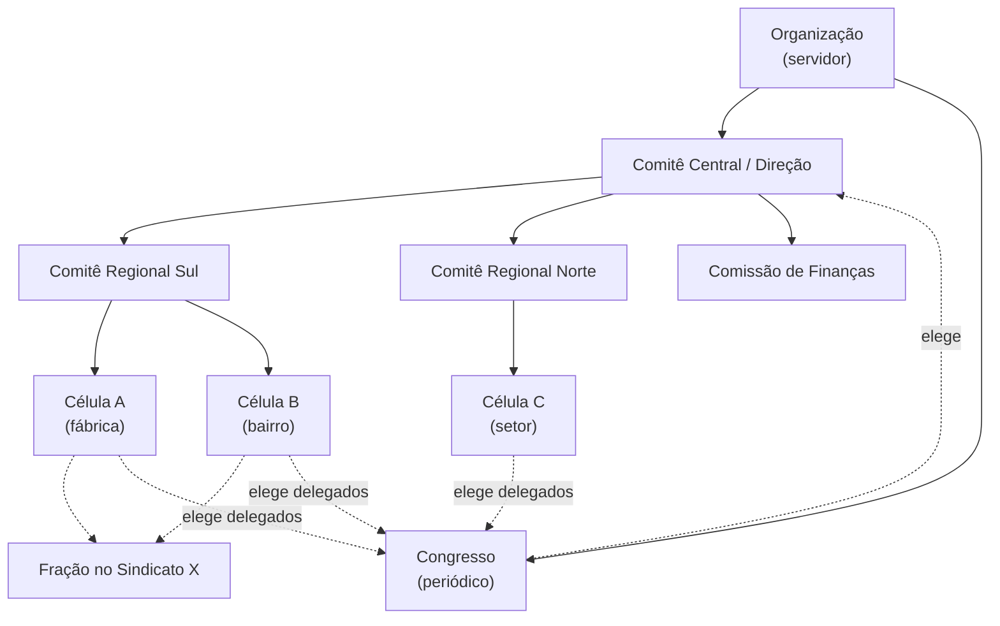
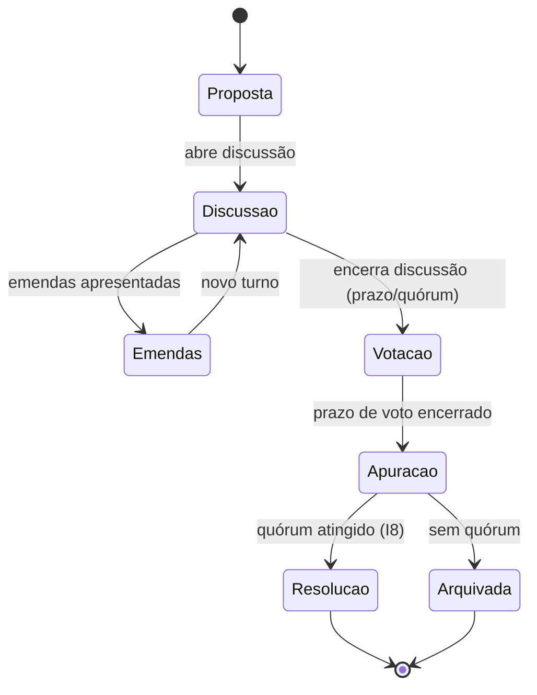
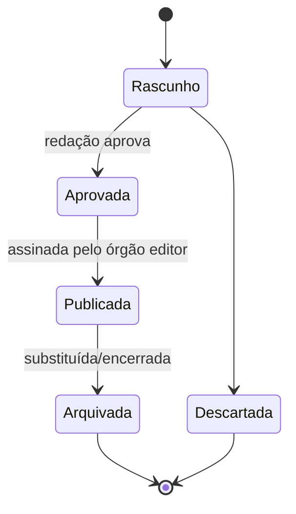
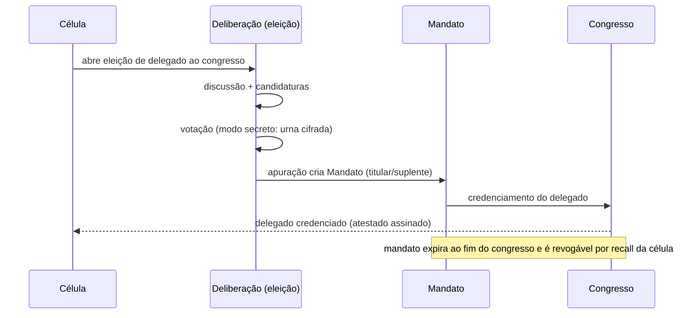
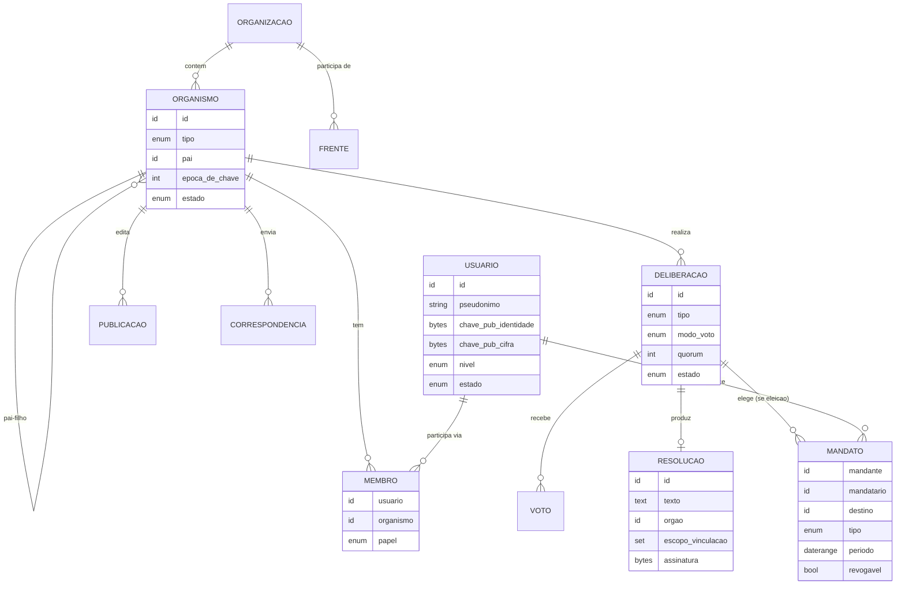

# 02 — Modelo de domínio

| | |
|---|---|
| **Status** | rascunho |
| **Última atualização** | 2026-08-08 |
| **Depende de** | [00 — Visão](00-visao.md), [01 — Fundamentos](01-fundamentos-leninistas.md) |
| **Alimenta** | [03](03-arquitetura-criptografica.md), [04](04-federacao.md), [05](05-financiamento.md), [06](06-modelo-de-ameacas.md) |
| **Público** | todos ([conceitual]) + engenheiros ([técnico]) |

> Este documento define **as entidades do sistema, suas relações e as regras (invariantes) que nunca podem ser violadas**. Cada entidade tem origem na tabela de mapeamento M1–M15 do [doc 01](01-fundamentos-leninistas.md), indicada entre colchetes. Os documentos técnicos seguintes só usam entidades definidas aqui.

## 1. Visão geral [conceitual]

O sistema modela **uma organização como uma árvore de organismos**. Na base estão as células (grupos de militantes); acima, comitês eleitos; no topo, o congresso e a direção. Pessoas são **militantes** (pertencem a uma célula) ou **simpatizantes** (só acompanham o jornal público). Organismos tomam decisões (**deliberações**) que produzem **resoluções**; elegem **mandatos** (delegados); e se comunicam pelo **jornal**. Tudo isso vive dentro de uma **organização**, que é um servidor.

Linha cheia = relação estrutural (pai/filho na árvore). Linha tracejada = relações de eleição e de participação transversal (a fração reúne militantes de várias células).

## 2. Entidades [técnico]

Cada entidade é descrita por **descrição**, **atributos**, **relações** e **regras**. Atributos criptográficos (chaves, assinaturas) são apenas nomeados aqui; sua mecânica está no [doc 03](03-arquitetura-criptografica.md).

### 2.1 Usuário / Militante [M1, M3, M6]

**Descrição.** Uma pessoa participante, representada exclusivamente por chaves e um pseudônimo. **Não existe, em nenhum lugar do modelo, campo para nome real, e-mail, telefone ou qualquer PII** — a ausência é estrutural (P2), não uma configuração.

**Atributos.**

| Atributo | Descrição |
|---|---|
| `id` | Identificador auto-certificante derivado da chave pública de identidade (ver doc 03). |
| `pseudonimo` | Nome fictício escolhido pelo usuário; único dentro do servidor; mutável. |
| `chave_pub_identidade` | Chave pública de assinatura (Ed25519). Prova quem ele é. |
| `chave_pub_cifra` | Chave pública de cifração (X25519), certificada pela de identidade. Recebe conteúdo cifrado. |
| `nivel` | `simpatizante` ou `militante`. |
| `estado` | `ativo`, `afastado`, `desligado`. |

**Relações.** Um militante é membro de exatamente uma **célula-base** (I1) e pode participar adicionalmente de comissões e frações; pode deter mandatos; é membro de organismos que lhe dão acesso às respectivas chaves de época.

**Regras.** O servidor guarda apenas `pseudonimo`, chaves públicas, `nivel` e `estado`, além dos vínculos de participação. Autenticação é sempre por assinatura (doc 03). Simpatizante acessa apenas publicações de escopo público.

### 2.2 Organismo (abstrato) [M5, M7]

**Descrição.** Qualquer instância organizada. É a abstração central do modelo: célula, comitê, comissão, fração, congresso e direção são todos **subtipos** de organismo e compartilham a mesma espinha (árvore, membros com papéis, chave de época, deliberações).

**Atributos comuns.**

| Atributo | Descrição |
|---|---|
| `id` | Identificador do organismo. |
| `tipo` | `celula`, `comite`, `comissao`, `fracao`, `congresso`, `direcao`. |
| `nome` | Rótulo interno (não é PII de pessoa). |
| `pai` | Organismo superior na árvore (nulo apenas para a raiz lógica, a Organização). |
| `membros` | Conjunto de `(usuario, papel)`. |
| `epoca_de_chave` | Inteiro; versão corrente da chave simétrica do organismo (doc 03). |
| `estado` | `ativo`, `suspenso`, `dissolvido`. |
| `estatuto_local` | Parâmetros herdados/sobrepostos do estatuto da organização (quórum, regra de maioria). |

**Papéis** (`papel` em `membros`): `secretario`, `tesoureiro`, `agitprop`, `membro`, e para organismos dirigentes `titular`/`suplente` (o mandato — 2.7). Papéis são atribuídos por deliberação, não por privilégio de sistema (Parte C.3 do doc 01).

#### Subtipos de organismo

- **Célula [M1]** — organismo-base. Referência de tamanho: 3–15 membros. Único subtipo ao qual um militante pertence obrigatória e unicamente (I1). Delibera, elege delegados, coleta cotização, mantém correspondência com a redação. Tem `subtipo_celula`: `trabalho`, `territorio`, `setor` (Parte C.4 do doc 01).
- **Comitê [M7]** — organismo dirigente de um escopo (local, regional). Seus membros são **mandatos** eleitos pelas instâncias inferiores.
- **Comissão** — organismo funcional permanente (finanças, ética, agitprop/redação). Membros designados por deliberação do organismo que a cria.
- **Fração [M11]** — organismo transversal que reúne militantes de várias células que atuam numa organização externa. Não é célula-base de ninguém (I1 preservada).
- **Congresso [M13]** — organismo deliberativo **temporário** e supremo. Tem `pauta`, `periodo` (abertura/encerramento) e um processo de **credenciamento** de delegados. Ao encerrar, passa a `dissolvido` mas suas resoluções persistem.
- **Direção / Comitê Central [M7]** — executivo eleito pelo congresso; dirige entre congressos. Mantém sub-organismos executivos (buro/secretariado) como comissões.

### 2.3 Organização / Servidor [M7]

**Descrição.** A entidade política que roda um servidor; **raiz** da árvore de organismos. Uma organização = um servidor (P6).

**Atributos.**

| Atributo | Descrição |
|---|---|
| `id` | Identificador da organização. |
| `nome` | Nome público da organização. |
| `chave_pub_organizacao` | Chave pública da organização; sua identidade na federação (doc 04). |
| `estatuto` | Parâmetros globais (ver abaixo). |

**Estatuto (parâmetros).** Quórum por tipo de deliberação; regra de maioria (simples/qualificada) por tipo; duração e teto de mandatos; proporção de delegados por número de membros; política de convites (quem pode emitir código de convite); tamanho mínimo/máximo de célula.

**Regras.** A organização não é um "superusuário": ela é o contexto e o conjunto de parâmetros. Nenhuma pessoa detém poder pelo simples fato de operar o servidor — poder é sempre mandato (I6).

### 2.4 Jornal, Publicação e Correspondência [M2, M10]

**Descrição.** O aparato de comunicação. O **Jornal** é o órgão editorial (central da organização, ou boletim de um organismo). Uma **Publicação** é uma edição/matéria; uma **Correspondência** é um informe que sobe da base para a redação.

**Publicação — atributos.**

| Atributo | Descrição |
|---|---|
| `id`, `titulo`, `corpo` | Conteúdo (cifrado, exceto escopo público — ver regra abaixo). |
| `orgao_editor` | Organismo (redação/comissão de agitprop) que assina a publicação. |
| `estado_editorial` | `rascunho` → `aprovada` → `publicada` → `arquivada`. |
| `escopo_circulacao` | `publico`, `interno_organizacao`, `interno_organismo`. |
| `assinatura` | Assinatura do órgão editor (doc 03). |

**Correspondência — atributos.** `remetente_organismo`, `destino` (redação ou instância superior), `corpo` (cifrado), `assinatura`. Modela o fluxo ascendente do centralismo democrático (M10).

**Regras.** Publicação de escopo `publico` é a **única exceção formal** à regra "tudo cifrado" (I7): ela é assinada mas legível, para alcançar simpatizantes e o exterior (ver ADR-0003). Escopos internos são cifrados para o organismo destinatário.

### 2.5 Deliberação [M4]

**Descrição.** O processo decisório de um organismo — a transformação do centralismo democrático em máquina de estados.

**Atributos.** `organismo`, `tipo` (`consultiva`, `deliberativa`, `eleicao`), `proposta`, `emendas`, `quorum`, `regra_maioria`, `modo_voto` (`aberto` ou `secreto`), `prazos` (por fase), `estado` (ver ciclo de vida na §4).

**Regras.** Toda deliberação passa obrigatoriamente por uma fase de **discussão** antes da **votação** (P4). O `modo_voto` determina a mecânica criptográfica (doc 03 §8): `aberto` usa commit-reveal (voto nominal simultâneo); `secreto` usa assinatura cega + urna. Uma eleição (`tipo = eleicao`) produz **mandatos** (2.7); uma deliberativa produz **resolução** (2.6).

### 2.6 Voto e Resolução [M4]

**Voto.** `deliberacao`, `eleitor` (ou credencial anônima, no voto secreto), `conteudo` (cifrado/às cegas conforme o modo), `assinatura`. Regra: **um voto por membro por deliberação** (I5), garantido por elegibilidade e unicidade (doc 03 §8).

**Resolução.** Decisão registrada de uma deliberação bem-sucedida: `deliberacao`, `texto`, `orgao` (que a emite), `escopo_vinculacao` (quais organismos obriga), `assinatura_do_organismo`, `timestamp`. A resolução é uma **ata assinada** e imutável; propaga-se para os feeds dos organismos subordinados dentro do `escopo_vinculacao` — é o "de cima para baixo" do centralismo (P4).

### 2.7 Mandato / Delegação [M9]

**Descrição.** Poder conferido por eleição — a única fonte de poder no sistema (I6).

**Atributos.**

| Atributo | Descrição |
|---|---|
| `mandante` | Organismo que elegeu (a base do poder). |
| `mandatario` | Usuário que recebe o mandato. |
| `destino` | Organismo onde o mandato é exercido (ex.: o congresso, o comitê). |
| `tipo` | `titular`, `suplente`, `observador`. |
| `periodo` | Início e fim (o mandato **expira**). |
| `revogavel` | Verdadeiro por padrão; recall por deliberação do mandante. |
| `relatorios` | Correspondências de prestação de contas vinculadas ao mandato. |

**Regras.** Um mandato só nasce de uma deliberação `eleicao` registrada (I3). Expira automaticamente ao fim do `periodo`. Pode ser revogado antes por nova deliberação do `mandante` (recall). Sem eleição válida, não há como um usuário figurar como `titular`/`suplente` em organismo dirigente.

### 2.8 Frente [M12]

**Descrição.** Acordo entre organizações (portanto, entre servidores) para ação comum. Detalhada no [doc 04](04-federacao.md); no modelo local, é referenciada por organismos conjuntos (um comitê da frente, um jornal da frente) cujos membros incluem delegados credenciados de outra organização.

**Atributos (visão local).** `acordo` (documento assinado pelas chaves das duas organizações), `escopo`, `validade`, `organismos_conjuntos`, `delegados_credenciados_externos`.

## 3. Invariantes

Regras que **nenhuma operação** pode violar. Numeradas e citáveis (I#).

- **I1 — Célula-base única.** Todo militante pertence a exatamente uma célula-base. Participações adicionais só em comissões e frações (nunca em segunda célula-base).
- **I2 — Árvore de organismos.** Os organismos formam uma árvore com raiz na organização; não há ciclos; todo organismo (exceto a raiz) tem exatamente um `pai`.
- **I3 — Poder só por eleição.** Um mandato (`titular`/`suplente` em organismo dirigente) só existe se derivar de uma deliberação `eleicao` registrada e válida.
- **I4 — Mandato é temporário e revogável.** Todo mandato tem `periodo` finito e pode ser revogado por deliberação do `mandante`.
- **I5 — Um voto por membro por deliberação.** Garantido por elegibilidade + unicidade (doc 03 §8), inclusive no voto secreto.
- **I6 — Sem superusuário.** Nenhum poder decorre de operar o servidor ou de qualquer atributo pessoal; todo poder é mandato (I3). O operador do servidor é adversário no modelo de ameaças (doc 06, A5).
- **I7 — Nada em claro no servidor, salvo publicação pública.** Todo conteúdo é envelope cifrado (doc 03); a única exceção é a `Publicacao` de `escopo = publico`, que é assinada e legível por desenho (ADR-0003).
- **I8 — Quórum para vincular.** Uma resolução só é vinculante se a deliberação que a produziu atingiu o `quorum` e a `regra_maioria` do estatuto.
- **I9 — Época de chave acompanha a composição.** Toda entrada ou saída de membro em um organismo incrementa sua `epoca_de_chave` e dispara redistribuição da chave de grupo (doc 03 §7).
- **I10 — Resolução é imutável.** Publicada, uma resolução não se altera; correções são novas resoluções que referenciam a anterior (preserva o registro auditável — P5).

## 4. Ciclos de vida [técnico]

### 4.1 Deliberação

### 4.2 Publicação

### 4.3 Eleição de delegado (célula → congresso)

## 5. Diagrama de entidades [técnico]

## 6. Cenário narrativo: um congresso em seis passos [conceitual]

Para amarrar as entidades ao vocabulário do [doc 01](01-fundamentos-leninistas.md), segue o percurso de uma decisão real.

1. **Convocação.** A **direção** (2.2) publica no **jornal** (2.4) a convocação do **congresso** (2.2/M13), com pauta e prazo — uma `Publicacao` de escopo interno à organização.
2. **Eleição na base.** Cada **célula** (2.1/M1) abre uma **deliberação** do tipo `eleicao` (2.5) para escolher seu **delegado**. A discussão acontece; a votação usa **voto secreto** (urna cifrada — doc 03 §8). A apuração cria um **mandato** (2.7/M9).
3. **Credenciamento.** Os delegados eleitos são **credenciados** no congresso (fig. 4.3): cada mandato gera um atestado assinado que prova "este pseudônimo é delegado eleito da célula X", sem expor os demais membros da célula.
4. **Deliberação no congresso.** O congresso abre **deliberações** sobre a pauta. Militantes agrupam posições e plataformas na fase de discussão (Parte C.1 do doc 01); segue a votação.
5. **Resolução.** Cada deliberação bem-sucedida (com **quórum** — I8) produz uma **resolução** (2.6): ata assinada pelo organismo, imutável (I10).
6. **Vinculação descendente.** As resoluções propagam-se, dentro de seu `escopo_vinculacao`, para os feeds de todos os organismos subordinados. A base agora executa a decisão que ajudou a formar — o ciclo do centralismo democrático (P4) se fecha.

## 7. Decisões em aberto

- Granularidade de **tarefas** atribuíveis dentro de um organismo (M10) — modelar como entidade própria ou como atributo de correspondência? (Adiado para a fase de implementação.)
- Regras de **quórum em congresso** com delegados titulares/suplentes ausentes — política de substituição.
- Se **frações** podem, elas próprias, deliberar de forma vinculante ou apenas coordenar. (Provável: apenas coordenar; confirmar com organizações reais na revisão.)

## Referências

- [doc 01 — Fundamentos leninistas](01-fundamentos-leninistas.md), tabela M1–M15.
- [doc 03 — Arquitetura criptográfica](03-arquitetura-criptografica.md) para a mecânica de chaves, envelopes e voto.
