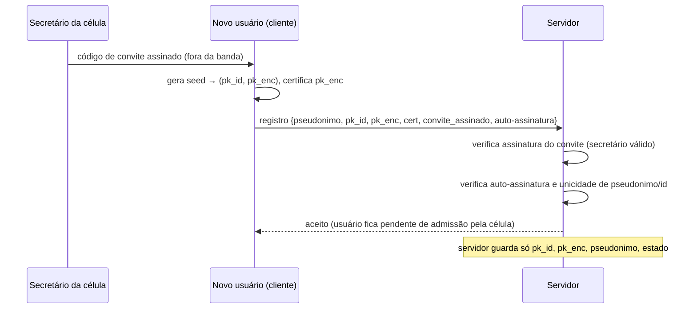
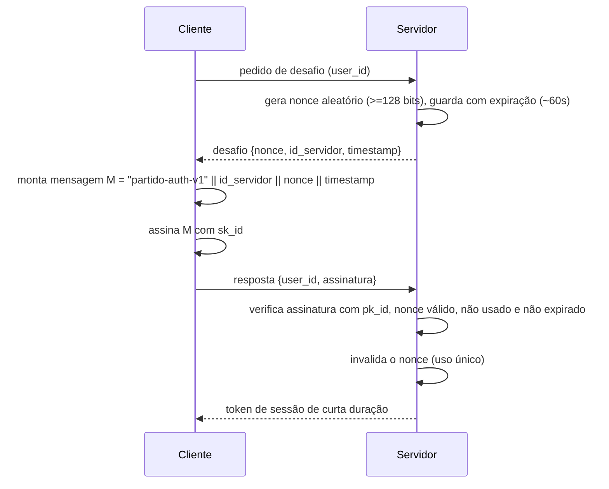
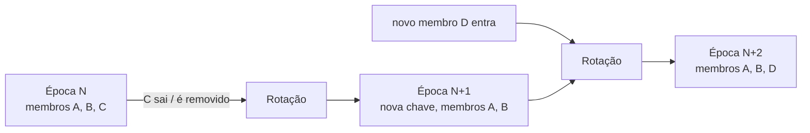
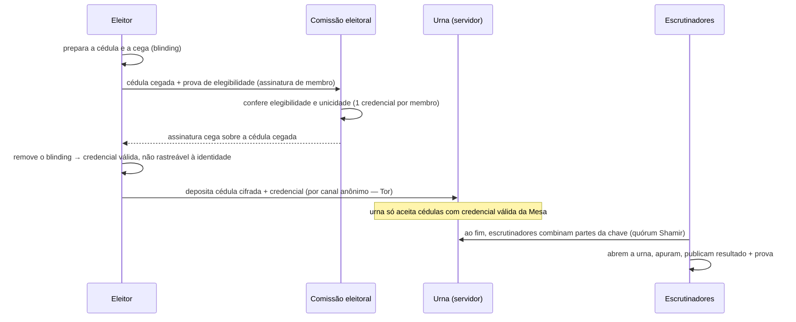

# 03 — Arquitetura criptográfica

| | |
|---|---|
| **Status** | rascunho |
| **Última atualização** | 2026-08-08 |
| **Depende de** | [00 — Visão](00-visao.md), [02 — Modelo de domínio](02-modelo-de-dominio.md) |
| **Decisões** | [ADR-0001](decisoes/adr-0001-identidade-por-par-de-chaves.md), [ADR-0002](decisoes/adr-0002-autenticacao-assinatura-de-nonce.md), [ADR-0003](decisoes/adr-0003-servidor-rejeita-nao-envelope.md), [ADR-0004](decisoes/adr-0004-cripto-de-grupo-por-epoca.md), [ADR-0006](decisoes/adr-0006-voto-secreto-assinatura-cega.md) |
| **Público** | engenheiros ([técnico]) com seções [conceitual] |

> Este é o documento técnico central. Ele especifica identidade, autenticação, o formato de envelope cifrado, a criptografia de grupo por organismo, o voto secreto e o que fica exposto como metadado. **Princípio inegociável (P7): só primitivas padrão, com referência (RFC/libsodium); nenhuma construção criptográfica caseira.** Onde o desenho tem limites, eles são declarados — a honestidade sobre o que **não** é protegido é requisito de qualidade, não fraqueza (ver também [doc 06](06-modelo-de-ameacas.md)).

## 1. Princípios criptográficos [conceitual]

1. **Servidor cego (P2).** O cliente cifra tudo antes de enviar. O servidor armazena e roteia; não possui chaves para ler conteúdo.
2. **Cliente é a raiz de confiança.** A garantia de que "só o destinatário lê" vem do software cliente — que é **livre e auditável** — e das chaves do usuário, não de promessas do servidor.
3. **Primitivas padrão (P7).** Tudo abaixo referencia uma RFC e/ou uma implementação em libsodium.
4. **MVP vs. futuro, explícito.** Cada mecanismo declara o que entra na primeira versão (MVP) e o que é evolução planejada. Empurrar o difícil para "futuro" com honestidade é melhor do que inventar solução frágil agora.

## 2. Tabela de primitivas [técnico]

Esta tabela é a **norma** do documento: todo mecanismo abaixo cita uma linha dela. Introduzir qualquer primitiva fora desta tabela exige um ADR.

| Uso | Primitiva | Referência |
|---|---|---|
| Assinatura de identidade | **Ed25519** | RFC 8032; libsodium `crypto_sign` |
| Cifra assimétrica (para um destinatário) | **X25519 + sealed box** | RFC 7748; libsodium `crypto_box_seal` |
| Cifra simétrica autenticada (AEAD) | **XChaCha20-Poly1305** | libsodium `crypto_aead_xchacha20poly1305_ietf` (nonce de 192 bits ⇒ nonce aleatório é seguro) |
| Hash / resumo | **BLAKE2b** | RFC 7693; libsodium `crypto_generichash` |
| Derivação de chave a partir de senha | **Argon2id** | RFC 9106; libsodium `crypto_pwhash` |
| Derivação de chave (a partir de chave) | **HKDF-SHA-512** | RFC 5869 |
| Assinatura cega (voto secreto) | **RSA blind signatures (RSABSSA)** | RFC 9474 |
| Divisão de segredo (chave da urna) | **Shamir Secret Sharing** | libsodium não provê; usar implementação padrão auditada |
| Grupo E2E dinâmico (evolução futura) | **MLS** | RFC 9420 |
| Serialização canônica | **CBOR determinístico** | RFC 8949 §4.2 |
| Biblioteca de referência | **libsodium** | — |

Parâmetros de referência (ajustáveis por estatuto/deploy):

- **Argon2id**: `opslimit`/`memlimit` na faixa "interativa a moderada" de libsodium (baseline sugerido: memória ≥ 64 MiB, iterações ≥ 3, paralelismo 1), seguindo as recomendações correntes do OWASP.
- **Nonces XChaCha20-Poly1305**: 24 bytes aleatórios por mensagem.
- **Tag Poly1305**: 16 bytes.

## 3. Identidade e chaves [técnico]

Ver [ADR-0001](decisoes/adr-0001-identidade-por-par-de-chaves.md).

### 3.1 Geração

A identidade nasce de uma **seed** aleatória (256 bits) gerada **no cliente**. Dela derivam-se, por HKDF com rótulos de domínio distintos:

- o par **Ed25519 de identidade** (`sk_id`, `pk_id`) — assina tudo; **é** a identidade;
- o par **X25519 de cifra** (`sk_enc`, `pk_enc`) — recebe conteúdo cifrado.

**Separação de chaves.** Assinatura e cifra usam pares distintos (princípio criptográfico consolidado: uma chave, um propósito). A `pk_enc` é **certificada** por uma assinatura de `sk_id` sobre `pk_enc || validade`, de modo que a chave de cifra pode ser **rotacionada** sem trocar a identidade.

O identificador do usuário é auto-certificante:

```
user_id = multibase(BLAKE2b-256(pk_id))
```

Assim, o `id` prova, por si, a qual chave pública corresponde — o servidor não pode "trocar" a identidade de um `id` sem que os clientes percebam. O `pseudonimo` é um rótulo mutável à parte (o `id` é a âncora estável).

### 3.2 Guarda da chave em repouso (no cliente)

A `seed` nunca sai em claro. No dispositivo, ela é cifrada com uma chave derivada por **Argon2id** de uma senha/frase do usuário (XChaCha20-Poly1305). Backup por **frase mnemônica** (lista de palavras estilo BIP-39) que codifica a seed para transporte offline.

**Consequência declarada (P8):** perder a seed (e o backup) = **perder a conta**, por desenho. O servidor **não** pode recuperar identidade — não tem material para isso. Recuperação social (re-atestação por membros da célula) é **evolução futura**, não MVP.

### 3.3 Múltiplos dispositivos

- **MVP:** transferência manual da seed (via frase mnemônica ou QR entre dispositivos do próprio usuário).
- **Futuro:** sub-chaves por dispositivo, certificadas pela `sk_id`, revogáveis individualmente.

## 4. Registro por convite [técnico]

O registro espelha o recrutamento pela célula (M1) e serve de defesa anti-Sybil (doc 06, A6). Um novo usuário só se registra apresentando um **código de convite assinado** pelo secretário de uma célula (papel definido no doc 02 §2.2).



O convite carrega o organismo de destino; a admissão efetiva (entrada como membro) é uma operação do organismo, que dispara a distribuição da chave de época (§7).

## 5. Autenticação: desafio-resposta por assinatura de nonce [técnico]

Ver [ADR-0002](decisoes/adr-0002-autenticacao-assinatura-de-nonce.md). **Esta seção responde diretamente à dúvida de projeto sobre "como identificar quem tem a chave privada".**

### 5.1 Por que NÃO "cifrar um segredo e o usuário devolve o decifrado"

A ideia intuitiva — o servidor cifra um número com a `pk_enc` do usuário e pede que ele devolva o número decifrado — **deve ser rejeitada**. Ela transforma o cliente num **oráculo de decifração**:

- Um servidor malicioso (ou um atacante em posição de MitM) pode apresentar **qualquer ciphertext** para o cliente "provar identidade" — inclusive mensagens reais capturadas de outros contextos — e obter o texto decifrado de volta. Isso é uma primitiva de ataque, não de autenticação.
- Mistura a **chave de cifra** com a função de **autenticação**, violando a separação de chaves (§3.1).

### 5.2 O padrão correto: assinatura de nonce com separação de domínio

Autenticação é **prova de posse da chave de identidade por assinatura** — o mesmo padrão de SSH e de WebAuthn/FIDO2. O usuário **assina** um desafio; nunca decifra nada em nome do servidor.



Propriedades:

- **Separação de domínio.** O prefixo constante `"partido-auth-v1"` amarra a assinatura ao propósito de autenticação: uma assinatura de login nunca pode ser confundida com a assinatura de uma resolução, de um voto ou de um envelope.
- **Anti-replay.** Nonce de uso único, com expiração curta, invalidado após o uso.
- **Vínculo ao servidor.** Incluir `id_servidor` impede que uma resposta capturada por um servidor sirva para autenticar em outro (relevante na federação, doc 04).
- **Só a chave pública é guardada.** O servidor nunca vê `sk_id`.

## 6. Envelope cifrado e a regra "o servidor rejeita o que não é envelope" [técnico]

Ver [ADR-0003](decisoes/adr-0003-servidor-rejeita-nao-envelope.md).

### 6.1 Formato

Toda unidade de conteúdo trafega como **envelope**, serializado em **CBOR determinístico**:

```
Envelope = {
  cabecalho: {              # em claro — mínimo necessário para roteamento
    versao,                 # versão do formato
    tipo,                   # mensagem | correspondencia | resolucao | voto | ...
    organismo_destino,      # id do organismo (compartimento)
    epoca_de_chave,         # inteiro; qual chave de grupo cifra o corpo
    remetente               # user_id (ver tradeoff em 6.3)
  },
  corpo_cifrado: bytes,     # AEAD: XChaCha20-Poly1305(chave_da_epoca, nonce, plaintext, AD=cabecalho)
  nonce: bytes(24),
  assinatura: bytes         # Ed25519 de sk_id sobre (cabecalho || corpo_cifrado || nonce)
}
```

Pontos de projeto:

- O **cabeçalho é usado como *associated data* (AD)** do AEAD: qualquer adulteração do cabeçalho (ex.: mudar `organismo_destino`) invalida a decifração no cliente destinatário. Cabeçalho e corpo ficam criptograficamente amarrados.
- A **assinatura externa** (sobre cabeçalho + corpo + nonce) permite ao servidor verificar **autoria e ACL** (o remetente é membro do organismo?) **sem decifrar** o corpo.
- O corpo é cifrado com a **chave simétrica da época** do organismo (§7). Para mensagens a um único destinatário (DM — futuro), usa-se sealed box para a `pk_enc` do destinatário.

### 6.2 Validação estrutural sem decifrar

Ao receber um envelope, o servidor **aceita ou rejeita** com base apenas na estrutura (P2 preservado):

1. CBOR decodifica no schema de `Envelope` (campos e tipos corretos)?
2. `assinatura` confere com a `pk_id` do `remetente`?
3. `remetente` é membro do `organismo_destino` com papel autorizado a esse `tipo` (ACL)?
4. `epoca_de_chave` é a corrente do organismo (rejeita épocas obsoletas)?
5. Tamanhos canônicos: `nonce` = 24 B, presença da tag de 16 B, e o `corpo_cifrado` cai num dos **buckets de padding** previstos (§9)?

Falhou qualquer item ⇒ **rejeitado**. É assim que "o servidor obriga tudo a ser cifrado": ele não aceita objetos que não tenham a forma de um envelope válido.

### 6.3 Honestidade: o que essa regra realmente garante

**O servidor não consegue *provar* que uma sequência de bytes é um texto cifrado** — `corpo_cifrado` é opaco por definição; um cliente adulterado poderia colocar ali bytes em claro do mesmo tamanho. Portanto:

- A garantia real de confidencialidade vem do **cliente livre e auditável**, que só produz envelopes de verdade, somada à validação estrutural acima.
- Como **defesa em profundidade** (não como garantia), o servidor pode aplicar heurísticas baratas — rejeitar corpos com entropia baixa ou que decodifiquem como UTF-8 válido — mas o documento é explícito: **isso é higiene, não prova.**
- A **única exceção formal** à regra é a `Publicacao` de escopo `publico` (I7), que é assinada mas legível por desenho (alcançar simpatizantes e o exterior). Toda exceção a "tudo cifrado" é essa e só essa, registrada em [ADR-0003](decisoes/adr-0003-servidor-rejeita-nao-envelope.md).

**Tradeoff de metadado:** `remetente` e `organismo_destino` ficam no cabeçalho em claro (o servidor precisa deles para ACL e roteamento). Isso é metadado exposto ao servidor — mitigações e a evolução "sealed sender" estão em §9 e no doc 06.

## 7. Criptografia de grupo por organismo [técnico]

Ver [ADR-0004](decisoes/adr-0004-cripto-de-grupo-por-epoca.md). Cada organismo é um **compartimento criptográfico** (M5, need-to-know): só seus membros leem seu conteúdo.

### 7.1 Chave de época

Cada organismo tem uma **chave simétrica de grupo** associada a uma **época** (`epoca_de_chave`, doc 02 §2.2). O corpo dos envelopes do organismo é cifrado com a chave da época corrente.

**Distribuição.** Quando um membro é admitido, quem o admite cifra a chave da época corrente para a `pk_enc` dele com um **sealed box** (`crypto_box_seal`), e publica esse pacote no servidor (que o roteia sem lê-lo). Assim cada membro obtém a chave do grupo sem que o servidor a veja.

### 7.2 Rotação (I9)



Regras:

- **Saída/remoção de membro ⇒ nova época obrigatória.** Gera-se nova chave, distribuída apenas aos membros restantes. O que sai **não lê** o conteúdo futuro.
- **Entrada de membro ⇒ nova época.** Por padrão (need-to-know), o novo membro **não recebe** as chaves de épocas anteriores — não lê o passado. Política de "dar acesso ao histórico" é decisão explícita do organismo, por época.

### 7.3 Registros duráveis vs. sigilo perfeito

Uma organização política precisa de **memória**: atas, resoluções e o jornal têm de permanecer legíveis para os membros presentes ao longo do tempo. Por isso o MVP favorece **registro cifrado durável por época** em vez de *forward secrecy* agressiva (apagar chaves rapidamente). É um tradeoff consciente, não um esquecimento.

- Mensageria efêmera entre indivíduos (DM com *double ratchet*, estilo Signal) é **futuro**; o MVP é centrado em organismos.
- **MLS (RFC 9420)** oferece gestão de grupo dinâmica com melhores propriedades (PCS/forward secrecy) e é a **evolução natural** da §7. O formato de envelope (§6) é agnóstico o suficiente para migrar de "chave de época simétrica" para MLS sem reescrever o modelo de domínio.

## 8. Voto secreto [técnico]

Ver [ADR-0006](decisoes/adr-0006-voto-secreto-assinatura-cega.md). Requisitos de uma eleição: **elegibilidade** (só membros votam), **unicidade** (um voto por membro — I5), **sigilo** (ninguém liga voto→pessoa), **verificabilidade** (a apuração é conferível) e um **limite honesto**: nenhum esquema aqui resiste a **coação** ou **venda de voto** (o eleitor pode provar seu voto a um coator). Isso é declarado, não escondido.

### 8.1 Votação nominal aberta — *commit-reveal* (MVP)

Para deliberações ordinárias e para a **tradição da votação nominal** em congressos (onde se quer registro de quem votou o quê), usa-se **commit-reveal**:

1. **Commit:** cada eleitor publica `BLAKE2b(voto || sal)` assinado. Ninguém vê o voto ainda; ninguém pode mudar depois.
2. **Reveal:** encerrado o prazo, revelam-se `voto || sal`; qualquer um confere contra o commit.

Isso garante **simultaneidade** (ninguém vota "olhando o placar"), não sigilo — por isso é o modo **aberto**.

### 8.2 Eleição secreta — assinatura cega + urna cifrada (MVP)

Para eleições secretas (delegados, cargos), o esquema combina **assinatura cega** (RFC 9474) para separar *elegibilidade* de *conteúdo do voto*, com uma **urna cifrada** de chave dividida:



Propriedades e cuidados:

- A **mesa** valida elegibilidade **sem ver o voto** (ele está cego); a **urna** aceita votos com credencial válida **sem saber de quem** (o blinding foi removido e não é rastreável). Elegibilidade e conteúdo ficam separados.
- A **chave da urna é dividida** entre ≥2 escrutinadores por **Shamir**; abre-se só com o quórum — nenhum escrutinador isolado abre a urna antes da hora.
- **Dependência crítica:** a deposição da cédula tem de vir por **canal anônimo (Tor / onion service)**. Sem isso, o servidor correlaciona voto→pessoa por IP/horário, e o sigilo cai. Isso está registrado como requisito, não como detalhe.

### 8.3 Futuro

Apuração **homomórfica com provas de conhecimento zero** (estilo **Helios/Belenios**), que dá verificabilidade ponta a ponta sem escrutinadores confiáveis. É referência de evolução; **não se reinventa** — adota-se um esquema publicado e revisado quando entrar no escopo.

## 9. Metadados: o que fica exposto e mitigações [técnico]

Confidencialidade de conteúdo (E2E) **não** é anonimato de participação. O que o servidor — e quem o observe ou apreenda — consegue ver, mesmo sem ler conteúdo:

| Metadado | Quem vê | Mitigação (MVP) | Evolução |
|---|---|---|---|
| Quem fala com qual organismo (`remetente`, `organismo_destino`) | servidor | ACL exige, mas expõe; **onion service** esconde IP | **sealed sender** (remetente cifrado para o organismo) |
| Grafo de filiação (quem é membro de quê) | servidor / quem apreende | zero PII; pseudônimos; retenção mínima | particionar/− minimizar; ver doc 06 A3 |
| Horário e volume de mensagens | servidor / rede | timestamps truncados; retenção mínima | mixagem/atrasos |
| Tamanho do conteúdo | servidor / rede | **padding em buckets** (tamanhos fixos escalonados) | — |
| Endereço IP | rede / servidor | **Tor por padrão**; onion service nativo | — |

Esta tabela conecta-se diretamente ao [doc 06](06-modelo-de-ameacas.md), que a transforma em análise por adversário. **Ponto político central:** o sistema protege *conteúdo* muito bem e *metadado de participação* apenas parcialmente; prometer o contrário seria desonesto.

## 10. Decisões em aberto

- Momento de adoção de **MLS** (§7.3) e caminho de migração da chave de época.
- **Sealed sender** (§9): custo x benefício frente à necessidade de ACL no servidor.
- **Recuperação social** de identidade (§3.2) — protocolo de re-atestação pela célula.
- Parâmetros finais de **Argon2id** por classe de dispositivo.
- Esquema concreto de **divisão da chave da urna** (Shamir puro vs. limiar sobre curva) e sua biblioteca auditada.
- Multi-dispositivo com sub-chaves (§3.3).

## Referências

- RFCs citadas na tabela §2.
- libsodium — documentação das primitivas (`crypto_sign`, `crypto_box_seal`, `crypto_aead_xchacha20poly1305_ietf`, `crypto_pwhash`, `crypto_generichash`).
- Sistemas comparáveis: Signal (double ratchet), MLS (RFC 9420), Helios/Belenios (voto verificável).
- [doc 02 — Modelo de domínio](02-modelo-de-dominio.md); [doc 06 — Modelo de ameaças](06-modelo-de-ameacas.md).
