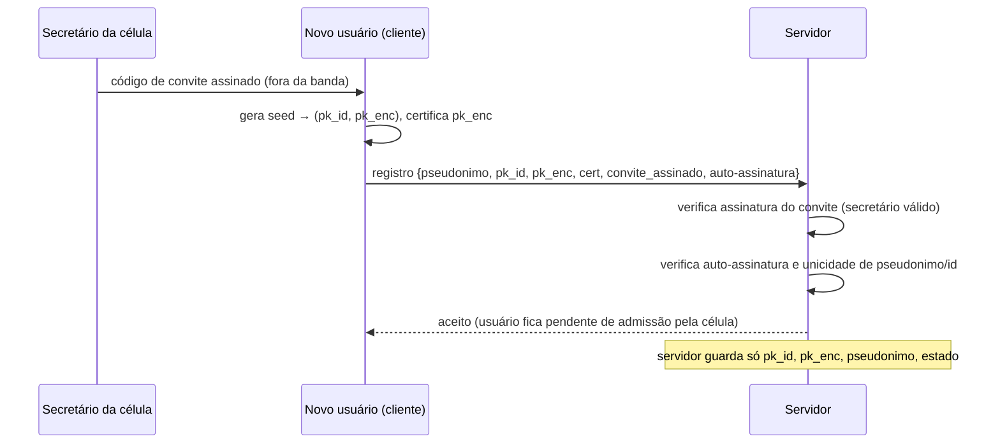
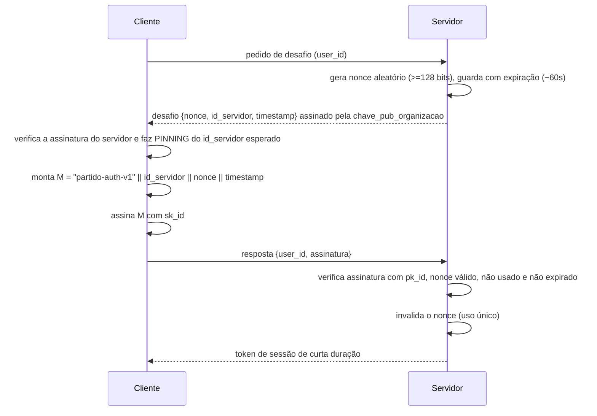
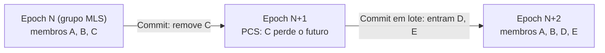
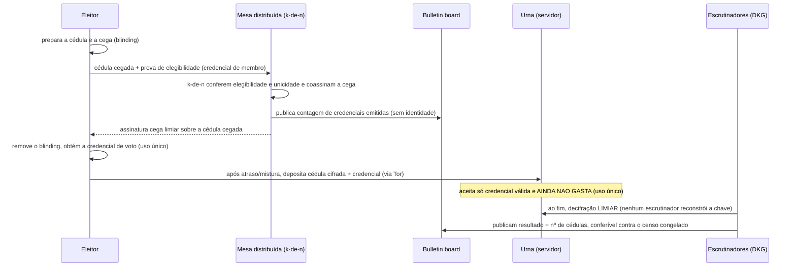

# 03 — Arquitetura criptográfica

| | |
|---|---|
| **Status** | rascunho |
| **Última atualização** | 2026-08-08 |
| **Depende de** | [00 — Visão](00-visao.md), [02 — Modelo de domínio](02-modelo-de-dominio.md) |
| **Decisões** | [0001](decisoes/adr-0001-identidade-por-par-de-chaves.md), [0002](decisoes/adr-0002-autenticacao-assinatura-de-nonce.md), [0003](decisoes/adr-0003-servidor-rejeita-nao-envelope.md), [0006](decisoes/adr-0006-voto-secreto-assinatura-cega.md), **[0008](decisoes/adr-0008-mls-e-credenciais-anonimas.md)** (substitui a [0004](decisoes/adr-0004-cripto-de-grupo-por-epoca.md)) |
| **Revisado por** | [revisao-critica.md](revisao-critica.md) (2026-08) |
| **Público** | engenheiros ([técnico]) com seções [conceitual] |

> Este é o documento técnico central. Ele especifica identidade, autenticação, o formato de envelope cifrado, a criptografia de grupo por organismo, o voto secreto e o que fica exposto como metadado. **Princípio inegociável (P7): só primitivas padrão, com referência (RFC/libsodium); nenhuma construção criptográfica caseira.** Onde o desenho tem limites, eles são declarados — a honestidade sobre o que **não** é protegido é requisito de qualidade, não fraqueza (ver também [doc 06](06-modelo-de-ameacas.md)).

## 1. Princípios criptográficos [conceitual]

1. **Servidor cego quanto ao conteúdo (P2).** O cliente cifra tudo antes de enviar; o servidor armazena e roteia, sem chaves para ler conteúdo. **Ele não é cego quanto à estrutura** — e, no reprojeto, as **credenciais anônimas** (§6, ADR-0008) reduzem o que ele aprende sobre *quem* participa, o principal furo apontado na revisão.
2. **O cliente é a raiz de confiança — e um requisito, não uma premissa.** A garantia de que "só o destinatário lê" vem do software cliente **livre e auditável**; por isso **build reprodutível + binary transparency** são requisito ([doc 06 A7](06-modelo-de-ameacas.md)), não meta futura.
3. **Primitivas padrão (P7).** Tudo abaixo referencia uma RFC e/ou uma implementação em libsodium.
4. **MVP vs. futuro, explícito.** Cada mecanismo declara o que entra na primeira versão (MVP) e o que é evolução planejada. Empurrar o difícil para "futuro" com honestidade é melhor do que inventar solução frágil agora.

## 2. Tabela de primitivas [técnico]

Esta tabela é a **norma** do documento: todo mecanismo abaixo cita uma linha dela. Introduzir qualquer primitiva fora desta tabela exige um ADR.

> **Nota de revisão (2026-08).** A tabela e as seções abaixo refletem o **reprojeto** decidido em [ADR-0008](decisoes/adr-0008-mls-e-credenciais-anonimas.md) (MLS + credenciais anônimas) e [ADR-0006 atualizado](decisoes/adr-0006-voto-secreto-assinatura-cega.md), após a [revisão crítica](revisao-critica.md). O modelo anterior de "chave de época por sealed box" (ADR-0004) foi substituído.

| Uso | Primitiva | Referência |
|---|---|---|
| Assinatura de identidade | **Ed25519** | RFC 8032; libsodium `crypto_sign` |
| Cifra assimétrica (para um destinatário) | **X25519 + sealed box** | RFC 7748; libsodium `crypto_box_seal` |
| Cifra simétrica autenticada (AEAD) | **XChaCha20-Poly1305** | libsodium `crypto_aead_xchacha20poly1305_ietf` (nonce de 192 bits ⇒ nonce aleatório é seguro) |
| **Grupo E2E dos organismos** | **MLS** (árvore assinada, `tree_hash`, `confirmation_tag`, FS + PCS) | RFC 9420 |
| **ACL sem revelar identidade** | **Credencial anônima — BBS+ / KVAC** (prova ZK de pertencimento) | *Signal private groups*; literatura BBS+/KVAC |
| Hash / resumo | **BLAKE2b** | RFC 7693; libsodium `crypto_generichash` |
| Derivação de chave a partir de senha | **Argon2id** | RFC 9106; libsodium `crypto_pwhash` |
| Derivação de chave (a partir de chave) | **HKDF-SHA-512** | RFC 5869 |
| Assinatura cega (voto) — **emissão limiar** | **RSABSSA** (RFC 9474) sob **assinatura limiar** k-de-n | RFC 9474 + esquema limiar auditado |
| Chave da urna | **DKG + VSS** (geração distribuída) + **decifração limiar** | Feldman/Pedersen VSS; ElGamal limiar |
| Serialização e assinatura | **CBOR determinístico** + **COSE** (assina os bytes exatos) | RFC 8949 §4.2; RFC 9052 |
| Biblioteca de referência | **libsodium** (+ implementação MLS e de credencial anônima auditadas) | — |

Parâmetros de referência (ajustáveis por estatuto/deploy):

- **Argon2id para a seed em repouso**: tier **SENSITIVE** do libsodium (`OPSLIMIT_SENSITIVE`, `MEMLIMIT` ~1 GiB) — é um custo único no *unlock*, no próprio dispositivo, e a seed é um alvo de **ataque offline** de alto valor (não o cenário "servidor com muitos logins" do tier interativo). Além disso: **exigir/medir entropia da passphrase** (ex.: diceware ≥ 6 palavras — Argon2id não salva senha fraca) e **ancorar a chave no keystore de hardware** (Secure Enclave/TPM/Android Keystore) quando disponível, para *rate-limiting* e não-exportabilidade.
- **Separação de domínio (obrigatória em TODO objeto assinado):** cada assinatura carrega um rótulo de domínio único e versionado (`"partido-auth-v1"`, `"partido-envelope-v1"`, `"partido-cert-v1"`, `"partido-voto-commit-v1"`, …); as entradas são serializadas com **comprimento explícito** (CBOR/COSE), assinando **os bytes exatos transmitidos** — nunca uma re-serialização — para eliminar ambiguidade de fronteira e malleabilidade de canonicalização.
- **Nonces XChaCha20-Poly1305**: 24 bytes aleatórios. **Tag Poly1305**: 16 bytes.

## 3. Identidade e chaves [técnico]

Ver [ADR-0001](decisoes/adr-0001-identidade-por-par-de-chaves.md).

### 3.1 Geração

A identidade nasce de uma **seed** aleatória (256 bits) gerada **no cliente**. Dela derivam-se, por HKDF com rótulos de domínio distintos:

- o par **Ed25519 de identidade** (`sk_id`, `pk_id`) — assina tudo; **é** a identidade;
- o par **X25519 de cifra** (`sk_enc`, `pk_enc`) — recebe conteúdo cifrado.

**Separação de chaves.** Assinatura e cifra usam pares distintos (princípio consolidado: uma chave, um propósito). A `pk_enc` é **certificada** por uma assinatura de `sk_id` (com rótulo de domínio `"partido-cert-v1"`) sobre `versao || pk_enc || notBefore || notAfter`, de modo que a chave de cifra pode ser **rotacionada** sem trocar a identidade. Para evitar *rollback* de chave pelo servidor (finding da revisão): o certificado tem **número de versão monotônico** e vale a regra "**somente a maior versão é válida**"; há **revogação** explícita; e a distribuição de certificados apoia-se em **key transparency** (log público append-only estilo CONIKS) para que o cliente detecte se o servidor está servindo um certificado obsoleto (a chave antiga, possivelmente comprometida).

O identificador do usuário é auto-certificante:

```
user_id = multibase(BLAKE2b-256(pk_id))
```

Assim, o `id` prova, por si, a qual chave pública corresponde — o servidor não pode "trocar" a identidade de um `id` sem que os clientes percebam. O `pseudonimo` é um rótulo mutável à parte (o `id` é a âncora estável).

### 3.2 Guarda da chave em repouso (no cliente)

A `seed` nunca sai em claro. No dispositivo, ela é cifrada com uma chave derivada por **Argon2id** de uma senha/frase do usuário (XChaCha20-Poly1305). Backup por **frase mnemônica** (lista de palavras estilo BIP-39) que codifica a seed para transporte offline.

**Consequência declarada (P8):** perder a seed (e o backup) = **perder a conta**, por desenho. O servidor **não** pode recuperar identidade — não tem material para isso. Recuperação social (re-atestação por membros da célula) é **evolução futura**, não MVP.

### 3.3 Múltiplos dispositivos

- **MVP:** transferência manual da seed (via frase mnemônica ou QR entre dispositivos do próprio usuário).
- **Futuro:** sub-chaves por dispositivo, certificadas pela `sk_id`, revogáveis individualmente.

## 4. Registro por convite [técnico]

O registro espelha o recrutamento pela célula (M1) e serve de defesa anti-Sybil (doc 06, A6). Um novo usuário só se registra apresentando um **código de convite assinado** pelo secretário de uma célula (papel definido no doc 02 §2.2).



O convite carrega o organismo de destino; a admissão efetiva (entrada como membro) é uma operação do organismo, que dispara um **`Commit` de `Add` no grupo MLS** do organismo (§7).

> **Metadado de recrutamento (correção da revisão — [doc 06 A3](06-modelo-de-ameacas.md)).** Se o servidor verifica um convite assinado por um secretário específico, ele aprende **quem apadrinhou quem** — um grafo de recrutamento, alvo de repressão. Mitigação: o convite deve ser **cegado** para o servidor — o secretário emite uma credencial que o servidor valida como "convite legítimo desta organização" **sem** saber qual secretário assinou (assinatura de grupo / credencial anônima, a mesma família do §6); ou a validação do convite ocorre **no organismo que admite**, não no servidor. O diagrama acima descreve o fluxo lógico; a versão que preserva privacidade substitui a verificação nominal do convite pela verificação cega.

## 5. Autenticação: desafio-resposta por assinatura de nonce [técnico]

Ver [ADR-0002](decisoes/adr-0002-autenticacao-assinatura-de-nonce.md). **Esta seção responde diretamente à dúvida de projeto sobre "como identificar quem tem a chave privada".**

### 5.1 Por que NÃO "cifrar um segredo e o usuário devolve o decifrado"

A ideia intuitiva — o servidor cifra um número com a `pk_enc` do usuário e pede que ele devolva o número decifrado — **deve ser rejeitada**. Ela transforma o cliente num **oráculo de decifração**:

- Um servidor malicioso (ou um atacante em posição de MitM) pode apresentar **qualquer ciphertext** para o cliente "provar identidade" — inclusive mensagens reais capturadas de outros contextos — e obter o texto decifrado de volta. Isso é uma primitiva de ataque, não de autenticação.
- Mistura a **chave de cifra** com a função de **autenticação**, violando a separação de chaves (§3.1).

### 5.2 O padrão correto: assinatura de nonce com separação de domínio

Autenticação é **prova de posse da chave de identidade por assinatura** — o mesmo padrão de SSH e de WebAuthn/FIDO2. O usuário **assina** um desafio; nunca decifra nada em nome do servidor.



Propriedades:

- **Canal autenticado do servidor (correção da revisão).** O desafio é **assinado pela `chave_pub_organizacao`** (doc 02 §2.3), e o cliente **verifica e fixa (pinning, TOFU + fingerprint)** o `id_servidor` esperado. Sem isso, um servidor malicioso poderia apresentar o `id_servidor` de outro e obter uma assinatura de login reutilizável (ataque de *relay*) — o `id_servidor` no desafio só protege se o cliente o conhece independentemente.
- **Separação de domínio.** O prefixo `"partido-auth-v1"` amarra a assinatura ao login: uma assinatura de login nunca é confundível com a de uma resolução, voto ou envelope.
- **Anti-replay.** Nonce de uso único, com expiração curta, invalidado após o uso (o anti-replay real é o nonce rastreado; o `timestamp` é só janela de validade).
- **Só a chave pública é guardada.** O servidor nunca vê `sk_id`.

## 6. Envelope cifrado e a regra "o servidor rejeita o que não é envelope" [técnico]

Ver [ADR-0003](decisoes/adr-0003-servidor-rejeita-nao-envelope.md).

### 6.1 Formato

Toda unidade de conteúdo trafega como **envelope**, serializado em **CBOR determinístico**:

```
Envelope = {
  cabecalho: {              # em claro — mínimo necessário para roteamento
    versao,                 # versão do formato
    tipo,                   # mensagem | correspondencia | resolucao | voto | ...
    organismo_destino,      # id do organismo (compartimento)
    epoch,                  # epoch MLS corrente do organismo (§7)
    msg_id,                 # identificador único da mensagem (anti-replay)
    contador,               # contador monotônico por remetente-no-organismo
    prev_hash               # BLAKE2b do envelope anterior do feed (cadeia)
  },
  corpo_cifrado: bytes,     # AEAD (MLS application message), AD = cabecalho
  prova_membro: bytes       # credencial anônima (BBS+/KVAC): "sou membro autorizado
                            #   de organismo_destino para este tipo" — SEM revelar quem
}
```

Pontos de projeto (reprojeto — [ADR-0008](decisoes/adr-0008-mls-e-credenciais-anonimas.md)):

- **Autoria por credencial anônima, não por assinatura nominal.** No lugar do `remetente` (user_id) em claro + assinatura Ed25519, o envelope carrega uma **prova de pertencimento** (BBS+/KVAC): o servidor verifica que **um** membro autorizado do organismo produziu a mensagem, **sem aprender qual**. Isso (a) tira o `remetente` do cabeçalho — a maior fonte de exposição do grafo (doc 06 A3); e (b) dá **deniability** — o envelope deixa de ser prova não-repudiável de autoria contra o remetente numa apreensão (o problema do §7 do doc 06 / STRIDE).
- **Transcrição em cadeia (anti-equivocação).** `msg_id` + `contador` monotônico + `prev_hash` encadeiam o feed do organismo. Clientes **detectam** replay (msg_id repetido), lacuna (contador com buraco) e reordenação/drop (prev_hash não bate); comparando a raiz da cadeia entre si, detectam **equivocação** (o servidor servindo visões divergentes). É a "cadeia de hashes verificável" que antes só existia na prosa do doc 06 — agora está no formato.
- **Cabeçalho como AD** do AEAD: adulterar o cabeçalho invalida a decifração. O corpo é uma **mensagem de aplicação MLS** do grupo do organismo (§7); a chave vem do *ratchet* MLS, não de uma chave de época estática.

### 6.2 Validação estrutural sem decifrar

Ao receber um envelope, o servidor **aceita ou rejeita** só pela estrutura (P2 quanto ao conteúdo):

1. CBOR decodifica no schema de `Envelope`?
2. `prova_membro` verifica contra o **verificador de credencial** do `organismo_destino` para o `tipo` (ACL) — **sem** identificar o membro?
3. `epoch` é o corrente do organismo, e o avanço de epoch é **autenticado** pelo grupo (§7 — rejeita downgrade)?
4. `contador`/`prev_hash` são consistentes com o feed (sem replay nem lacuna)?
5. Tamanhos canônicos e `corpo_cifrado` num dos **buckets de padding** (§9)?

Falhou qualquer item ⇒ **rejeitado**.

### 6.3 Honestidade: o que essa regra realmente garante

**O servidor não consegue *provar* que uma sequência de bytes é um texto cifrado** — `corpo_cifrado` é opaco; um cliente adulterado poderia colocar ali bytes em claro. Portanto:

- A garantia real de confidencialidade vem do **cliente livre e auditável** ([doc 06 A7](06-modelo-de-ameacas.md): build reprodutível é **requisito**), somada à validação acima.
- Heurísticas de entropia/UTF-8 são **higiene, não prova** — e podem descartar mensagens curtas legítimas; mantidas só como defesa em profundidade opcional.
- **Exceções formais** à regra "todo objeto é um envelope cifrado com prova de membro" (ADR-0003, atualizado): (1) `Publicacao` de escopo `publico` (assinada, legível por desenho); (2) **cédula de voto anônima** (§8, portadora de credencial de voto, não de credencial de membro); (3) **objetos de gestão de grupo MLS** (`KeyPackage`, `Welcome`, `Commit`), validados pela assinatura do emissor autorizado.

**Metadado residual.** Sai o `remetente`; permanecem `organismo_destino`, `epoch`, tamanhos e horário — ainda metadado. Mitigações (padding, retenção mínima, e o roteamento por organismo em vez de por pessoa) em §9; o grafo por-pessoa deixa de ser reconstruível a partir do cabeçalho, que era o pior vazamento.

## 7. Grupo por organismo: MLS [técnico]

Ver [ADR-0008](decisoes/adr-0008-mls-e-credenciais-anonimas.md) (substitui a ADR-0004). Cada organismo é um **grupo MLS** (RFC 9420) — um compartimento criptográfico (M5, need-to-know): só seus membros leem seu conteúdo.

### 7.1 Por que MLS, e não "chave de época por sealed box"

O desenho anterior distribuía a chave de época por `crypto_box_seal`. A [revisão crítica](revisao-critica.md) §2-B mostrou que isso é inseguro contra o adversário declarado: `sealed box` é **anônimo e não-autenticado** (qualquer parte, inclusive o servidor, fabrica um pacote de chave e **equivoca** membros), não há confirmação de que o grupo compartilha a **mesma** chave, e não há *post-compromise security* (comprometer uma chave privada dá leitura permanente do futuro). O MLS foi desenhado exatamente contra essa classe de ataque:

- **Árvore de ratchet assinada** + `tree_hash`: a composição e as chaves são autenticadas; o servidor não insere membro nem troca chave sem quebrar a árvore.
- **`confirmation_tag`**: todos os membros confirmam a **mesma** visão de epoch — elimina a equivocação.
- **Forward secrecy + post-compromise security**: comprometer uma chave não dá o passado (FS) e, após uma atualização/remoção, o adversário perde o futuro (PCS).
- **Avanço de epoch autenticado** (`Commit`): não há *downgrade* de epoch induzido por metadado não autenticado.

### 7.2 Composição, admissão e remoção



- Admissão via `Add`/`Welcome`; remoção via `Remove`; ambas empacotadas em **`Commit`**, que avança o epoch de forma autenticada.
- **Admissão em lote:** credenciar um congresso de centenas de delegados é **um** `Commit`, não uma rotação por delegado — elimina o custo O(n²) e a corrida do modelo anterior (I9 relaxada para "entrada em lote / saída", doc 02).
- **Remoção corta o futuro (PCS):** o membro removido não lê epochs seguintes, mesmo que retenha material antigo.
- Por padrão, quem entra **não lê o passado** (need-to-know); acesso a histórico é decisão explícita do organismo (ver §7.3).

### 7.3 Memória durável, separada da higiene de chave

Uma organização precisa de **memória** (atas, resoluções, jornal legíveis no tempo). Isso **não** conflita com a forward secrecy do MLS — a falsa dicotomia "durabilidade exige FS fraca" foi corrigida na revisão. A solução é separar as camadas:

- **Transporte** (mensageria corrente do organismo): MLS, com FS/PCS plenos.
- **Arquivo durável** (atas, resoluções que precisam sobreviver): re-cifrado sob uma **chave de arquivo do organismo**, versionada e acessível aos membros correntes — um registro explícito, não um efeito colateral de guardar chaves de transporte antigas.

Assim, apagar material de transporte antigo (bom para FS) não apaga a memória institucional (guardada, deliberadamente, no arquivo).

## 8. Voto secreto [técnico]

Ver [ADR-0006](decisoes/adr-0006-voto-secreto-assinatura-cega.md). Requisitos de uma eleição: **elegibilidade** (só membros votam), **unicidade** (um voto por membro — I5), **sigilo** (ninguém liga voto→pessoa), **integridade** (não se cunha voto além do censo — o ponto que a revisão corrigiu) e **verificabilidade** (a apuração é conferível — **parcial no MVP**, ver §8.3). **Limite honesto:** nenhum esquema aqui resiste a **coação** ou **venda de voto** (o eleitor pode provar seu voto a um coator). Declarado, não escondido.

### 8.1 Votação nominal aberta — *commit-reveal* (MVP)

Para deliberações ordinárias e para a **tradição da votação nominal** em congressos (onde se quer registro de quem votou o quê), usa-se **commit-reveal**:

1. **Commit:** cada eleitor publica `BLAKE2b("partido-voto-commit-v1" || voto || sal)` assinado, com `sal` **aleatório ≥ 128 bits** (obrigatório: se o espaço de voto é pequeno — sim/não — e o sal é fraco, o commit é quebrável por força bruta durante a fase de commit).
2. **Reveal:** encerrado o prazo, revelam-se `voto || sal`; qualquer um confere.

Garante **simultaneidade**, não sigilo — por isso é o modo **aberto**. **Aborto seletivo tratado:** quem observa os reveals alheios e **retém** o seu para negar quórum ou forçar re-votação é penalizado — o não-reveal no prazo conta como abstenção registrada (ou, para eleições sérias, usa-se abertura forçável via segredo compartilhado / *timed-commitment*), de modo que reter o voto não dá vantagem.

### 8.2 Eleição secreta — emissão limiar + urna por DKG (MVP)

Ver [ADR-0006 atualizado](decisoes/adr-0006-voto-secreto-assinatura-cega.md). O esquema separa **elegibilidade** de **conteúdo**, mas — correção central da revisão — **a integridade não pode depender de uma parte única**: a mesa é **distribuída** (emissão limiar) e a urna é gerada por **DKG** (ninguém detém a chave inteira).



Propriedades e correções:

- **Integridade não é de parte única (A9).** A assinatura cega é **emitida em limiar (k-de-n)**: nenhuma mesa isolada cunha credenciais extras (o *ballot stuffing* indetectável do desenho anterior). O **bulletin board** publica o número de credenciais emitidas, conferível contra o **censo eleitoral congelado** (I12) — sobre-emissão vira detectável.
- **Uso único.** A urna marca cada credencial como **gasta**, prevenindo duplo-depósito (antes não especificado).
- **Urna por DKG + VSS.** A chave da urna é gerada de forma **distribuída** (nenhum *dealer* jamais conhece a chave inteira — o furo do Shamir puro) com *shares* verificáveis; a apuração é **decifração limiar** — a urna nunca é "reconstruída" num único ponto. É também o caminho natural para o futuro homomórfico (§8.3).
- **Sigilo depende de canal anônimo + mistura.** A deposição vem por **Tor**, e há **atraso/mistura (lote)** entre emissão e deposição — sem isso, "credenciado em T1 / depositou em T1+δ" correlaciona voto→pessoa mesmo sobre Tor. O cliente é **fail-closed**: sem canal anônimo confirmado, **recusa** depositar (doc 06 §8).

### 8.3 Limite de verificabilidade e futuro

**O MVP é honestamente NÃO verificável ponta a ponta:** o eleitor não pode conferir que *seu* voto entrou na contagem final — confia-se que os escrutinadores decifram corretamente. A evolução é **apuração homomórfica com provas ZK** (estilo **Helios/Belenios**) e **cast-or-audit de Benaloh** (o eleitor desafia o cliente a provar que cifrou o voto certo), que dão verificabilidade E2E sem escrutinadores confiáveis. **Não se reinventa** — adota-se um esquema publicado e revisado quando entrar no escopo.

## 9. Metadados: o que fica exposto e mitigações [técnico]

Confidencialidade de conteúdo (E2E) **não** é anonimato de participação. O que o servidor — e quem o observe ou apreenda — consegue ver, mesmo sem ler conteúdo:

| Metadado | Quem vê | Mitigação | Estado |
|---|---|---|---|
| **Quem** fala com o organismo (identidade do remetente) | servidor | **credencial anônima** (BBS+/KVAC): a autoria some do cabeçalho; o servidor autoriza sem identificar | ADR-0008 — em implantação |
| Grafo de filiação (quem é membro de quê) | servidor / apreensão | credencial anônima + **handles por-organismo não-vinculáveis** (em vez de `user_id` global) | ADR-0008; ver doc 06 A3 |
| Qual organismo recebe (`organismo_destino`) | servidor | roteamento por organismo, não por pessoa; padding | residual (aceito) |
| Horário e volume | servidor / rede | retenção mínima; **mistura/atraso** (obrigatória no voto, §8.2) | parcial |
| Tamanho do conteúdo | servidor / rede | **padding em buckets** — *insuficiente isolado*: o metadado dominante é temporal, que só mistura resolve | parcial |
| Endereço IP | rede / servidor | **Tor, fail-closed** (sem canal anônimo, recusa operações sensíveis); onion service nativo | MVP |
| Vínculo a conta real via **push** (FCM/APNs) | Google/Apple | evitar push ou desacoplar token da identidade; polling sobre Tor | em aberto (doc 06 I2) |

**Padding honesto:** trata só tamanho; sem cobertura temporal (dummy traffic/mistura) rende pouco — não é creditado como mitigação autônoma. **Timestamps truncados** *in-band* são cosméticos (o servidor registra o horário real de chegada) — a mitigação real é mistura/atraso. Esta tabela alimenta o [doc 06](06-modelo-de-ameacas.md). **Ponto central:** com credenciais anônimas, o sistema deixa de reconstruir o grafo *por pessoa*; sem elas (estado anterior), a promessa de "servidor cego quanto à filiação" era insustentável.

## 10. Decisões em aberto

- **Credencial anônima (BBS+/KVAC):** escolha do esquema, biblioteca auditada, e **revogação** (accumulator/epoch) quando um membro sai.
- **MLS:** biblioteca, perfil de ciphersuite, e a camada de **arquivo durável** (§7.3) por cima.
- **Cliente / cadeia de suprimento (doc 06 A7):** build reprodutível, *rebuilders*, binary transparency — tratado como requisito.
- **Push notifications:** evitar FCM/APNs ou desacoplar o token (doc 06 I2).
- **Recuperação social** de identidade (§3.2) — protocolo de re-atestação pela célula, para o MVP.
- **Voto:** biblioteca de assinatura cega **limiar** + DKG/VSS; caminho para verificabilidade E2E (Helios/Belenios).
- **Coação legal:** passphrase de coação / negação plausível; multi-dispositivo com sub-chaves revogáveis (§3.3).

## Referências

- RFCs citadas na tabela §2.
- libsodium — documentação das primitivas (`crypto_sign`, `crypto_box_seal`, `crypto_aead_xchacha20poly1305_ietf`, `crypto_pwhash`, `crypto_generichash`).
- Sistemas comparáveis: Signal (double ratchet), MLS (RFC 9420), Helios/Belenios (voto verificável).
- [doc 02 — Modelo de domínio](02-modelo-de-dominio.md); [doc 06 — Modelo de ameaças](06-modelo-de-ameacas.md).
