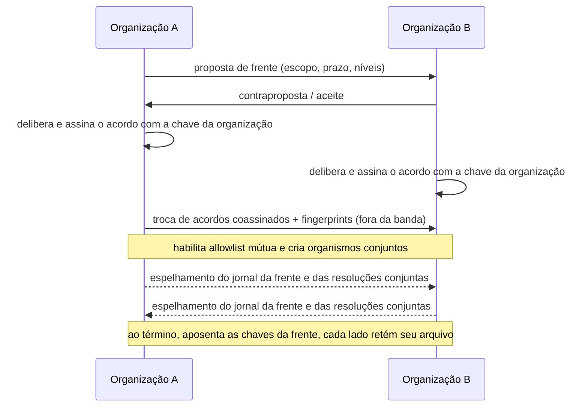

# 04 — Federação e frentes comuns

| | |
|---|---|
| **Status** | rascunho |
| **Última atualização** | 2026-08-08 |
| **Depende de** | [02 — Modelo de domínio](02-modelo-de-dominio.md), [03 — Arquitetura criptográfica](03-arquitetura-criptografica.md) |
| **Decisões** | [ADR-0005](decisoes/adr-0005-federacao-por-acordo-bilateral.md) |
| **Público** | engenheiros ([técnico]) com seções [conceitual] |

> Uma organização é um servidor (P6). Este documento especifica como **dois servidores cooperam** para formar uma **frente comum** (M12) — o análogo técnico da tática da frente única: **"marchar separados, golpear juntos"** ([doc 01 A.10](01-fundamentos-leninistas.md)).

## 1. Modelo de confiança [conceitual]

A federação aqui **não** é aberta como a de redes sociais (onde qualquer servidor fala com qualquer outro por padrão). É **bilateral e explícita**: dois servidores só trocam dados depois que as duas organizações firmam um **acordo político** e habilitam uma **lista de permissões (allowlist)** uma para a outra. Ver [ADR-0005](decisoes/adr-0005-federacao-por-acordo-bilateral.md).

O princípio de organização que isso espelha é preciso: na frente única, o acordo entre as **direções** precede e delimita a ação comum; cada organização mantém sua estrutura, seu jornal e sua autonomia. O software impõe exatamente essa ordem — **primeiro o acordo, depois o *peering* técnico** — e nada além do que o acordo autoriza atravessa a fronteira.

## 2. Identidade da organização [técnico]

Cada organização tem um **par de chaves da organização** (Ed25519), gerado e custodiado por ela (por exemplo, sob controle de mandato do comitê central — doc 02). A `chave_pub_organizacao` (doc 02 §2.3) é a identidade federativa.

Descoberta e verificação:

- O servidor publica sua chave pública e metadados de federação em um endpoint bem-conhecido: `/.well-known/partido-org` (documento **assinado** pela chave da organização).
- A confiança na chave é estabelecida **fora da banda**: as duas organizações conferem o *fingerprint* da chave uma da outra por um canal seguro (encontro presencial de delegados, canal já confiável). Isso evita que um servidor no meio do caminho injete uma chave falsa (ataque de diretório — doc 06, A5).
- A chave da organização é **rotacionável**, com a nova chave assinada pela anterior (continuidade verificável).

## 3. Ciclo de vida de uma frente [conceitual + técnico]

Etapas:

1. **Proposta.** Uma organização propõe à outra o escopo (o que a frente fará), a validade e os níveis de interface (§5).
2. **Acordo coassinado.** Cada organização **delibera** internamente (doc 02 §2.5) e assina o documento de acordo com sua chave de organização. O acordo, com as duas assinaturas, é o ato constitutivo da frente.
3. **Organismos conjuntos.** Cria-se, por exemplo, um **comitê da frente** (organismo cujos membros são delegados credenciados de ambos os lados) e um **jornal da frente**.
4. **Operação.** As organizações espelham entre si apenas o conteúdo da frente (§4).
5. **Dissolução.** No fim do prazo (ou por deliberação), as chaves específicas da frente são aposentadas. **Cada organização retém seu próprio arquivo**; nenhuma leva a base de membros da outra.

## 4. Privacidade entre organizações [técnico]

Esta é a propriedade central do desenho de federação: **uma organização nunca expõe sua base de membros à outra.**

- **Só delegados credenciados cruzam a fronteira.** Para participar de um organismo conjunto, a organização B emite um **atestado assinado** — "este pseudônimo é delegado credenciado da organização B para a frente F" — sem revelar quem mais existe em B. O servidor de A vê apenas os delegados de B que a própria B credenciou; nunca o grafo de filiação de B.
- **A base acessa a frente pelo próprio servidor.** Um militante comum de A lê o jornal da frente **espelhado no servidor de A**. Ele não se conecta ao servidor de B; o servidor de B nunca vê o IP nem o pseudônimo da base de A.
- **Os objetos trocados são os envelopes do [doc 03](03-arquitetura-criptografica.md).** A federação não introduz criptografia nova: resoluções, publicações e correspondências da frente são os mesmos envelopes (§6 do doc 03), cifrados no **grupo MLS do organismo conjunto**, cujos membros são os delegados credenciados dos dois lados.

## 5. Níveis de interface [conceitual]

O "nível de interface" que a visão deixou em aberto vira um **parâmetro do acordo**. Três níveis, do mais leve ao mais forte:

| Nível | O que a frente compartilha | Exemplo |
|---|---|---|
| **1 — Jornal comum** | Publicações espelhadas entre as organizações | Uma campanha de agitação conjunta, um manifesto comum |
| **2 — Organismo conjunto** | Comitê da frente com deliberação vinculante **apenas dentro do escopo da frente** | Coordenação de uma greve, de um ato, de uma pauta |
| **3 — Processos conjuntos** | Eleições/congressos conjuntos (delegações de ambos deliberam juntas) | Fusão em curso, coordenação de longo prazo |

**Recomendação:** o MVP implementa os **níveis 1 e 2**. O nível 3 (voto conjunto entre bases de organizações distintas) levanta questões de elegibilidade e sigilo entre servidores que merecem desenho próprio; fica como evolução.

## 6. Topologia de hospedagem [técnico]

Para evitar a complexidade de replicação multi-mestre nesta fase:

- Cada organismo conjunto tem um **servidor-sede** designado no acordo (por exemplo, o servidor de A hospeda o comitê da frente).
- O outro servidor mantém um **espelho somente-leitura** do conteúdo da frente, sincronizado por *pull* autenticado (assinaturas de organização) sobre a allowlist.
- Escritas (novas publicações, votos no organismo conjunto) vão ao servidor-sede; o espelho as recebe e as serve à sua base.

## 7. Protocolo de transporte [técnico]

Comparação honesta das opções de protocolo servidor-a-servidor:

| Opção | A favor | Contra |
|---|---|---|
| **ActivityPub** | Ecossistema grande, especificação madura | Desenhado para social **público**; modelo de metadados vaza participação; adaptá-lo a E2E + allowlist é ir contra a corrente |
| **Matrix** | E2E e federação prontos, salas ~ organismos | Complexidade alta; federação aberta por padrão precisa ser restringida; metadados de sala no servidor |
| **API S2S mínima própria** | Objetos = os **envelopes assinados do doc 03**; sem cripto nova; só transporte HTTPS/Tor entre pares em allowlist | É preciso especificar e manter a própria API |

**Recomendação:** **API S2S mínima própria** no MVP — ela reusa integralmente o modelo de envelopes já especificado (não inventa criptografia), e a superfície é pequena porque a allowlist limita os pares. **Matrix** fica anotado como alternativa a **prototipar** caso a manutenção da API própria se mostre custosa.

## 8. Decisões em aberto

- Nível 3 (processos decisórios conjuntos): elegibilidade e sigilo de voto entre bases de servidores distintos.
- Protocolo de sincronização do espelho (frequência, resolução de conflitos, prova de completude do log).
- Federação **multilateral** (frente de três ou mais) — composição de allowlists e de organismos conjuntos.
- Revogação de credencial de delegado em tempo hábil no servidor parceiro.

## Referências

- [doc 01 A.10 — Frente única](01-fundamentos-leninistas.md); [doc 03 §6 — Envelopes](03-arquitetura-criptografica.md); [doc 06 A5 — Servidor malicioso](06-modelo-de-ameacas.md).
- ActivityPub (W3C); Matrix (matrix.org) — para comparação de protocolo.
