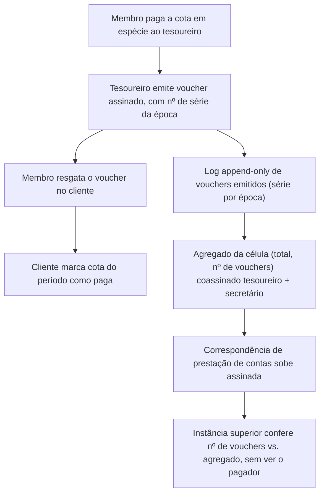

# 05 — Financiamento e cotização

| | |
|---|---|
| **Status** | rascunho |
| **Última atualização** | 2026-08-08 |
| **Depende de** | [01 — Fundamentos](01-fundamentos-leninistas.md) (A.12, M14), [02 — Modelo de domínio](02-modelo-de-dominio.md) |
| **Público** | todos ([conceitual]) |

> A cotização — a contribuição regular dos membros — é a **base material da independência** de uma organização (M14, [doc 01 A.12](01-fundamentos-leninistas.md)). Este documento estuda como receber contribuições **pequenas** com o **máximo anonimato possível do contribuinte**, mantendo a **prestação de contas** — e é honesto sobre o que é viável.

## 1. Requisitos [conceitual]

1. **Valores pequenos e recorrentes.** É cotização de militante, não financiamento de campanha: importâncias modestas, muitas, periódicas.
2. **Anonimato do contribuinte.** Idealmente, nem o servidor nem terceiros ligam "pessoa → pagamento". Note a assimetria: quer-se anonimato de **quem paga**, mas **transparência de quem recebe** (a organização presta contas).
3. **Prestação de contas agregada.** A célula reporta um **total** ("a Célula A arrecadou X no mês"), não uma lista de quem pagou quanto — é a compartimentação (M5) aplicada às finanças: o tesoureiro sabe, as instâncias superiores veem o agregado.
4. **Viabilidade real.** Precisa funcionar para pessoas não-técnicas, com liquidez no país de operação.

## 2. Aviso legal [conceitual]

**Este documento não é aconselhamento jurídico e não descreve forma de contornar a lei.** O enquadramento depende do que a organização é:

- **Partido político registrado no Brasil:** doações de **origem não identificada são vedadas**. A base não é apenas a Lei 9.096/1995 (Lei dos Partidos Políticos): a exigência de identificação (CPF/CNPJ do doador) vem sobretudo da **Lei 9.504/1997** (arrecadação eleitoral) e das **resoluções do TSE** que regem a prestação de contas; recursos de "fonte não identificada" são rejeitados. Há ainda **exposição criminal** (falsidade ideológica eleitoral, art. 350 do Código Eleitoral; caixa dois). Para partido registrado, o anonimato do contribuinte é **incompatível com a lei** — o modo anônimo **não deve ser oferecido**.
- **Associação civil, coletivo ou movimento não registrado como partido:** o quadro é outro (Código Civil, estatuto da associação), mas incidem obrigações concretas: **escrituração do CNPJ** (ECF) e a **DME — Declaração de Operações em Espécie** (Receita Federal) para movimentações em dinheiro ≥ R$ 30.000; o acúmulo de caixa em espécie pelo tesoureiro pode disparar essa obrigação. Há também risco de **PLD/UIF**: o *pooling* anônimo de espécie pode ser lido por terceiros como fracionamento/*smurfing*, mesmo sem crime antecedente.

> **Default seguro (correção após a [revisão crítica](revisao-critica.md) §2-F).** Como o *modo anônimo* é estruturalmente o mecanismo pelo qual se descumpre a exigência de identificação, o software **não** o oferece como padrão. Quando a organização se declara **partido registrado**, o **modo transparente é o padrão e o modo anônimo é bloqueado** (com aviso ativo). O modo anônimo fica disponível apenas para organizações que declaram não estar sob esse regime — e ainda assim com o aviso das obrigações acima. Um disclaimer textual não neutraliza um *default* que entrega um sistema de espécie anonimizada chave-na-mão.

**A decisão de regime é da organização**, mas o software escolhe o *default* pelo enquadramento declarado. Há ainda a tendência regulatória internacional de **restringir instrumentos de pagamento anônimos** (por exemplo, as regras europeias de prevenção à lavagem que limitam ativos com anonimato reforçado, em vigência escalonada) — o que reforça tratar isto como **estudo de opções**, não como promessa.

## 3. Matriz comparativa das opções [conceitual + técnico]

Avaliação honesta. "Anonimato" nunca aparece sem qualificação.

Colunas: além das óbvias, **Estabilidade de valor** importa porque a cotização é uma **cota fixa** — um ativo volátil faz o valor real oscilar entre emissão e resgate. E há a **re-identificação no off-ramp**: mesmo com pagador anônimo, converter cripto→reais para gastar (aluguel, gráfica) passa por corretora com **KYC**, criando um evento que liga a *organização* aos fundos — o que atinge o ativo mais sensível em contexto clandestino (a própria existência da associação, [doc 06 §2](06-modelo-de-ameacas.md)).

| Opção | Anonimato do pagador | Recebedor | Rastreabilidade real | Estabilidade de valor | Re-identificação no off-ramp | Usabilidade (leigo) | Liquidez BR | Risco regulatório |
|---|---|---|---|---|---|---|---|---|
| **PIX / transferência** | **Nenhum** (CPF/conta) | Transparente | Total | Alta | N/A | Altíssima | Altíssima | Baixo |
| **Dinheiro vivo + recibo em papel** | **Máximo** | Transparente (agregado) | Nenhuma | Alta | N/A (não passa por câmbio) | Alta | Altíssima | Depende do uso |
| **Bitcoin (on-chain)** | **Pseudônimo, não anônimo** (cadeia pública; KYC liga endereço a pessoa) | Auditável | Alta | **Baixa** (volátil) | **Alta** (saque KYC) | Média | Alta | Médio |
| **Lightning** | Melhor que on-chain, mas metadados de rota + entrada/saída KYC | Auditável | Média | Baixa | Alta | Baixa/Média | Baixa | Médio |
| **Stablecoin (USDT/USDC)** | Pseudônimo (como Bitcoin) + **emissor central pode congelar** | Auditável | Alta | **Alta** (paridade) | **Alta** (saque KYC) | Média | **Altíssima** (maior fatia do volume BR) | Médio/Alto |
| **Monero (XMR)** | **Alto** (endereços furtivos, RingCT) | Auditável só por *view key* (transações de entrada; não comprova gastos) | Baixa | **Baixa** (volátil) | Alta e mais difícil (deslistado) | Baixa | **Baixa** | **Alto** (privacy coin) |
| **GNU Taler** | **Alto (só quanto ao servidor/rede)** | **Transparente e auditável** | Baixa (pagador) / total (recebedor) | Depende do lastro | Depende do operador | Média | Nenhuma hoje | Médio |
| **Voucher pré-pago em espécie** | **Máximo quanto ao servidor; NENHUM quanto ao tesoureiro** | Transparente (agregado) | Nenhuma no software | Alta | N/A | Média (cerimônia de resgate) | Altíssima (é dinheiro) | Depende do uso |

Leitura dos destaques:

- **Bitcoin não é anônimo.** É pseudônimo sobre um livro-razão **público**; análise de cadeia e o KYC das corretoras frequentemente reconstroem "pessoa → endereço". Descrevê-lo como anônimo seria falso.
- **Monero** é o melhor anonimato on-chain, mas paga o preço em **liquidez** (deslistagem em corretoras) e **risco regulatório** (é alvo declarado de restrições a *privacy coins*).
- **GNU Taler** é o **encaixe conceitual perfeito** para o requisito 2: por construção, o **pagador é anônimo** (retira "moedas" por **assinatura cega** — conceitualmente análoga à do voto secreto do doc 03, mas **não a mesma construção**: o Taler usa assinaturas cegas chaumianas RSA e vem migrando para *Clause Blind Schnorr Signatures*, ao passo que a RFC 9474 é a RSABSSA; não há reúso direto de código) e o **recebedor é transparente e auditável**. É exatamente "doador anônimo, organização que presta contas". O custo é a adoção: exige um operador de câmbio Taler e praticamente não há liquidez hoje — na prática, **inviável no Brasil hoje**.
- **Voucher em dinheiro vivo** é o **mais anônimo quanto ao servidor** e o **mais fiel ao modelo histórico** (A.12) — mas com uma qualificação decisiva: **não é anônimo quanto ao tesoureiro**, que sabe exatamente quem pagou (req. 3). Monero e Taler dão anonimato **até quanto ao recebedor** — propriedade estritamente mais forte. E o voucher, como código assinado, é um **instrumento ao portador**: cópia/roubo antes do resgate é gastável por terceiros.
- **Auditabilidade — o ponto crítico da revisão.** No desenho ingênuo, o único artefato que sobe é o **agregado autoassinado pelo próprio tesoureiro**, e ninguém reconcilia os vouchers contra esse total (eles ficam dispersos com os membros). Isso entrega anonimato do pagador **ao custo de eliminar a conferência** — o tesoureiro pode subdeclarar (embolsar a diferença) ou inflar (emitir para amigos), de forma **indetectável**. O antifraude de "token de uso único" combate o duplo-resgate *pelo membro* (um não-problema — ele só fraudaria a si) e ignora o vetor real (o **tesoureiro**). Ver [doc 06, adversário A8](06-modelo-de-ameacas.md).

## 4. Recomendação

**Arquitetura de *gateway* de contribuição plugável**, com o *default* seguro do §2 e evolução por plugins:

- **MVP:**
  - **Modo transparente (default para partido registrado): PIX/transferência identificada**, rastro contábil completo.
  - **Modo anônimo (só fora do regime de partido registrado): voucher assinado pelo tesoureiro**, vendido em espécie — **com a auditoria ancorada fora do tesoureiro** (obrigatório, não opcional): (a) o agregado é **coassinado por um segundo papel da célula** (o secretário, que conta os vouchers emitidos), e/ou (b) um **log append-only assinado de vouchers emitidos** (série numerada por época, como o log de atas do [doc 06 A5](06-modelo-de-ameacas.md)) permite conferir "nº de vouchers ↔ agregado" **sem revelar pagadores**. Sem uma dessas âncoras, o voucher é apenas um **recibo do tesoureiro para o membro** — e o documento não deve chamá-lo de "prestação de contas".
- **Estudo contínuo (plugins futuros):** **GNU Taler** (o ideal conceitual, quando houver operador/liquidez) e **Monero** (quando o anonimato on-chain justificar o custo de liquidez/risco).

**Registro no servidor:** apenas **agregados por organismo**, cifrados (envelope do doc 03), agora **coassinados** (tesoureiro + secretário) ou acompanhados do log de série. Nunca "pessoa → valor". A prestação de contas sobe como **correspondência** ([doc 02 §2.4](02-modelo-de-dominio.md)): totais assinados, consolidados de baixo para cima.

## 5. Ciclo do voucher [técnico]

Propriedades: o servidor vê apenas os passos L–G (log de série + agregados coassinados). Os passos A–D não revelam a identidade do pagador ao servidor — o vínculo "pessoa → pagamento" existe **apenas offline, com o tesoureiro**, como na cotização histórica.

**Limite de confiança (corrigido).** A confiança recai sobre o tesoureiro, mas **não inteiramente**: a coassinatura do secretário e o log de série tornam o desvio **detectável** (o total tem de bater com o número de vouchers emitidos). O tesoureiro é um **papel eleito e revogável** (ver [doc 02 §2.2/§2.7](02-modelo-de-dominio.md), com a revogabilidade do papel agora explícita) — e o [doc 06](06-modelo-de-ameacas.md) passa a modelá-lo como o adversário **A8 (insider financeiro)**. Sem essas âncoras, o esquema entregaria *menos* auditabilidade que um livro-caixa de papel.

## 6. Decisões em aberto

- Formato e antifraude do **voucher** (evitar duplo-resgate sem revelar o pagador — provável uso de token assinado de uso único, análogo à credencial de voto do doc 03 §8).
- Viabilidade prática de operar um **câmbio GNU Taler** para uma organização.
- Política contábil do **modo transparente** (integração com obrigações fiscais).

## Referências

- [doc 01 A.12 / M14 — Cotização](01-fundamentos-leninistas.md); [doc 03 §8 — Assinatura cega](03-arquitetura-criptografica.md).
- Lei 9.096/1995 (Lei dos Partidos Políticos, Brasil) — vedação a doações não identificadas a partidos registrados.
- GNU Taler (taler.net); documentação do Monero; literatura de análise de cadeia de Bitcoin.
