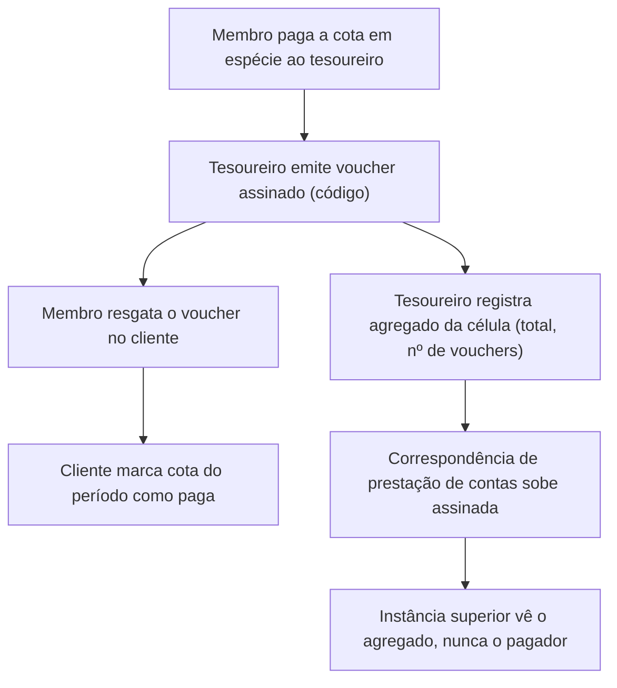

# 05 — Financiamento e cotização

| | |
|---|---|
| **Status** | rascunho |
| **Última atualização** | 2026-08-08 |
| **Depende de** | [01 — Fundamentos](01-fundamentos-leninistas.md) (A.12, M14), [02 — Modelo de domínio](02-modelo-de-dominio.md) |
| **Público** | todos ([conceitual]) |

> A cotização — a contribuição regular dos membros — é a **base material da independência** de uma organização (M14, [doc 01 A.12](01-fundamentos-leninistas.md)). Este documento estuda como receber contribuições **pequenas** com o **máximo anonimato possível do contribuinte**, mantendo a **prestação de contas** — e é honesto sobre o que é viável.

## 1. Requisitos [conceitual]

1. **Valores pequenos e recorrentes.** É cotização de militante, não financiamento de campanha: importâncias modestas, muitas, periódicas.
2. **Anonimato do contribuinte.** Idealmente, nem o servidor nem terceiros ligam "pessoa → pagamento". Note a assimetria: quer-se anonimato de **quem paga**, mas **transparência de quem recebe** (a organização presta contas).
3. **Prestação de contas agregada.** A célula reporta um **total** ("a Célula A arrecadou X no mês"), não uma lista de quem pagou quanto — é a compartimentação (M5) aplicada às finanças: o tesoureiro sabe, as instâncias superiores veem o agregado.
4. **Viabilidade real.** Precisa funcionar para pessoas não-técnicas, com liquidez no país de operação.

## 2. Aviso legal [conceitual]

**Este documento não é aconselhamento jurídico e não descreve forma de contornar a lei.** O enquadramento depende do que a organização é:

- **Partido político registrado no Brasil:** a Lei 9.096/1995 (Lei dos Partidos Políticos) e a legislação eleitoral **vedam doações de origem não identificada**. Para esse caso, o anonimato do contribuinte é **incompatível com a lei** — o software deve operar em **modo de transparência total** (contribuições identificadas e auditáveis).
- **Associação civil, coletivo ou movimento não registrado como partido:** o quadro é outro e varia; ainda assim, obrigações fiscais e de prevenção à lavagem de dinheiro podem incidir.

Por isso, **a decisão de regime de financiamento é da organização**, não do software. O sistema oferece tanto um **modo identificado/transparente** quanto um **modo anônimo**, e cada organização escolhe conforme seu enquadramento legal. Há ainda a tendência regulatória internacional de **restringir instrumentos de pagamento anônimos** (por exemplo, as regras europeias de prevenção à lavagem que limitam ativos com anonimato reforçado, em vigência escalonada) — o que reforça tratar isto como **estudo de opções**, não como promessa.

## 3. Matriz comparativa das opções [conceitual + técnico]

Avaliação honesta. "Anonimato" nunca aparece sem qualificação.

| Opção | Anonimato do pagador | Anonimato/transparência do recebedor | Rastreabilidade real | Usabilidade (leigo) | Liquidez no Brasil | Risco regulatório | Integração |
|---|---|---|---|---|---|---|---|
| **PIX / transferência** | **Nenhum** (identifica CPF/conta) | Transparente | Total | Altíssima | Altíssima | Baixo | Trivial |
| **Bitcoin (on-chain)** | **Pseudônimo, não anônimo** (cadeia pública, análise de fluxo; KYC em corretoras liga endereço a pessoa) | Auditável | Alta | Média | Média | Médio | Média |
| **Lightning (Bitcoin)** | Melhor que on-chain, mas metadados de rota e entrada/saída via corretora KYC | Auditável | Média | Baixa/Média | Baixa | Médio | Alta |
| **Monero (XMR)** | **Alto** (endereços furtivos, RingCT, valores ocultos) | Pode ser auditável por *view key* | Baixa | Baixa | **Baixa** (deslistado em muitas corretoras) | **Alto** (privacy coin) | Média |
| **GNU Taler** | **Alto para o pagador** (retirada por assinatura cega) | **Transparente e auditável** por desenho | Baixa (pagador) / total (recebedor) | Média (precisa de operador de câmbio) | Nenhuma hoje | Médio | Alta (pouca adoção) |
| **Voucher pré-pago em dinheiro vivo** | **Máximo** (o servidor nunca vê o pagador) | Transparente (agregado) | Nenhuma no software | Alta | Altíssima (é dinheiro) | Depende do uso | **Baixa** (fluxo simples) |

Leitura dos destaques:

- **Bitcoin não é anônimo.** É pseudônimo sobre um livro-razão **público**; análise de cadeia e o KYC das corretoras frequentemente reconstroem "pessoa → endereço". Descrevê-lo como anônimo seria falso.
- **Monero** é o melhor anonimato on-chain, mas paga o preço em **liquidez** (deslistagem em corretoras) e **risco regulatório** (é alvo declarado de restrições a *privacy coins*).
- **GNU Taler** é o **encaixe conceitual perfeito** para o requisito 2: por construção, o **pagador é anônimo** (retira "moedas" por assinatura cega — a mesma primitiva RFC 9474 do voto secreto, doc 03) e o **recebedor é transparente e auditável**. É exatamente "doador anônimo, organização que presta contas". O custo é a adoção: exige um operador de câmbio Taler e praticamente não há liquidez hoje.
- **Voucher em dinheiro vivo** é, ao mesmo tempo, o **mais anônimo** e o **mais fiel ao modelo histórico** (A.12): o tesoureiro da célula coleta a cota **em espécie** e emite, no software, um **código de voucher assinado** que o membro resgata como "cota paga". O servidor **nunca sabe quem pagou** — sabe apenas que a Célula A emitiu N vouchers. O tesoureiro sabe, como o tesoureiro de célula sempre soube.

## 4. Recomendação

**Arquitetura de *gateway* de contribuição plugável**, com dois modos e evolução por plugins:

- **MVP — dois caminhos conforme o enquadramento da organização (§2):**
  - **Modo anônimo: voucher assinado pelo tesoureiro**, vendido em espécie. Máximo anonimato do pagador, prestação de contas por agregado, zero dependência tecnológica frágil. É o padrão recomendado para organizações que podem operar assim.
  - **Modo transparente: PIX/transferência identificada**, para partidos registrados e quem precise de rastro contábil completo.
- **Estudo contínuo (plugins futuros):** **GNU Taler** (o ideal conceitual, quando houver operador/liquidez) e **Monero** (quando anonimato on-chain justificar o custo de liquidez/risco).

**Registro no servidor:** apenas **agregados por organismo**, cifrados (envelope do doc 03). Nunca "pessoa → valor". A prestação de contas sobe como **correspondência** (doc 02 §2.4): totais assinados pelo tesoureiro, consolidados de baixo para cima.

## 5. Ciclo do voucher [técnico]

Propriedades: o servidor vê apenas os passos E–G (agregados assinados). Os passos A–D não revelam a identidade do pagador ao servidor — o vínculo "pessoa → pagamento" existe **apenas offline, com o tesoureiro**, exatamente como na cotização histórica. Isso também define o limite: a confiança recai sobre o tesoureiro da célula (um papel eleito e prestador de contas — doc 02 §2.7), não sobre a tecnologia.

## 6. Decisões em aberto

- Formato e antifraude do **voucher** (evitar duplo-resgate sem revelar o pagador — provável uso de token assinado de uso único, análogo à credencial de voto do doc 03 §8).
- Viabilidade prática de operar um **câmbio GNU Taler** para uma organização.
- Política contábil do **modo transparente** (integração com obrigações fiscais).

## Referências

- [doc 01 A.12 / M14 — Cotização](01-fundamentos-leninistas.md); [doc 03 §8 — Assinatura cega](03-arquitetura-criptografica.md).
- Lei 9.096/1995 (Lei dos Partidos Políticos, Brasil) — vedação a doações não identificadas a partidos registrados.
- GNU Taler (taler.net); documentação do Monero; literatura de análise de cadeia de Bitcoin.
