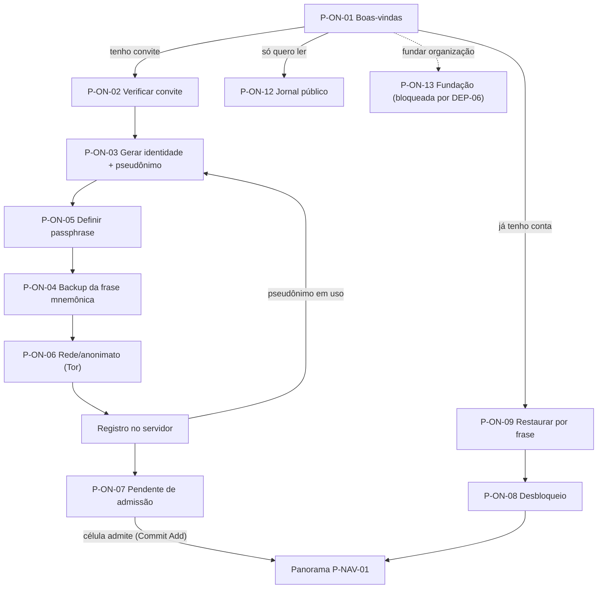

# 07/01 — Acesso, identidade e onboarding (ON)

| | |
|---|---|
| **Status** | rascunho |
| **Última atualização** | 2026-08-11 |
| **Depende de** | [07 — Páginas (índice)](README.md), [00-design-system](00-design-system.md), [03 — Cripto §3–5](../03-arquitetura-criptografica.md), [06 — Ameaças §8](../06-modelo-de-ameacas.md) |
| **Público** | designers e engenheiros ([técnico]) com seções [conceitual] |

> A área mais delicada do produto: aqui nasce a identidade (par de chaves, P3), entra-se por convite (defesa anti-Sybil, A6), e configura-se a rede *fail-closed* (UX7). Cada tela carrega duas obrigações em tensão — **não perder a pessoa** (uma seed perdida é uma conta perdida, por desenho) e **não induzir backup inseguro** que recrie o PII que o [ADR-0001](../decisoes/adr-0001-identidade-por-par-de-chaves.md) removeu (doc 06 §8.6). O gabarito de 9 pontos ([README §5](README.md)) rege cada página.

---

## Fluxo geral da primeira execução [conceitual]



Princípios de fluxo: **a identidade é criada e resguardada *antes* de tocar o servidor** (a seed nasce no cliente, §3 do doc 03); a **passphrase vem antes do backup** — a seed nunca persiste em disco sem cifra, e uma cerimônia interrompida retoma sem material exposto (toda cerimônia tem estado de **retomada**); o registro (envio de chaves públicas + convite) só ocorre ao final — se o pseudônimo colidir, o fluxo volta **apenas** ao passo do pseudônimo (P-ON-03), sem refazer passphrase, backup ou rede; e a **admissão** (virar membro de fato) é uma operação da célula, não do cadastro. *(Nota: a numeração dos IDs é histórica — P-ON-05 ocorre antes de P-ON-04 no fluxo; os IDs não são renumerados para preservar a citabilidade.)*

---

## P-ON-01 — Boas-vindas / primeira execução

1. **Objetivo.** Oferecer os três caminhos de entrada sem pressupor conta.
2. **Quem chega.** Qualquer pessoa na primeira abertura do app.
3. **Funcionalidades.** Três ações principais: *criar identidade* (tenho um convite), *restaurar* (já tenho frase mnemônica), *ler o jornal público* (sem conta) — mais um quarto caminho discreto, *fundar uma organização* (P-ON-13), hoje **bloqueado pelo ADR de gênese** (DEP-06) e exibido como indisponível com o porquê. Link discreto para "o que é isto" (visão) e para o painel de Exposição (P-SEG-06).
4. **Dinâmica.** Escolha ramifica o fluxo acima. Nenhuma coleta de dado aqui.
5. **Experiência e layout.** Tela sóbria (D1), sem *marketing*. Um parágrafo honesto: "isto é uma ferramenta de organização; você é um pseudônimo com uma chave; nada aqui usa seu nome real." Sem cor de compartimento (ainda não há compartimento).
6. **Estados.** Offline: "criar" e "restaurar" funcionam (geração é local); "ler jornal público" precisa de rede e informa isso.
7. **Restrições.** P3 (identidade = chave); UX6 (honestidade desde a primeira tela). Não pede e-mail/telefone — **não há campo de PII em lugar nenhum** (doc 02 §2.1).
8. **Aberto.** Nome do projeto (doc 00 §6).

## P-ON-02 — Verificação de convite

1. **Objetivo.** Validar que a pessoa tem um convite legítimo de uma célula, sem expor ao servidor **quem** a apadrinhou.
2. **Quem chega.** Recém-convidado, vindo de P-ON-01. O convite chega **fora da banda** (o secretário o entrega pessoalmente/por canal já seguro — doc 03 §4).
3. **Funcionalidades.** Colar código ou ler QR do convite; validação criptográfica local do convite; leitura do organismo de destino embutido no convite.
4. **Dinâmica.** O cliente confere a assinatura do convite. **Ponto crítico de privacidade (doc 03 §4, A3):** a validação perante o servidor deve ser **cegada** — o servidor aceita "convite legítimo desta organização" **sem** aprender qual secretário assinou (credencial/assinatura de grupo). A UI trata isso como padrão; se o MVP entregar só validação nominal, o painel de Exposição declara o metadado de recrutamento residual (README §7).
5. **Experiência e layout.** `Ceremony` de um passo. O chip de confiança é **condicionado ao estado real do build** (regra do design system §2): com validação cega entregue, chip "Anônimo" ("o convite não revela seu padrinho ao servidor"); em modo nominal (fallback do MVP), chip "Exposto" — *"o servidor vê qual secretário assinou este convite"* — dito aqui, no ponto de uso, não só no painel de Exposição [DEP-03]. Erro de convite inválido/expirado é claro e não culpabiliza.
6. **Estados.** Inválido, expirado, já usado; offline (valida a assinatura localmente, mas o registro final espera rede).
7. **Restrições.** A6 (anti-Sybil por convite); A3 (não vazar grafo de recrutamento); UX2.
8. **Aberto.** Esquema concreto de convite cegado (doc 03 §10).

## P-ON-03 — Geração de identidade e pseudônimo

1. **Objetivo.** Criar a seed e escolher o pseudônimo.
2. **Quem chega.** Convite validado.
3. **Funcionalidades.** Geração da **seed de 256 bits no cliente** (doc 03 §3.1), derivando por HKDF o par Ed25519 de identidade e o X25519 de cifra (certificado pela identidade); escolha do **pseudônimo** (único no servidor, mutável); educação de opsec de pseudônimo.
4. **Dinâmica.** Seed gerada localmente; nada sai do dispositivo neste passo. O `user_id` auto-certificante é derivado da chave pública (`multibase(BLAKE2b-256(pk_id))`).
5. **Experiência e layout.** `HonestyCallout` de opsec (doc 06 §8.1): *"Escolha um pseudônimo sem relação com seu nome, trabalho ou redes."* E o **limite honesto**: *"Um mesmo aparelho pode ligar seus pseudônimos por rede/horário — pseudônimo não é anonimato de rede; para isso, use Tor (passo adiante)."* Prévia do identicon derivada do **pseudônimo** (os handles por-organismo só nascem na admissão a cada organismo — a relação exata pseudônimo × handle é matéria do ADR de identidade [DEP-05]).
6. **Estados.** Pseudônimo já em uso — a checagem ocorre **só na etapa de registro** (fim do fluxo), para não vazar enumeração antes da hora; nesse caso o fluxo **retorna apenas a este passo** (sub-passo isolado "escolha outro pseudônimo" → reenvio imediato do registro; seed, passphrase, backup e rede intactos). Geração em curso (brevíssima).
7. **Restrições.** P3; UX2 (garantia de interface; a âncora `user_id` e o pseudônimo único no servidor são o residual do [DEP-05]); doc 06 §8.1 (não insinuar não-vinculabilidade que a rede desfaz).
8. **Aberto.** Esquema de identicon (design system §12).

## P-ON-04 — Cerimônia de backup da frase mnemônica

1. **Objetivo.** Garantir que a pessoa guarde a frase que **é** a única recuperação da conta — sem induzir backup inseguro.
2. **Quem chega.** Identidade gerada e **passphrase já definida** (P-ON-05 vem antes no fluxo — a seed nunca espera esta cerimônia sem cifra).
3. **Funcionalidades.** **Tela de preparo** antes de começar (*"você vai precisar de papel, caneta e ~15 minutos a sós"* — reduz o antipadrão da foto); exibir a frase mnemônica (lista de palavras estilo BIP-39 que codifica a seed, doc 03 §3.2), em grupos numerados de 4 (tela pequena); confirmação por reintrodução de palavras sorteadas; guia de backup seguro; estado de **retomada** (cerimônia interrompida recomeça daqui, sem material exposto).
4. **Dinâmica.** `Ceremony` full-screen, focada, com captura de tela bloqueada (`FLAG_SECURE`) e as salvaguardas de acessibilidade×opsec do design system §10 (aviso sobre leitor de tela vocalizar a frase; teclado incógnito na confirmação). Confirmação obrigatória antes de prosseguir. **Os dois segredos são nomeados em contraste** para não serem confundidos nem guardados juntos: esta é a *"chave-mestra de papel"* (anota e guarda offline; recupera a conta); a passphrase de P-ON-05 é a *"senha de uso diário"* (memoriza; destrava o aparelho).
5. **Experiência e layout.** Texto reto (D6): *"Se você perder esta frase e o acesso a este aparelho, **a conta é perdida** — ninguém no servidor pode recuperá-la, por desenho."* Guia de backup que **evita** o antipadrão perigoso (doc 06 §8.6): *"Não fotografe nem salve na nuvem"* — porque isso recria o rastro que o sistema removeu. Aponta para a **recuperação social** (P-ON-11) como rede de segurança complementar.
6. **Estados.** Confirmação incorreta (repete); "adiar" **não** é oferecido para a confirmação mínima (é o único ponto quase-obrigatório, justificado pelo risco de perda total).
7. **Restrições.** doc 03 §3.2 ("perder a seed = perder a conta"); doc 06 §8.6 (não recriar PII via backup inseguro).
8. **Aberto.** Integração com P-ON-11 (recuperação social) para suavizar a rigidez do "perdeu, perdeu".

## P-ON-05 — Definição de passphrase (chave em repouso)

1. **Objetivo.** Proteger a seed em repouso no dispositivo.
2. **Quem chega.** Identidade recém-gerada (P-ON-03) — este passo vem **antes** do backup (P-ON-04), para a seed nunca persistir sem cifra.
3. **Funcionalidades.** Definir passphrase que deriva (Argon2id) a chave que cifra a seed (XChaCha20-Poly1305, doc 03 §3.2); **medidor de entropia** exigindo força real (diceware ≥ 6 palavras — doc 03 §2); ancorar a chave no **keystore de hardware** quando disponível.
4. **Dinâmica.** Argon2id com custo **calibrado ao dispositivo** — correção honesta da revisão adversarial: o tier ~1 GiB do libsodium **trava aparelhos de entrada**, então a UI calibra (mede) e usa o keystore de hardware (Secure Enclave/TPM/Android Keystore) para *rate-limiting* e não-exportabilidade, em vez de um custo fixo inviável.
5. **Experiência e layout.** Medidor de entropia honesto (não teatro de "força de senha"): sugere diceware, mostra o número de palavras. `HonestyCallout`: *"Argon2id não salva senha fraca — a força vem da sua frase."*
6. **Estados.** Sem keystore de hardware (degrada para só-Argon2id, avisando); passphrase fraca (bloqueia avanço até o mínimo).
7. **Restrições.** doc 03 §2/§3.2; A4 (dispositivo comprometido — a chave em repouso é o alvo offline).
8. **Aberto.** Parâmetros de calibração por classe de dispositivo (doc 03 §10).

## P-ON-06 — Configuração de rede e anonimato

1. **Objetivo.** Estabelecer o canal anônimo (Tor/onion) e o comportamento *fail-closed*.
2. **Quem chega.** Passphrase definida — antes do primeiro contato com o servidor.
3. **Funcionalidades.** Ativar Tor/onion service (doc 03 §9); configurar o **transporte** (*bridges*/pluggable transports para redes que bloqueiam Tor — doc 06 §8.2). O comportamento *fail-closed* em si **não é configurável**: é propriedade imposta pelo sistema (doc 06 §8), regida pela lista canônica de operações [DEP-10].
4. **Dinâmica.** O cliente prioriza o onion service da organização; testa a conexão anônima. A UI explica o que o fail-closed fará: recusar operações sensíveis sem canal anônimo, em vez de cair para clearnet — e que a resposta a bloqueio de rede são as *bridges*, nunca o rebaixamento silencioso.
5. **Experiência e layout.** A `NetworkStatusBar` do shell nasce aqui e passa a ser permanente. `HonestyCallout`: *"Sem Tor, o servidor e a rede veem que **este aparelho** fala com a organização — um metadado forte (doc 06 A1). Com fail-closed, preferimos recusar a te expor em silêncio."*
6. **Estados.** Tor indisponível/bloqueado (oferece bridges; explica o bloqueio); conexão lenta (Tor tem custo — reconhecido).
7. **Restrições.** UX7; doc 06 §8.2/A1; doc 03 §9.
8. **Aberto.** Especificação exata do comportamento sem Tor (doc 06 §9).

## P-ON-07 — Pendente de admissão

1. **Objetivo.** Comunicar que a conta existe, mas a pessoa ainda **não é membro** até a célula admiti-la.
2. **Quem chega.** Registro enviado (chaves públicas + convite cegado ao servidor).
3. **Funcionalidades.** Estado de espera; explicação do que falta (a célula precisa executar o `Commit Add` no grupo MLS — doc 03 §4/§7.2); possibilidade de ler apenas o que é público enquanto espera.
4. **Dinâmica.** A admissão efetiva é uma operação do organismo (P-ORG-04), possivelmente **em lote**; ao ocorrer, a época avança e a pessoa passa a ver o mural da célula (need-to-know: sem histórico anterior).
5. **Experiência e layout.** EmptyState explicativo, sem falsa barra de progresso. Deixa claro que a espera é **social** (alguém da célula precisa agir), não técnica — e instrui o óbvio que o app não pode fazer: *"avise quem te convidou, pelo mesmo canal em que recebeu o convite"* (dentro do sistema não há como cutucar ninguém: a pessoa ainda não é membro).
6. **Estados.** Admissão pendente, admitido (transição para Panorama), convite recusado pela célula.
7. **Restrições.** doc 03 §4/§7.2; I9 (época acompanha composição); need-to-know (doc 03 §7.2).
8. **Aberto.** —

## P-ON-08 — Desbloqueio e login

1. **Objetivo.** Destravar a seed local e autenticar-se ao servidor sem virar oráculo de decifração.
2. **Quem chega.** Usuário recorrente, a cada sessão.
3. **Funcionalidades.** Desbloqueio local (passphrase → Argon2id → decifra a seed); **autenticação por desafio-resposta** (assina um nonce, doc 03 §5); *pinning* do `id_servidor`.
4. **Dinâmica.**

```mermaid
sequenceDiagram
    participant U as Usuário
    participant C as Cliente
    participant S as Servidor
    U->>C: passphrase (desbloqueio local)
    C->>C: Argon2id → decifra seed → sk_id disponível
    C->>S: pedido de desafio (user_id) via Tor
    S-->>C: desafio {nonce, id_servidor, ts} assinado pela chave da organização
    C->>C: verifica assinatura do servidor; PINNING do id_servidor (TOFU)
    C->>S: resposta {user_id, assinatura de "partido-auth-v1"||id_servidor||nonce||ts}
    S-->>C: token de sessão curto
```

5. **Experiência e layout.** Rápido e sem fricção diária desnecessária; biometria/keystore de hardware pode destravar localmente (nunca substitui a passphrase como raiz). LockIndicator no shell reflete o estado. **Nunca** pede para "decifrar um segredo do servidor" (doc 03 §5.1 — antipadrão rejeitado).
6. **Estados.** Passphrase errada (rate-limit local via keystore), com o caminho de socorro **visível**: *"esqueci a senha de uso diário → restaurar pela chave-mestra de papel"* (P-ON-09 — que vale também no mesmo aparelho); servidor não confere o *pinning* (alerta forte de possível *relay*/servidor trocado — doc 03 §5.2); offline (desbloqueio local funciona; login espera rede).
7. **Restrições.** doc 03 §5 (assinatura de nonce, separação de domínio, canal do servidor autenticado); A5 (anti-relay por pinning).
8. **Aberto.** —

## P-ON-09 — Restauração por frase mnemônica

1. **Objetivo.** Recriar a identidade a partir da frase — num aparelho novo **ou no mesmo aparelho** (o caminho de "esqueci a passphrase").
2. **Quem chega.** Quem trocou/perdeu o aparelho e tem a frase; ou quem esqueceu a passphrase local (via link em P-ON-08).
3. **Funcionalidades.** Inserir a frase; reconstruir a seed e as chaves; redefinir passphrase local; reconfigurar rede.
4. **Dinâmica.** A identidade é a mesma (mesmo `user_id`); o histórico local **não** volta (need-to-know; o histórico vivia no aparelho antigo). O acesso ao conteúdo corrente dos organismos depende de a composição MLS reconhecê-la — pode exigir uma re-sincronização/`Commit`.
5. **Experiência e layout.** `Ceremony` de restauração; valida o *checksum* da frase antes de prosseguir; explica que histórico local não é recuperado.
6. **Estados.** Frase inválida (checksum); frase válida mas conta desligada/revogada no servidor (informa o estado).
7. **Restrições.** doc 03 §3.2/§3.3; need-to-know.
8. **Aberto.** Reingresso ao material corrente após restauração (interação com MLS — doc 03 §10).

## P-ON-10 — Emparelhamento de dispositivo

1. **Objetivo.** Ter a mesma identidade em dois aparelhos do próprio usuário (MVP: transferência manual da seed).
2. **Quem chega.** Usuário com conta ativa querendo um segundo dispositivo.
3. **Funcionalidades.** Exibir a seed como **QR efêmero** para leitura pelo outro aparelho (doc 03 §3.3); confirmação em ambos.
4. **Dinâmica.** MVP é **transferência manual** entre dispositivos do próprio usuário; **futuro:** sub-chaves por dispositivo, certificadas pela `sk_id` e revogáveis individualmente (P-SEG-03).
5. **Experiência e layout.** `Ceremony` com QR de vida curta, **brilho máximo temporário** ao exibir (câmeras ruins em ambiente privado/escuro), e **regeneração ilimitada e sem penalidade** ao expirar (cada QR é efêmero). Link explícito de fallback: *"câmera não funciona? use a frase"* (P-ON-09) — que é também o caminho completo para pessoa cega (design system §10). `HonestyCallout`: *"Quem vê este QR ganha sua identidade — faça isto a sós, offline."* Captura de tela bloqueada.
6. **Estados.** QR expirado (regenerar); leitura confirmada; ambiente inseguro alertado.
7. **Restrições.** doc 03 §3.3; A4 (o QR é material sensível).
8. **Aberto.** Sub-chaves por dispositivo (doc 03 §3.3, P-SEG-03).

## P-ON-11 — Recuperação social

1. **Objetivo.** Recuperar acesso por **re-atestação da célula** quando a frase se perdeu — a rede de segurança contra o "perdeu tudo".
2. **Quem chega.** Membro que perdeu a seed e o backup, mas tem a célula.
3. **Funcionalidades.** Iniciar pedido de recuperação; a célula, por **quórum** (re-atestação por membros — doc 06 §8.6), reconhece a nova chave do camarada; religação da identidade ao organismo.
4. **Dinâmica.** É trazida "para perto do MVP" justamente porque o "perdeu = perdeu" induz backup inseguro (doc 06 §8.6). O protocolo de re-atestação é **decisão em aberto** (doc 03 §10) — a UI desenha a cerimônia de forma agnóstica: pedido → atestações da célula → novo vínculo.
5. **Experiência e layout.** `RecoveryFlow` conduzido pela célula; deixa explícito que é um ato **social com quórum**, não um "esqueci minha senha" automático (não há superusuário para isso — I6).
6. **Estados.** Aguardando atestações; quórum atingido; recusado.
7. **Restrições.** I6 (sem superusuário); I11-espírito (ato coletivo); doc 06 §8.6.
8. **Aberto.** Protocolo de re-atestação (doc 03 §10, doc 06 §9) — bloqueia a versão final desta tela.

## P-ON-12 — Leitor do jornal público

1. **Objetivo.** Ler as publicações de escopo `publico` **sem conta** — o simpatizante como leitor externo (doc 02 §2.1).
2. **Quem chega.** Qualquer pessoa; simpatizantes; o "exterior" que o jornal quer alcançar (P5).
3. **Funcionalidades.** Ler publicações `publico` (assinadas e legíveis por desenho, I7); verificar a assinatura do órgão editor; **nenhuma** interação social (sem comentar, curtir, seguir).
4. **Dinâmica.** É a **única exceção** à regra "tudo cifrado" (I7, ADR-0003): texto assinado, legível, para alcançar o exterior. Sem conta, sem chaves.
5. **Experiência e layout.** Modo leitura (tipografia serifada, design system §5.4); `PublicationReader` com selo de assinatura verificada. Convite discreto a "fazer parte" leva a P-ON-01 (que exige convite — não há auto-cadastro).
6. **Estados.** Offline (mostra o que já baixou); assinatura inválida (alerta — possível publicação forjada).
7. **Restrições.** I7 (público é a exceção legível); doc 02 §2.1 (simpatizante = leitor externo no MVP); UX1 (nada de rede social).
8. **Aberto.** Registro futuro de simpatizante *identificado* (auto-registro fraco — doc 02 §2.1), se um dia desejado.

## P-ON-13 — Fundação da organização *(bloqueada por ADR — DEP-06)*

**Stub de reserva de ID — sem spec final.** O produto atual só cobre organizações **já fundadas**: o registro exige convite de secretário, que exige eleição, que exige célula, que exige criador — o dia zero é circular por desenho. Esta página será a **cerimônia de gênese** (gerar a chave da organização, estatuto inicial, célula fundadora com papéis provisórios e prazo para a primeira eleição), e **não pode ser especificada** antes do ADR de gênese fixar as salvaguardas que preservam I3/I6 (nº mínimo de fundadores, convite-gênese contado e expirável, limites e visibilidade do estado provisório, ato de fundação como raiz da cadeia de auditoria). Ver [revisao-critica-2.md](../revisao-critica-2.md).

## Decisões em aberto da área

- **[DEP-06] Gênese** (P-ON-13): ADR de fundação — bloqueia a página; sem ele, o "ciclo completo" começa numa organização existente.
- **[DEP-03] Convite cegado** (P-ON-02, P-ORG-10): esquema concreto — impacta o metadado de recrutamento (A3) e o chip exibido.
- **[DEP-05] Identidade** (P-ON-03/08): matriz pseudônimo × handle × `user_id`; loop de colisão detalhado na §6 de P-ON-03.
- **Recuperação social** (P-ON-11): protocolo de re-atestação — bloqueia a tela final; o pedido cruzará organismos ([DEP-04]).
- **Calibração Argon2id + keystore** (P-ON-05): parâmetros por classe de dispositivo; exigência de entropia **adaptativa** só com keystore de hardware *atestado* (StrongBox/SE), piso não-trivial, regra a registrar no doc 03 — nunca "com hardware, PIN basta".
- **Sub-chaves por dispositivo** (P-ON-10/P-SEG-03): para limitar dano de A4 e permitir revogação por aparelho.

## Referências

- [doc 03 §3–5](../03-arquitetura-criptografica.md) (identidade, registro, autenticação); [doc 06 §8](../06-modelo-de-ameacas.md) (opsec incentivada).
- [Design system](00-design-system.md) — `Ceremony`, `NetworkStatusBar`, `HonestyCallout`, `TrustChip`.
