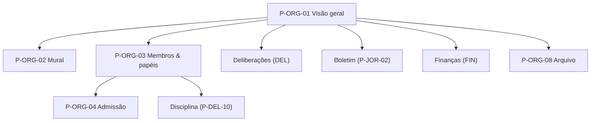

# 07/02 — Panorama, navegação e organismos (NAV/ORG)

| | |
|---|---|
| **Status** | rascunho |
| **Última atualização** | 2026-08-11 |
| **Depende de** | [07 — Páginas (índice)](README.md), [00-design-system](00-design-system.md), [02 — Domínio §2](../02-modelo-de-dominio.md), [03 — Cripto §6–7](../03-arquitetura-criptografica.md) |
| **Público** | designers e engenheiros ([técnico]) com seções [conceitual] |

> Esta área é a **casa** do produto: a navegação por compartimento (UX1) e a vida dentro de um organismo. Aqui a compartimentação deixa de ser lógica e vira experiência — cada tela pertence a **um** organismo, com sua cor de identidade (design system §3), e nada atravessa a fronteira sem o seletor (P-NAV-03). O gabarito de 9 pontos ([README §5](README.md)) rege cada página.

---

## Estrutura de um compartimento [conceitual]

Todo organismo (célula, comissão, comitê, fração, congresso, direção) compartilha esta espinha (doc 02 §2.2). O que difere entre subtipos é **quais superfícies aparecem** (uma comissão pode não coletar cotização; um congresso é temporário) e **quais ações o seu papel habilita** (UX3).

---

## P-NAV-01 — Panorama

1. **Objetivo.** Dar um ponto de partida que reúne **apenas o que você tem direito de ver** — sem virar feed social.
2. **Quem chega.** Todo usuário autenticado, ao abrir o app.
3. **Funcionalidades.** Resumo por compartimento (o que há de novo em cada organismo seu: deliberações abertas, resoluções descidas, correspondência); atalho ao Jornal central (publicações descidas); pendências que **exigem sua ação** (votar antes do prazo, prestar contas de mandato).
4. **Dinâmica.** É uma **superfície agregadora** — a exceção formal declarada no [README §3.4](README.md) à regra de compartimento único. Cada item leva ao seu organismo e assume a cor daquele compartimento. Ordena por urgência de ação (prazos), não por "engajamento". **Regra de conteúdo dos cartões:** identidade do organismo + contagens + tipos + prazos + o **título mínimo** de uma pendência acionável ("1 votação com prazo hoje: eleição de delegado") — **nunca** trecho de mensagem de mural/correspondência, nunca handles de terceiros. Custo assumido: uma captura expõe o mapa de filiações *do próprio usuário* — mitigado por app-lock, retenção local e o **modo discreto** opcional (cores sem nomes de organismo).
5. **Experiência e layout.** Sem chrome de compartimento fixo (o Panorama é transversal); cada cartão traz a cor do organismo de origem. Sem contadores de curtida/visualização (D1). `HonestyCallout` inicial some após onboarding (política de repetição do design system §11).
6. **Estados.** Vazio (recém-admitido, sem pendências — explica o need-to-know); offline (mostra o último sincronizado, enfileira ações); rekey em algum organismo (sinaliza no cartão).
7. **Restrições.** UX1 (não é feed social); UX3 (pendências seguem mandato); need-to-know.
8. **Aberto.** —

## P-NAV-02 — Meus organismos

1. **Objetivo.** Ver e navegar a árvore dos compartimentos a que **eu** pertenço.
2. **Quem chega.** Usuário querendo trocar de contexto ou ver sua posição na estrutura.
3. **Funcionalidades.** Lista/árvore dos meus organismos (a célula-base — I1 — mais comissões, frações e destinos de mandato); cada um com sua cor e tipo; entrada no compartimento.
4. **Dinâmica.** Mostra **só os organismos de que sou membro** — não a organização inteira (isso é P-ORG-07, e mesmo lá, limitado). A árvore aqui é a **minha** vizinhança na estrutura.
5. **Experiência e layout.** Ícones de tipo de organismo (design system §9); cor de identidade por item; a célula-base destacada (é única, I1).
6. **Estados.** Um único organismo (recém-entrante); pendente de admissão em algum (P-ON-07); organismo suspenso/dissolvido (esmaecido).
7. **Restrições.** I1 (uma célula-base), I2 (árvore); UX2 (não correlaciona meus handles entre organismos na exibição).
8. **Aberto.** —

## P-NAV-03 — Seletor de compartimento

1. **Objetivo.** Tornar a **troca de organismo** um gesto deliberado e sentido (a ação de segurança central da navegação).
2. **Quem chega.** Usuário em qualquer tela, via shell.
3. **Funcionalidades.** Abrir o seletor; escolher outro organismo meu; transição explícita de compartimento.
4. **Dinâmica.** Ao trocar, a **espinha muda de cor** (design system §3) com movimento curto perceptível — "você cruzou uma fronteira". O conteúdo do compartimento anterior é descarregado da tela (não coexiste).
5. **Experiência e layout.** Componente `CompartmentSwitcher` do shell; respeita `prefers-reduced-motion` (vira cross-fade).
6. **Estados.** Só um compartimento (seletor inativo); troca durante ação não salva (avisa/enfileira o rascunho).
7. **Restrições.** UX1 (compartimentação topológica); D2.
8. **Aberto.** —

## P-NAV-04 — Busca escopada

1. **Objetivo.** Encontrar conteúdo **dentro do compartimento atual** — nunca uma busca global de pessoas.
2. **Quem chega.** Usuário dentro de um organismo.
3. **Funcionalidades.** Buscar em deliberações, publicações, correspondência e membros **do organismo atual**; filtros por tipo/estado.
4. **Dinâmica.** A busca é **escopada** (UX1): não há índice global cross-organismo nem busca de pessoas pela organização. Busca de membro é local ao organismo e por handle local.
5. **Experiência e layout.** Campo dentro do compartimento; resultados na cor do compartimento; deixa explícito o escopo ("buscando em: Célula A").
6. **Estados.** Sem resultados; conteúdo fora do meu acesso (não indexado — não aparece nem como "existe mas bloqueado", para não vazar).
7. **Restrições.** UX1, UX2 (sem busca global de pessoas); A3 (não construir índice que reconstrua grafo).
8. **Aberto.** —

## P-NAV-05 — Avisos locais

1. **Objetivo.** Notificar sem push que ligue pseudônimo a conta real.
2. **Quem chega.** Todo usuário.
3. **Funcionalidades.** Central de avisos **locais** (novas deliberações, prazos, resoluções descidas, pedidos de prestação de contas); alimentada por **polling sobre Tor**.
4. **Dinâmica.** **Nunca push (FCM/APNs)** — o device token liga o pseudônimo a uma conta real e vaza timing (doc 06 §5/§9). O polling é consciente de bateria (design system §10) — e a **latência do polling entra na margem dos prazos** exibidos (classe "ação com prazo", design system §7): um prazo nunca aparece mais folgado do que o aviso consegue alcançar.
5. **Experiência e layout.** `LocalNoticeCenter` do shell; cada aviso leva ao seu compartimento (com a cor de origem).
6. **Estados.** Offline (acumula ao voltar); polling pausado por bateria (informa).
7. **Restrições.** doc 06 §5/§9 (sem push); UX7 (polling sobre Tor).
8. **Aberto.** Custo de bateria/tráfego do polling sobre Tor (doc 06 §9).

---

## P-ORG-01 — Visão geral do organismo

1. **Objetivo.** A porta de um compartimento: estado e atalhos.
2. **Quem chega.** Membro do organismo, via P-NAV-02/03 ou de um aviso.
3. **Funcionalidades.** Resumo (mural recente, deliberações abertas, próximos prazos); atalhos às superfícies (membros, deliberações, boletim, finanças, arquivo) conforme o subtipo e o meu papel.
4. **Dinâmica.** As superfícies visíveis dependem do **subtipo** e as ações, do **papel** (UX3). Cabeçalho de compartimento com cor de identidade e EpochIndicator.
5. **Experiência e layout.** `CompartmentHeader`; cartões de atalho; TrustChip explicando o que o servidor vê deste organismo (destino, horários) vs. o que fica cifrado (conteúdo).
6. **Estados.** Recém-admitido (need-to-know: sem histórico); suspenso/dissolvido; rekey.
7. **Restrições.** doc 02 §2.2; UX3; UX6 (TrustChip presente).
8. **Aberto.** —

## P-ORG-02 — Mural / feed do organismo

1. **Objetivo.** A conversa corrente do organismo — mensageria E2E do grupo.
2. **Quem chega.** Membros do organismo.
3. **Funcionalidades.** Ler e escrever mensagens (mensagens de aplicação MLS, doc 03 §6/§7); ver autoria **por handle interno**; anexos cifrados; ver resoluções descidas de cima (dentro do `escopo_vinculacao`, I13).
4. **Dinâmica.** Cada mensagem é um envelope: **conteúdo cifrado** (MLS ratchet); autoria **atribuída por handle entre membros** (doc 03 §6.1, design system §4) e, perante o servidor, autorizada por credencial de membro — o servidor não aprende **qual dos N membros** escreveu (com o residual do roster dito no ExposurePanel). **Integridade do feed [DEP-08]:** o cliente confere o feed contra adulteração (replay/lacuna/reordenação/equivocação) e alerta — mas a mecânica exata está **em reprojeto**: o formato vigente do doc 03 §6.1 (`contador` por remetente em claro) contradiz a autoria anônima (nota de revisão no próprio doc 03); o que a tela fixa é o **resultado** (anomalia detectada → alerta), não o mecanismo. **Resolução vinculante** de um organismo superior aparece aqui como item especial (reembalagem/relay — [DEP-01]).
5. **Experiência e layout.** `HandleChip` na autoria; TrustChip permanente com classes ("Cifrado · o servidor vê: destino, quando, tamanho, posição na sequência") → `MetadataDisclosure` com a enumeração completa do cabeçalho real (design system §2); item de resolução descida usa `ResolutionAta` (link para P-DEL-09).
6. **Estados.** Need-to-know (sem histórico anterior à entrada — EmptyState explica); rekey (envio brevemente travado); anomalia de cadeia (alerta de possível equivocação — doc 06 A5); offline (enfileira).
7. **Restrições.** doc 03 §6/§7; I13 (vinculação desce dentro da subárvore); UX2; UX6.
8. **Aberto.** [DEP-01] propagação descendente; [DEP-08] transcrição do envelope × autoria anônima.

## P-ORG-03 — Membros e papéis

1. **Objetivo.** Ver a composição do organismo e os papéis do buro — com a **fonte** de cada poder.
2. **Quem chega.** Membros; ações extras para quem tem papel/mandato.
3. **Funcionalidades.** Lista de membros (handles locais); papéis (secretário, tesoureiro, agitprop; titular/suplente em dirigentes); **proveniência** de cada papel (qual deliberação o atribuiu). Iniciar deliberação de atribuição/revogação de **papel** ou **disciplinar** — sempre via deliberação. **Admissão é regime distinto** (autoridade única, alinhada a P-ORG-04 e doc 03 §4): a *elegibilidade* vem do convite; a *execução* (`Commit Add`) é do papel autorizado pela política do estatuto — não exige deliberação por entrada.
4. **Dinâmica.** **Não há botão "remover" nem "promover"** (UX4): papéis são **atribuídos e revogados por deliberação com quórum** (doc 02 §2.2), e sanções pelo rito disciplinar (I11). A tela conduz à deliberação apropriada (P-DEL-02/P-DEL-10). O `RoleBadge` sempre mostra a fonte (mandato/deliberação) e o prazo, quando aplicável. EmptyState de **papel vago**: *"esta célula está sem secretário eleito — abrir eleição"* (o desbloqueio existe no domínio; a UI o conduz).
5. **Experiência e layout.** `HandleChip` + `RoleBadge` por membro; ações de "propor atribuição/revogação/admissão/disciplina" só aparecem para quem pode iniciá-las, levando a uma deliberação — nunca a uma mutação direta.
6. **Estados.** Membro pendente (P-ON-07); membro afastado/desligado (estado do domínio, com a resolução de origem, I11); época em transição.
7. **Restrições.** UX3, UX4; I6 (sem superusuário); I11 (papel/sanção por deliberação); doc 06 A3 (o `papel` é metadado sensível — a exibição é interna ao organismo).
8. **Aberto.** Grau de exposição do `papel` ao servidor até as credenciais anônimas plenas (doc 06 A3).

## P-ORG-04 — Admissão de membro

1. **Objetivo.** Efetivar a entrada de um convidado como membro (o passo que P-ON-07 espera).
2. **Quem chega.** Secretário/papel autorizado da célula; ou o organismo em lote (ex.: credenciamento de congresso).
3. **Funcionalidades.** Rever pendentes; admitir (executa `Commit Add` no grupo MLS, doc 03 §7.2); **admissão em lote** (um `Commit` para muitos — I9, evita O(n²)).
4. **Dinâmica.**

Admissão é, por I11-espírito, um ato do organismo; para célula, o secretário costuma executá-la, mas a **elegibilidade** vem do convite (doc 03 §4). Novo membro **não** recebe o histórico (need-to-know).
5. **Experiência e layout.** Lista de pendentes com o organismo de destino do convite; ação de admitir em lote com seleção múltipla; EpochIndicator anima na conclusão.
6. **Estados.** Sem pendentes; admissão em lote parcial; falha de Commit (retenta); admitido com deliberação aberta no organismo (explica a **inelegibilidade** naquela deliberação — o censo congelou na abertura, I12).
7. **Restrições.** doc 03 §4/§7.2; I9 (lote); need-to-know.
8. **Aberto.** —

## P-ORG-05 — Criar organismo

1. **Objetivo.** Criar um novo organismo na posição correta da árvore.
2. **Quem chega.** Papel/mandato competente (a criação de sub-organismos deriva de deliberação do organismo que os cria — doc 02 §2.2).
3. **Funcionalidades.** Escolher subtipo (célula, **comitê**, comissão, fração); definir `pai` na árvore (I2); herdar/sobrepor estatuto (P-ORG-06); para **fração**, registrar o `pai` como o **comitê coordenador** e as células de origem como relação à parte (`fracao_alimentada_por`) — preservando I1/I2. Para **comitê**: criar ≠ compor — a criação (por deliberação da instância que o institui) apenas abre o organismo; sua **composição** vem de eleições nas instâncias inferiores (P-MAN-01), porque seus membros são mandatos (doc 02 §2.2). Congresso e direção **não** nascem aqui (congresso → P-MAN-06; direção → eleita pelo congresso).
4. **Dinâmica.** A criação respeita a árvore (I2, sem ciclos) e I1 (fração não é célula-base de ninguém). Célula nova escolhe o **`subtipo_celula`** (`trabalho`/`territorio`/`setor` — doc 02 §2.2, a escolha C.4 do doc 01), exibido depois no `CompartmentHeader`. O novo grupo MLS nasce com seus membros iniciais (um `Commit` de composição).
5. **Experiência e layout.** Assistente por passos; diagrama da posição na árvore antes de confirmar; `ConfirmDestructive` não se aplica (é criação), mas confirma a posição.
6. **Estados.** Violação de invariante bloqueada com explicação (ex.: tentar dar dois `pai`); criação em curso.
7. **Restrições.** I1, I2; doc 02 §2.2 (subtipos e fração).
8. **Aberto.** Se frações deliberam vinculante ou só coordenam (doc 02 §7) — afeta as superfícies da fração.

## P-ORG-06 — Configuração do organismo

1. **Objetivo.** Ajustar os parâmetros locais (estatuto herdado/sobreposto).
2. **Quem chega.** Papel/mandato competente; mudanças que **vinculam** passam por deliberação (UX4).
3. **Funcionalidades.** Ver o estatuto herdado da organização **completo** (doc 02 §2.3: quórum por tipo, regra de maioria, duração/teto de mandatos, **proporção de delegados por número de membros**, **política de convites**, tamanho mínimo/máximo de célula); **sobrepor** onde permitido (`estatuto_local`). A **reforma do estatuto global** não acontece aqui — é deliberação da instância competente (presumivelmente congresso), registrada como pendência de domínio (estatuto versionado — [revisao-critica-2.md](../revisao-critica-2.md)).
4. **Dinâmica.** Distinção clara: **preferências locais não-vinculantes** podem ser ajustadas pelo papel; **parâmetros que afetam validade de decisões** (quórum, maioria) só mudam por **deliberação** (I8, UX4). O tamanho de célula pode ser **imposto pelo servidor** (doc 06 §8.3), não só sugerido.
5. **Experiência e layout.** Formulário que marca cada parâmetro como "local" ou "requer deliberação"; o segundo grupo abre uma proposta (P-DEL-02) em vez de salvar direto.
6. **Estados.** Parâmetro travado pela organização (não sobreponível); pendente de deliberação.
7. **Restrições.** I8 (quórum vincula); UX3/UX4; doc 06 §8.3 (tamanho imponível).
8. **Aberto.** Quais parâmetros são sobreponíveis localmente vs. fixos pela organização.

## P-ORG-07 — Árvore da organização

1. **Objetivo.** Situar-se na estrutura **sem vazar a filiação alheia**.
2. **Quem chega.** Membros querendo entender a organização; dirigentes.
3. **Funcionalidades.** Ver o **esqueleto** de organismos que você tem direito de ver (tipicamente sua subárvore e a cadeia até a raiz); **não** ver os membros de organismos dos quais não participa.
4. **Dinâmica.** Correção honesta (A3): a árvore de organismos é metadado sensível. A UI mostra a **estrutura** que seu papel autoriza, **nunca** a composição de células alheias. A visão é derivada do que você pode legitimamente conhecer, não um organograma total.
5. **Experiência e layout.** Diagrama de árvore com os nós visíveis; nós fora do seu alcance aparecem como "existe um ramo aqui" no máximo, sem membros — ou nem isso, conforme o papel.
6. **Estados.** Visão mínima (militante de base vê pouco além da sua célula e a cadeia acima); visão ampla (dirigente eleito, dentro do mandato).
7. **Restrições.** A3 (grafo de filiação é o ativo mais exposto); I2; UX1.
8. **Aberto.** Política exata de visibilidade da estrutura por papel (interage com credenciais anônimas, doc 06 A3).

## P-ORG-08 — Arquivo durável

1. **Objetivo.** Acessar a **memória** do organismo (atas, resoluções, jornal legível no tempo), separada da higiene de chave do transporte.
2. **Quem chega.** Membros com acesso ao arquivo — **concedido por deliberação**, não automático.
3. **Funcionalidades.** Ler o arquivo re-cifrado sob a **chave de arquivo do organismo** (versionada, doc 03 §7.3); buscar atas/resoluções antigas.
4. **Dinâmica.** O MLS dá forward secrecy ao **transporte**; a **memória** vive numa camada separada (doc 03 §7.3) — apagar transporte antigo (bom para FS) não apaga a memória. O acesso de um membro ao passado é **decisão explícita do organismo** (need-to-know), não efeito colateral de guardar chaves antigas.
5. **Experiência e layout.** Superfície distinta do mural (é "memória", não "conversa"); indica claramente que é o registro durável e quem tem acesso.
6. **Estados.** Sem acesso concedido (EmptyState explica que é preciso deliberação); arquivo vazio; versão de chave de arquivo em rotação.
7. **Restrições.** doc 03 §7.3; need-to-know; I10 (resoluções imutáveis no arquivo).
8. **Aberto.** Camada de arquivo durável sobre MLS (doc 03 §10) — bloqueia detalhes finais.

## P-ORG-09 — Estado de época / rekey

1. **Objetivo.** Dar feedback honesto quando a composição do grupo muda (entrada/saída → novo epoch).
2. **Quem chega.** Todos os membros, de forma passiva (é um estado, não uma página navegada isoladamente — vive no shell e nas superfícies).
3. **Funcionalidades.** Sinalizar rekey em curso (`Commit`); explicar em [conceitual] o que aconteceu ("a composição mudou; quem saiu perde o futuro — PCS").
4. **Dinâmica.** Entrada/saída avança o epoch (I9) via `Commit` autenticado; durante a transição, o envio pode travar brevemente. Remoção corta o futuro do removido (PCS, doc 03 §7).
5. **Experiência e layout.** `EpochIndicator` no `CompartmentHeader`; micro-explicação sob demanda (D5). Sem jargão imposto.
6. **Estados.** Rekey em curso; concluído; falha (retenta, informa).
7. **Restrições.** I9; doc 03 §7 (Commit autenticado, PCS).
8. **Aberto.** —

## P-ORG-10 — Convites do organismo

1. **Objetivo.** Emitir e gerir os convites que P-ON-02 consome — a torneira do funil de entrada (defesa anti-Sybil A6).
2. **Quem chega.** Quem a **política de convites do estatuto** autoriza (doc 02 §2.3 — tipicamente o secretário; a página lê a política de P-ORG-06, não a hardcoda).
3. **Funcionalidades.** Emitir código de convite assinado (com organismo de destino e validade — doc 03 §4); listar convites emitidos e seus estados; **revogar** convite não usado; expiração automática.
4. **Dinâmica.** O convite é entregue **fora da banda** (pessoalmente/canal já seguro) — a página gera o artefato, não o transporta. **O log de emissão/revogação vive dentro do compartimento** (cifrado no grupo da célula), nunca no servidor em claro: com validação cegada [DEP-03], um registro server-side recriaria exatamente o grafo de recrutamento que o cegamento esconde (doc 06 A3). Esse log interno é também a âncora de auditoria contra o limite declarado de A6 (secretário cunhando convites): a célula vê quantos convites seu secretário emitiu.
5. **Experiência e layout.** Lista com estado por convite (ativo/usado/expirado/revogado); emissão como cerimônia curta com aviso de entrega segura; chip de confiança condicionado ao estado do cegamento ([DEP-03], mesmo regime de P-ON-02).
6. **Estados.** Sem convites; limite da política atingido; convite usado (link ao pendente em P-ORG-04); revogado.
7. **Restrições.** doc 03 §4; A6; A3 (log intra-compartimento); UX3 (capacidade vem da política do estatuto).
8. **Aberto.** [DEP-03] convite cegado — muda a validação e o chip; formato exato do artefato de convite.

## Decisões em aberto da área

- **[DEP-01] Propagação descendente** (P-ORG-02): mecanismo de reembalagem/relay (revisao-critica §2-A).
- **[DEP-08] Transcrição do envelope × autoria anônima** (P-ORG-02): em reprojeto no doc 03 §6.1.
- **[DEP-03] Convite cegado** (P-ORG-10): esquema e metadado residual.
- **[DEP-12] Arquivo durável sobre MLS** (P-ORG-08): camada a especificar (doc 03 §10).
- **Visibilidade da estrutura por papel** (P-ORG-07): política fina, ligada às credenciais anônimas (A3).
- **Frações deliberam ou só coordenam** (P-ORG-05): doc 02 §7.
- **Ciclo de vida do organismo** (dissolução/fusão/divisão; transferência de célula-base; saída voluntária): operações de **domínio ainda não modeladas** — registradas em [revisao-critica-2.md](../revisao-critica-2.md); nenhuma página as improvisa.

## Referências

- [doc 02 §2](../02-modelo-de-dominio.md) (organismo, membros, papéis, invariantes); [doc 03 §6–7](../03-arquitetura-criptografica.md) (envelope, MLS, arquivo).
- [Design system](00-design-system.md) — `CompartmentHeader`, `CompartmentSwitcher`, `HandleChip`, `RoleBadge`, `EpochIndicator`, `TrustChip`.
