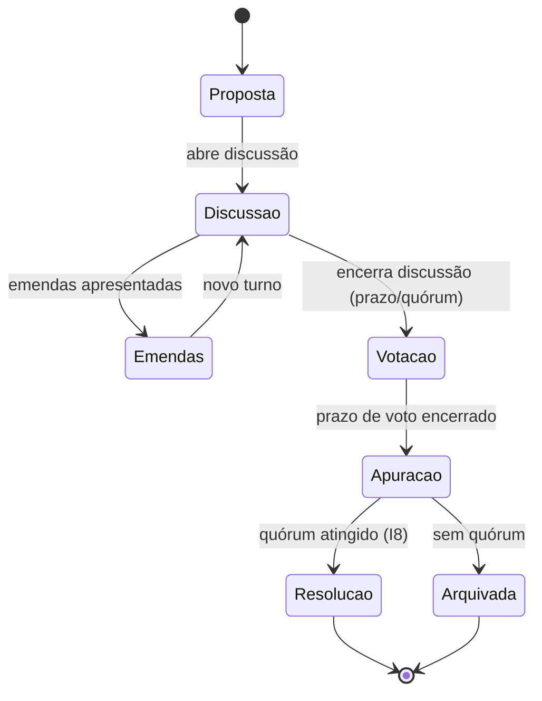
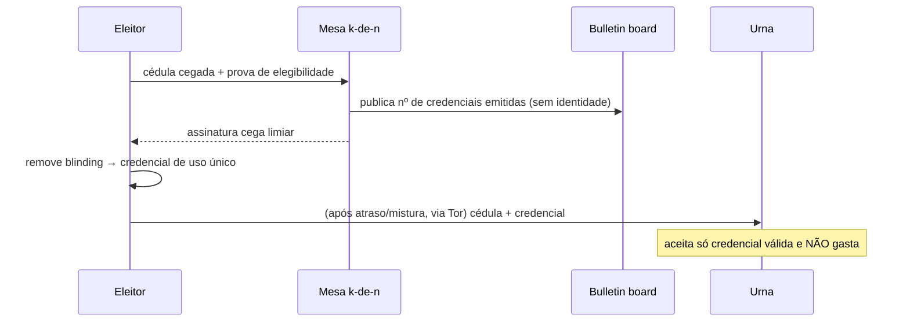

# 07/03 — Deliberação e voto (DEL)

| | |
|---|---|
| **Status** | rascunho |
| **Última atualização** | 2026-08-11 |
| **Depende de** | [07 — Páginas (índice)](README.md), [00-design-system](00-design-system.md), [02 — Domínio §2.5–2.6, §4](../02-modelo-de-dominio.md), [03 — Cripto §8](../03-arquitetura-criptografica.md), [ADR-0006](../decisoes/adr-0006-voto-secreto-assinatura-cega.md), [ADR-0009](../decisoes/adr-0009-disciplina-como-deliberacao.md) |
| **Público** | designers e engenheiros ([técnico]) com seções [conceitual] |

> O coração do produto: a transformação do **centralismo democrático em máquina de estados** (P4). Discussão **precede** o voto; o quórum **vincula** (I8); a resolução **desce** (I13); a sanção é **desfecho de deliberação, não botão** (I11). O voto tem dois modos com mecânicas criptográficas distintas (doc 03 §8) e limites honestos que a UI **diz no ponto de uso** (UX6): nenhum esquema resiste a **coação/venda de voto**, e o MVP **não** é verificável ponta a ponta. O gabarito de 9 pontos ([README §5](README.md)) rege cada página.

---

## Ciclo de vida (a máquina de estados) [conceitual]

O componente `DeliberationStepper` (design system §8) materializa esta máquina no topo de toda tela de deliberação — a pessoa sempre sabe em que fase está e o que vem a seguir. **Ao abrir a deliberação, o censo eleitoral congela** (I12, literal): a composição elegível vira o "caderno" e não muda até a apuração — quem é admitido durante a discussão **não vota nesta deliberação** (coerente com need-to-know: não leu o debate; e fecha a janela de encher a assembleia no meio de uma deliberação viva, A2/A6). *(Uma flexibilização — re-abertura do censo por deliberação do próprio organismo, só até abrir a votação — está proposta como ADR em [revisao-critica-2.md](../revisao-critica-2.md); até ela existir, vale I12 literal.)*

---

## P-DEL-01 — Lista de deliberações do organismo

1. **Objetivo.** Ver as deliberações do organismo por estado e agir nas que exigem você.
2. **Quem chega.** Membros do organismo.
3. **Funcionalidades.** Listar por fase (proposta, discussão, emendas, votação, apuração, resolvida, arquivada); filtrar por tipo (consultiva, deliberativa, eleição, disciplinar); destacar **prazos** e "precisa do seu voto".
4. **Dinâmica.** Ordena por urgência de ação, não por atividade. Cada item mostra a fase (`DeliberationStepper` compacto) e o prazo.
5. **Experiência e layout.** Dentro do compartimento (cor do organismo); `QuorumMeter` compacto nas que estão em votação/apuração.
6. **Estados.** Vazio; deliberação com prazo estourando (destaque); need-to-know (não vê deliberações anteriores à sua entrada).
7. **Restrições.** doc 02 §4.1; UX3 (ações seguem elegibilidade).
8. **Aberto.** —

## P-DEL-02 — Nova proposta

1. **Objetivo.** Abrir uma deliberação com as regras corretas herdadas do estatuto.
2. **Quem chega.** Membro elegível a propor (conforme estatuto/papel).
3. **Funcionalidades.** Definir tipo (`consultiva`/`deliberativa`/`eleicao`); **modo de voto** (`aberto` ou `secreto`); ver **quórum** e **regra de maioria** herdados (I8, não editáveis livremente); prazos por fase; texto da proposta.
4. **Dinâmica.** **Abrir a deliberação congela o censo** (I12) — a tela diz isso na confirmação de abertura. O `modo_voto` determina a mecânica adiante (doc 03 §8): `aberto` → commit-reveal (P-DEL-05); `secreto` → credencial cega + urna (P-DEL-06/07). O quórum/maioria vêm do `estatuto_local` (P-ORG-06); alterá-los é outra deliberação, não um campo livre aqui (UX4).
5. **Experiência e layout.** Assistente por passos; `HonestyCallout` ao escolher `secreto`: *"O voto secreto protege o sigilo perante o sistema, mas exige canal anônimo (Tor) e **não** protege contra coação."*
6. **Estados.** Rascunho; parâmetro travado pelo estatuto (explica); sem elegibilidade para propor.
7. **Restrições.** I8 (quórum/maioria); doc 02 §2.5; P4 (haverá discussão antes do voto).
8. **Aberto.** —

## P-DEL-03 — Fase de discussão

1. **Objetivo.** Discutir **antes** de votar — e permitir o agrupamento de posições (a "liberdade de discussão" do P4).
2. **Quem chega.** Membros do organismo.
3. **Funcionalidades.** Debater (mensagens atribuídas por handle interno); **agrupar tendências/plataformas** (doc 01 C.1) — posições nomeadas às quais membros se alinham; referenciar a proposta e emendas.
4. **Dinâmica.** A discussão é **obrigatória antes da votação** (P4). O `TendencyGroup` permite que posições se organizem sem virar facção proibida — o sistema implementa a **unidade de ação após a decisão**, não o silenciamento antes dela (doc 01 C.1). *(Ressalva de projeto: o domínio ainda não tem entidade de Tendência/Plataforma — doc 01 C.1; a UI a desenha como agrupamento de discussão, e o backend a fixa ou a promessa é suavizada.)*
5. **Experiência e layout.** Fio de discussão + painel de tendências; TrustChip (cifrado; servidor vê metadado). Autoria por `HandleChip`.
6. **Estados.** Discussão aberta; encerrando (prazo/quórum de discussão); sem tendências (só debate livre).
7. **Restrições.** P4; doc 01 C.1; UX2 (handles internos).
8. **Aberto.** Entidade de Tendência/Plataforma no domínio (doc 01 C.1).

## P-DEL-04 — Fase de emendas

1. **Objetivo.** Emendar a proposta com rastreio de versões.
2. **Quem chega.** Membros elegíveis.
3. **Funcionalidades.** Apresentar emendas; versionar; abrir **novo turno** de discussão sobre a emenda; consolidar o texto que irá a voto.
4. **Dinâmica.** Emendas podem devolver à discussão (loop `Emendas → Discussao`, máquina de estados). O texto final que vai a voto é o consolidado.
5. **Experiência e layout.** `AmendmentThread` com diff de versões; deixa claro **qual texto** será votado.
6. **Estados.** Emenda em discussão; consolidada; retirada.
7. **Restrições.** doc 02 §4.1.
8. **Aberto.** —

## P-DEL-05 — Votação aberta (commit-reveal)

1. **Objetivo.** Voto nominal simultâneo — para deliberações ordinárias e a tradição da votação nominal em congressos.
2. **Quem chega.** Membros elegíveis (censo congelado, I12).
3. **Funcionalidades.** **Commit:** publicar `BLAKE2b("partido-voto-commit-v1" || voto || sal)` assinado, com `sal` aleatório ≥128 bits; **Reveal:** após o prazo, revelar `voto || sal`; qualquer um confere.
4. **Dinâmica.** Garante **simultaneidade, não sigilo** (por isso é o modo *aberto*/nominal). **Aborto seletivo tratado** (doc 03 §8.1): quem retém o reveal para negar quórum é penalizado — não-reveal no prazo conta como **abstenção registrada**.
5. **Experiência e layout.** `OpenBallot` em dois tempos (commit, depois reveal), com o `DeliberationStepper` mostrando a fase; `HonestyCallout`: *"Este voto é nominal — fica registrado quem votou o quê."* O sal é gerado pelo cliente (a pessoa não digita nada frágil).
6. **Estados.** Aguardando commit; janela de reveal; não-revelado (vira abstenção); apuração.
7. **Restrições.** doc 03 §8.1; I5 (um voto por membro); I12 (censo congelado).
8. **Aberto.** —

## P-DEL-06 — Voto secreto: preparo da cédula

1. **Objetivo.** Preparar e cegar a cédula, obtendo a credencial de voto — **com gate fail-closed**.
2. **Quem chega.** Eleitor elegível numa deliberação de modo `secreto`.
3. **Funcionalidades.** Preparar a cédula; **cegá-la** (blinding); apresentar prova de elegibilidade (credencial de membro) à **mesa distribuída k-de-n**; coletar as **k coassinaturas cegas** → credencial de voto de uso único.
4. **Dinâmica.** A elegibilidade é separada do conteúdo (doc 03 §8.2). A emissão é **distribuída k-de-n** — nenhuma mesa isolada cunha credenciais (corrige A9). *Honestidade sobre o esquema [DEP-09]:* "assinatura limiar de RSA cega" não existe como padrão/artefato auditado; a direção registrada é **k assinaturas RFC 9474 independentes de mesas distintas (k > n/2, conjunto de signatários uniforme por eleição** — se cada eleitor escolhesse seu subconjunto, o padrão de assinantes o marcaria). A cerimônia coleta k respostas, e a UI mostra o progresso. **Gate fail-closed (UX7):** sem canal anônimo confirmado, o cliente **recusa** prosseguir (`FailClosedBlocker`) — não há "prosseguir mesmo assim".
5. **Experiência e layout.** `Ceremony` de voto (focada); `SecretBallot`; **sem** chip "Anônimo" neste passo — a mesa confere elegibilidade e unicidade, logo **sabe que você pediu credencial** (o anonimato nasce no depósito, P-DEL-07); o chip aqui é "Exposto: a mesa registra que você se credenciou; sua cédula permanece cega". `HonestyCallout` central: *"O sistema não liga seu voto a você. Ele **não** te protege se alguém te obriga a provar como votou (coação/venda de voto)."* (doc 06 §5).
6. **Estados.** **Fail-closed** (bloqueia, explica); **coletando k de n** (mesa parcialmente disponível); credencial emitida; elegibilidade recusada; mesa indisponível (→ P-DEL-11, estados de falha).
7. **Restrições.** UX7; I5/I12; A9 (emissão distribuída); doc 03 §8.2.
8. **Aberto.** [DEP-09] esquema de emissão k-de-n + bibliotecas DKG/VSS + parâmetros de mistura.

## P-DEL-07 — Voto secreto: depósito na urna

1. **Objetivo.** Depositar a cédula na urna de forma não-correlacionável.
2. **Quem chega.** Eleitor com credencial de voto (de P-DEL-06).
3. **Funcionalidades.** Depositar cédula cifrada + credencial na urna **via Tor**, após **atraso/mistura** (lote); a urna aceita só credencial válida e **ainda não gasta** (uso único).
4. **Dinâmica.**

**Sigilo depende de canal anônimo + mistura** (doc 03 §8.2): sem atraso, "credenciado em T1 / depositou em T1+δ" correlaciona voto→pessoa mesmo sobre Tor. Por isso o cliente é fail-closed e há mistura obrigatória — e o depósito agendado cai em **janelas de lote com aleatorização** (nunca offset determinístico por usuário, que recorrelacionaria emissão→depósito). **Prazo × mistura (regra que faltava):** o prazo de **emissão de credencial** encerra antes do fechamento da **urna**, com período de graça ≥ atraso máximo de mistura — P-DEL-01/06 exibem o **"último horário seguro para votar"** (prazo − atraso máximo); voto iniciado depois disso é recusado *antes* de credenciar, nunca perdido em silêncio.
5. **Experiência e layout.** `UrnDeposit`; mostra o estado da mistura/atraso honestamente ("aguardando janela de mistura"); nunca sugere que é instantâneo. Estado persistente e re-entrante em linguagem [conceitual]: *"credencial emitida; sua cédula **ainda não** está na urna"* — a pessoa sempre sabe responder "votei ou não votei?". Depósito agendado sobrevive ao fechamento do app com aviso local (P-NAV-05).
6. **Estados.** Aguardando janela de mistura; depositado; **fail-closed** (Tor caiu com credencial emitida — bloqueia e **preserva** o estado re-entrante); credencial já gasta (erro claro); janela perdida (declara "não depositado", conta como credencial não utilizada — nunca finge sucesso; classe "ação com prazo", design system §7).
7. **Restrições.** UX7; doc 03 §8.2 (Tor + mistura + uso único); A9; I12 (os dois sub-prazos entram nos `prazos` por fase do doc 02 §2.5 — toque leve de domínio sinalizado).
8. **Aberto.** [DEP-09] Parâmetros de mistura/atraso e das janelas de lote.

## P-DEL-08 — Apuração e bulletin board

1. **Objetivo.** Apurar por decifração limiar e tornar a integridade **conferível** — dentro dos limites honestos do MVP.
2. **Quem chega.** Escrutinadores (mandato eleitoral) operam; membros conferem o bulletin board.
3. **Funcionalidades.** Ao fim, **decifração limiar** da urna (nenhum escrutinador reconstrói a chave — DKG/VSS); publicar resultado; **bulletin board em três números**, todos agregados e sem identidade: **censo** (elegíveis congelados, I12), **credenciais emitidas** (≤ censo — violação = fraude da mesa), **cédulas depositadas** (≤ emitidas — violação = forja); a diferença emitidas−depositadas é declarada como *"credenciais não utilizadas (abstenção ou janela perdida)"* — credencial expirada **continua contando** em "emitidas" (são não-rastreáveis; nunca se decrementa).
4. **Dinâmica.** A integridade não é de parte única (correção A9): sobre-emissão vira **detectável** (emitidas × censo). **Duas honestidades declaradas:** (a) o MVP **não** é verificável ponta a ponta (doc 03 §8.3) — o eleitor não confere que *seu* voto entrou; (b) a contagem agregada **não detecta** cunhagem em nome de abstencionistas dentro do censo — limite herdado da fonte, coberto pelo rótulo "não verificável E2E". A conferência **por-entrada pública foi deliberadamente recusada** (tornaria a *não-participação* verificável — um coator poderia exigir e conferir abstenção); a direção registrada é **auto-verificação privada** da própria entrada ("não pedi credencial mas consto como credenciado" → alarme com disputa via escrutinadores) — [DEP-09]/[revisao-critica-2.md](../revisao-critica-2.md).
5. **Experiência e layout.** `BulletinBoardPanel` (censo · emitidas · depositadas); `HonestyCallout` firme: *"Você pode conferir que não houve mais credenciais que eleitores, nem mais cédulas que credenciais. Você **não** pode, nesta versão, conferir que o seu voto específico foi contado."* (doc 03 §8.3).
6. **Estados.** Apurando; publicado; discrepância emitidas×censo ou depositadas×emitidas (alerta de possível fraude — A9); **mesa/escrutinadores incompletos** (menos de k disponíveis — a apuração não trava para sempre: estado terminal "apuração impossível" com caminho de deliberação que declara a eleição falhada e reconvoca, censo re-congelado, **nenhuma decifração parcial**); quórum não atingido → arquivada.
7. **Restrições.** I5/I12; A9; doc 03 §8.2/§8.3 (limite de verificabilidade declarado).
8. **Aberto.** [DEP-09]; verificabilidade E2E (Helios/Belenios) — evolução (doc 03 §8.3, doc 06 §9); auto-verificação privada da própria entrada.

## P-DEL-09 — Resolução (ata)

1. **Objetivo.** Registrar a decisão como **ata assinada e imutável** e fazê-la descer aos organismos vinculados.
2. **Quem chega.** Membros do organismo; e, por propagação, os organismos subordinados no `escopo_vinculacao`.
3. **Funcionalidades.** Gerar a resolução (`texto`, `orgao`, `escopo_vinculacao`, `substitui`, assinatura do organismo, timestamp); **encadeamento** de correções via `substitui` (I10); propagação descendente (I13).
4. **Dinâmica.** Só é **vinculante** se a deliberação atingiu quórum e maioria (I8). É **imutável** (I10): correção é uma **nova** resolução apontando para a anterior. O `escopo_vinculacao ⊆ descendentes do orgao` (I13) — **com a ressalva do congresso [DEP-07]**: na árvore atual do doc 02 o congresso não tem descendentes, e I13 literal o deixaria sem vincular ninguém; a emenda (reposicionar a árvore ORG→Congresso→CC, fiel ao doc 01 A.7, ou exceção tipada) está pendente, e esta tela desenha o resultado pretendido. A **assinatura do organismo** depende do esquema coletivo a fixar (ex.: FROST) — cerimônia agnóstica [DEP-02]. A propagação a organismos-filhos usa reembalagem/relay [DEP-01].
5. **Experiência e layout.** `ResolutionAta` — cartão de ata com selo de assinatura, cadeia `substitui` visível, e o `escopo_vinculacao` explícito ("obriga: Célula A, Célula B"). Nos organismos-filhos, aparece no mural (P-ORG-02) como item de resolução descida.
6. **Estados.** Vinculante; substituída (mostra o elo); em propagação; sem quórum (não vira resolução — arquivada).
7. **Restrições.** I8, I10, I13; doc 02 §2.6; dependências: assinatura do organismo (FROST) e propagação descendente (README §7).
8. **Aberto.** Esquema de assinatura do organismo; mecânica de propagação descendente (revisao-critica §2-A).

## P-DEL-10 — Deliberação disciplinar

1. **Objetivo.** Aplicar sanção (censura, afastamento, desligamento) **só como desfecho de deliberação com quórum e com devido processo** — nunca por botão.
2. **Quem chega.** Membros do organismo competente (a **regra de competência** — qual instância pode sancionar quem — é pendência de domínio nomeada; ver §8).
3. **Funcionalidades.** Abrir deliberação disciplinar (tipo próprio — proposta de domínio, ver §8); **rito de devido processo mínimo**, imposto pela máquina de estados: (a) **notificação** ao acusado na abertura (aviso local prioritário); (b) **espaço de defesa** garantido na fase de discussão (o acusado fala antes do voto); (c) posição do acusado no censo definida e visível (participa do quórum? vota? — a fixar no domínio, exibida sempre); (d) **apelação à instância superior** registrada como caminho na resolução. Ao aprovar com quórum, o sistema **executa** a transição de estado e a exclusão criptográfica correspondente.
4. **Dinâmica.** I11/[ADR-0009](../decisoes/adr-0009-disciplina-como-deliberacao.md): qualquer transição que restrinja direitos **só é válida** como consequência de deliberação com quórum — fecha o "superusuário oculto". Sem defesa e recurso, porém, o rito registraria uma **máquina de expurgo** — e a tradição citada no doc 01 tinha instâncias de recurso; por isso o devido processo é parte da spec, não cortesia. O **desligamento** implica remoção de todas as filiações e revogação de todos os mandatos, com avanço de época. A exclusão é *executada* pelo sistema, *decidida* pela deliberação. A revogação da **credencial anônima** do desligado (para que não continue autorizando envios) é dependência aberta do doc 03 §10 — sinalizada, não improvisada.
5. **Experiência e layout.** Mesmo fluxo de deliberação (não uma tela de "admin"); a fase de defesa é visualmente distinta no `DeliberationStepper`; `ConfirmDestructive` só na execução pós-quórum; a resolução de origem (e o estado da apelação) ficam ligados ao estado do membro (visível em P-ORG-03).
6. **Estados.** Em notificação; em defesa/discussão; em votação; aprovada → executando exclusão/rekey; rejeitada; **em apelação**; recall associado (se atinge mandatos, ver MAN).
7. **Restrições.** I11, I6 (sem superusuário), ADR-0009; I9 (época avança no desligamento).
8. **Aberto.** Modelo de sanção no domínio (estado "censura", tipo de deliberação disciplinar, **regra de competência**, posição do acusado no censo, rito de apelação — ADR-0009 §Consequências deixa "direito de defesa?" em aberto; consolidado em [revisao-critica-2.md](../revisao-critica-2.md)); revogação de credencial anônima na saída (doc 03 §10).

## P-DEL-11 — Constituição da mesa e da urna

1. **Objetivo.** Constituir a infraestrutura que todo voto secreto pressupõe: a **mesa k-de-n** (emissão de credenciais) e os **escrutinadores com a chave da urna** (DKG/VSS) — a precondição que P-DEL-06/07/08 consomem e nenhuma outra tela criava.
2. **Quem chega.** O organismo que abre a eleição secreta; os eleitos para a mesa/escrutínio.
3. **Funcionalidades.** Eleger os n da mesa e os escrutinadores (**mandato eleitoral** — reusa a deliberação `eleicao`, P-MAN-01); conduzir a **cerimônia DKG/VSS** (geração distribuída da chave da urna — nenhum participante conhece a chave inteira, doc 03 §8.2), com progresso por participante; publicar no bulletin board o **conjunto de signatários da eleição** (uniforme para todos os eleitores — [DEP-09]); registrar k e n.
4. **Dinâmica.** A cerimônia é multi-parte e humana: a UI a conduz passo a passo, com estados de espera por participante. **Estados de falha desenhados** (é o que faltava): participante ausente na cerimônia (recomeça com substituto eleito), *share* perdido antes da apuração (ver P-DEL-08 — "apuração impossível" com reconvocação; nunca decifração parcial). **Mesa mínima viável** para células pequenas (3–15): parâmetros k/n do estatuto com piso de segurança — decisão em aberto do domínio.
5. **Experiência e layout.** `Ceremony` multi-parte com progresso por pessoa ("3 de 5 shares gerados"); cada participante vê só o próprio share (need-to-know); vocabulário [conceitual] na superfície ("mesa", "urna lacrada por várias chaves"), técnico a um toque (D5).
6. **Estados.** Elegendo mesa; cerimônia em curso (aguardando participante X); constituída (eleições secretas habilitadas); falha (recomeçar); share comprometido (reconstituir antes de nova eleição).
7. **Restrições.** A9 (a distribuição é a correção central); I3 (mesa/escrutínio são mandatos eleitos); doc 03 §8.2.
8. **Aberto.** [DEP-09] bibliotecas DKG/VSS e esquema k-de-n; parâmetros k/n mínimos por tamanho de organismo (estatuto).

## Decisões em aberto da área

- **[DEP-02] Assinatura do organismo** (P-DEL-09): esquema coletivo (FROST) a fixar.
- **[DEP-01] Propagação descendente** (P-DEL-09): reembalagem/relay (revisao-critica §2-A).
- **[DEP-07] Congresso × I13** (P-DEL-09): emenda pendente (árvore ou exceção tipada).
- **[DEP-09] Voto** (P-DEL-06/07/08/11): esquema de emissão k-de-n, DKG/VSS, mistura; caminho a verificabilidade E2E; auto-verificação privada da entrada no censo.
- **Entidade de Tendência/Plataforma** (P-DEL-03): domínio (doc 01 C.1).
- **Modelo de sanção e devido processo** (P-DEL-10): estado "censura", tipo disciplinar, competência, apelação (revisao-critica-2).

## Referências

- [doc 02 §2.5–2.6, §4](../02-modelo-de-dominio.md); [doc 03 §8](../03-arquitetura-criptografica.md); [ADR-0006](../decisoes/adr-0006-voto-secreto-assinatura-cega.md); [ADR-0009](../decisoes/adr-0009-disciplina-como-deliberacao.md).
- [Design system](00-design-system.md) — `DeliberationStepper`, `OpenBallot`, `SecretBallot`, `UrnDeposit`, `BulletinBoardPanel`, `QuorumMeter`, `ResolutionAta`, `TendencyGroup`.
