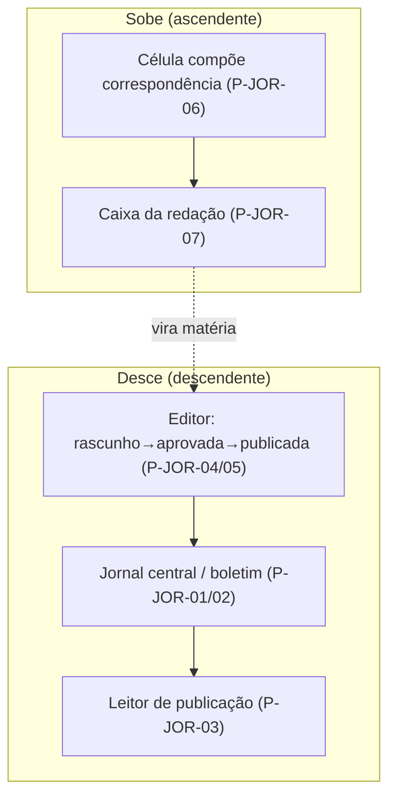
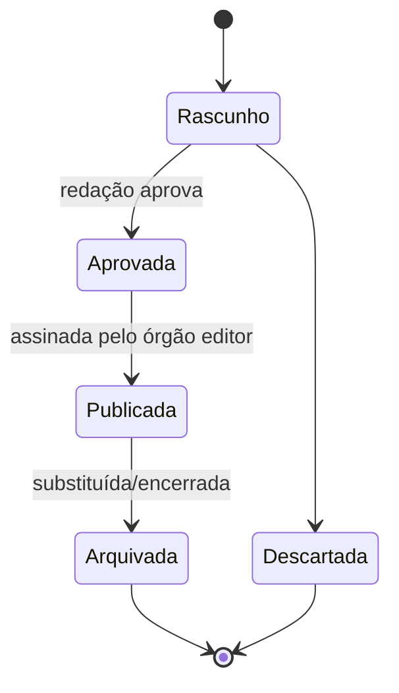

# 07/05 — Jornal, publicações e correspondência (JOR)

| | |
|---|---|
| **Status** | rascunho |
| **Última atualização** | 2026-08-11 |
| **Depende de** | [07 — Páginas (índice)](README.md), [00-design-system](00-design-system.md), [02 — Domínio §2.4, §4.2](../02-modelo-de-dominio.md), [03 — Cripto §6](../03-arquitetura-criptografica.md) |
| **Público** | designers e engenheiros ([técnico]) com seções [conceitual] |

> O jornal é **o organizador coletivo** (P5, M2): não uma rede social, mas o aparato editorial que dá unidade política à organização. Seu traço decisivo é o **fluxo bidirecional** — a **correspondência sobe** da base para a redação; a **publicação assinada desce** para toda a rede. O "Jornal" não é uma entidade própria: é uma **visão** das `Publicacao` agrupadas por `orgao_editor` e `escopo` (doc 02 §2.4). A única exceção à regra "tudo cifrado" vive aqui: a publicação de escopo `publico` (I7). O gabarito de 9 pontos ([README §5](README.md)) rege cada página.

---

## O circuito do jornal [conceitual]

Ciclo de vida de uma publicação (doc 02 §4.2):

---

## P-JOR-01 — Jornal central

1. **Objetivo.** Ler a linha e as resoluções da organização — a visão das publicações da **redação** que descem para a base.
2. **Quem chega.** Militantes (escopos internos que lhes cabem); leitor externo só o `publico` (P-ON-12).
3. **Funcionalidades.** Listar publicações da redação por escopo/edição; abrir uma publicação (P-JOR-03); acompanhar a linha e o registro auditável das resoluções (P5).
4. **Dinâmica.** É uma **visão** (não entidade): agrupa `Publicacao` cujo `orgao_editor` é a redação da organização (doc 02 §2.4). Serve também de **registro auditável** da linha (P5).
5. **Experiência e layout.** Modo leitura (tipografia serifada, design system §5.4); transversal, mas cada item traz a cor do organismo editor. Sem métricas de engajamento (D1).
6. **Estados.** Offline (lê o baixado); escopo além do meu acesso (não listado); assinatura inválida (alerta).
7. **Restrições.** P5; I7 (público legível; internos cifrados); UX1 (não é feed social).
8. **Aberto.** —

## P-JOR-02 — Boletim do organismo

1. **Objetivo.** Ler as publicações do **próprio organismo** (o boletim local).
2. **Quem chega.** Membros do organismo.
3. **Funcionalidades.** Listar/abrir publicações cujo `orgao_editor` é este organismo; escopos `interno_organismo`/`interno_organizacao`/`publico`.
4. **Dinâmica.** Mesma natureza de visão (doc 02 §2.4), filtrada pelo organismo atual. O agitprop costuma produzir o boletim (papel, doc 01 A.8).
5. **Experiência e layout.** Dentro do compartimento (cor do organismo); modo leitura.
6. **Estados.** Vazio (sem boletim ainda); need-to-know (não vê edições anteriores à entrada).
7. **Restrições.** doc 02 §2.4; UX1.
8. **Aberto.** —

## P-JOR-03 — Leitor de publicação

1. **Objetivo.** Ler uma publicação com **escopo e assinatura verificáveis**.
2. **Quem chega.** Militantes (todos os escopos que lhes cabem); leitor externo (só `publico`).
3. **Funcionalidades.** Renderizar o corpo; **verificar a assinatura** do `orgao_editor` (selo); mostrar o `escopo_circulacao`; para `publico`, funciona sem conta (P-ON-12).
4. **Dinâmica.** Publicação `publico` é a **única exceção formal** à regra "tudo cifrado" (I7, ADR-0003): assinada e legível. Escopos internos são cifrados para o organismo destinatário e só abrem para membros.
5. **Experiência e layout.** `PublicationReader` com selo de "assinatura verificada"; TrustChip declara o escopo ("Interno à organização — cifrado" vs. "Público — assinado e legível por qualquer um").
6. **Estados.** Assinatura verificada/inválida; escopo sem acesso; arquivada (marca como "substituída/encerrada" — rótulo da transição do doc 02 §4.2; a `Publicacao` **não** tem elo de sucessão no domínio, então nenhum "link à sucessora" é inventado aqui).
7. **Restrições.** I7; assinatura do órgão editor (ADR-0003; a imutabilidade de *resoluções* é I10 — não se aplica a publicações); doc 02 §2.4.
8. **Aberto.** —

## P-JOR-04 — Editor de publicação

1. **Objetivo.** Redigir e conduzir uma publicação pela máquina de estados até a assinatura do órgão editor.
2. **Quem chega.** Agitprop/redação (papel que edita).
3. **Funcionalidades.** Compor `titulo`/`corpo`; escolher `escopo_circulacao` (`ScopeSelector`: `publico`/`interno_organizacao`/`interno_organismo`); enviar para aprovação (P-JOR-05); ao aprovar, **assinar pelo órgão editor** e publicar.
4. **Dinâmica.** Estados `rascunho→aprovada→publicada→arquivada` (doc 02 §4.2). A assinatura é do **organismo editor** (não pessoal) — depende do esquema de assinatura coletiva a fixar (FROST — README §7). Escolher `publico` dispara aviso: sairá **em claro** (I7).
5. **Experiência e layout.** Editor com o `ScopeSelector` em destaque e `HonestyCallout` no escopo `publico`: *"Isto será legível por qualquer pessoa, para sempre — inclusive fora da organização."*
6. **Estados.** Rascunho; aguardando aprovação; publicada; descartada; arquivada.
7. **Restrições.** doc 02 §2.4/§4.2; I7 (público em claro); estados da máquina editorial do doc 02 §4.2 (I10 é de resoluções, não de publicações); [DEP-02] assinatura do organismo (FROST); **[DEP-01]** para o escopo `interno_organizacao`: não existe "o grupo da organização inteira" — a entrega desse escopo depende do mesmo mecanismo de relay das resoluções.
8. **Aberto.** Esquema de assinatura do órgão editor (FROST — README §7).

## P-JOR-05 — Fila editorial

1. **Objetivo.** A redação aprova (ou devolve) rascunhos antes da publicação.
2. **Quem chega.** Redação/comissão de agitprop.
3. **Funcionalidades.** Ver rascunhos submetidos; aprovar (→ `aprovada`) ou devolver com observações; encaminhar para assinatura/publicação.
4. **Dinâmica.** É o passo `Rascunho→Aprovada` da máquina de estados (doc 02 §4.2), sob responsabilidade da redação. A aprovação editorial não é sanção nem deliberação vinculante — é curadoria do órgão.
5. **Experiência e layout.** `EditorialQueue`: lista de rascunhos com estado; ação de aprovar/devolver.
6. **Estados.** Fila vazia; item devolvido; aprovado.
7. **Restrições.** doc 02 §4.2; UX3 (só a redação vê a fila).
8. **Aberto.** —

## P-JOR-06 — Correspondência: compositor

1. **Objetivo.** Compor um **informe que sobe** da base para a redação ou a instância superior.
2. **Quem chega.** Qualquer membro/organismo (o fluxo ascendente é rotina — M10).
3. **Funcionalidades.** Redigir `corpo` (cifrado); escolher `destino` (redação ou instância superior); anexar; assinar e enviar.
4. **Dinâmica.** Modela o fluxo ascendente do centralismo (M10): o que acontece na fábrica/no bairro sobe. Reutilizado pela **prestação de contas** de mandato (P-MAN-04). **Honestidade sobre o mecanismo [DEP-04]:** o remetente **não é membro** do grupo MLS do destino (redação/instância superior) — no formato vigente do doc 03 §6 ele não produz a `prova_membro` nem cifra para o ratchet do destino; o envio cross-organismo depende do ADR de **mensageria entre organismos** (ex.: chave caixa-postal certificada pelo grupo). A tela fixa o resultado (o informe chega ao destino e só a ele); o chip diz "cifrado para: Redação" **sem** prometer o mecanismo.
5. **Experiência e layout.** `CorrespondenceComposer`; TrustChip (cifrado para o destino); deixa claro **quem** vai ler (o destino), não "todo mundo".
6. **Estados.** Rascunho; enviado; recebido/apreciado.
7. **Restrições.** M10; doc 02 §2.4; doc 03 §6.
8. **Aberto.** —

## P-JOR-07 — Correspondência: caixa da redação

1. **Objetivo.** Receber e curar os informes que sobem, para virarem matéria.
2. **Quem chega.** Redação/agitprop.
3. **Funcionalidades.** Ver correspondências recebidas; triar; **converter** um informe em rascunho de publicação (liga o circuito sobe→desce).
4. **Dinâmica.** Fecha o circuito bidirecional: a correspondência que sobe (P-JOR-06) alimenta a publicação que desce (P-JOR-04). A curadoria respeita a compartimentação — a redação vê o que lhe foi endereçado. *Lacuna sinalizada:* esta caixa é **da redação**; a correspondência genérica ao destino "instância superior" (que P-JOR-06 oferece) ainda não tem caixa própria — generalizar esta página para "caixa de correspondência do organismo" (visível conforme papel) é ajuste previsto, dependente de [DEP-04].
5. **Experiência e layout.** Caixa de entrada da redação; ação "transformar em matéria" leva ao editor (P-JOR-04).
6. **Estados.** Sem correspondências; triadas; convertidas.
7. **Restrições.** M2/M10; doc 02 §2.4.
8. **Aberto.** —

## Decisões em aberto da área

- **[DEP-02] Assinatura do órgão editor** (P-JOR-04): esquema coletivo (FROST).
- **[DEP-01] Entrega do escopo `interno_organizacao`** (P-JOR-01/04): sem grupo "organização inteira", depende do relay das resoluções.
- **[DEP-04] Mensageria entre organismos** (P-JOR-06/07): mecanismo do envio ascendente; caixa genérica da instância superior.
- **Granularidade de tarefas** dentro do organismo (doc 02 §7): se a correspondência carrega tarefas atribuíveis ou se vira entidade própria.

## Referências

- [doc 02 §2.4, §4.2](../02-modelo-de-dominio.md); [doc 03 §6](../03-arquitetura-criptografica.md); [doc 01 A.1, A.8, M2/M10](../01-fundamentos-leninistas.md).
- [Design system](00-design-system.md) — `PublicationReader`, `PublicationEditor`, `EditorialQueue`, `CorrespondenceComposer`, `ScopeSelector`, `ResolutionAta`.
