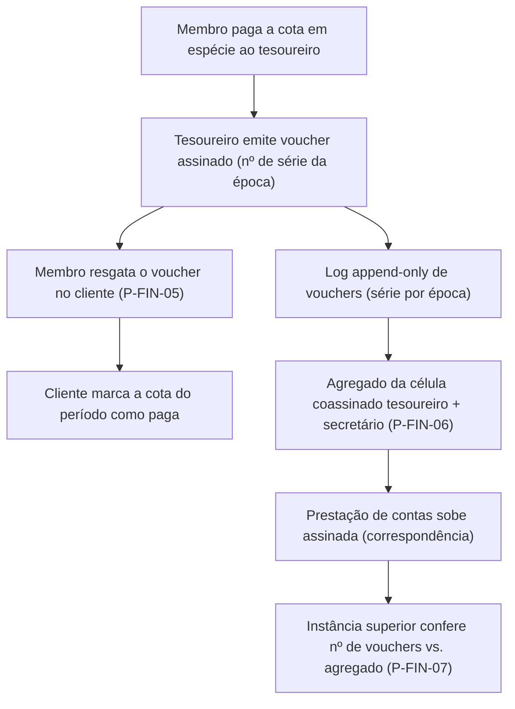

# 07/06 — Finanças e cotização (FIN)

| | |
|---|---|
| **Status** | rascunho |
| **Última atualização** | 2026-08-11 |
| **Depende de** | [07 — Páginas (índice)](README.md), [00-design-system](00-design-system.md), [05 — Financiamento](../05-financiamento.md), [02 — Domínio §2.4](../02-modelo-de-dominio.md), [06 — Ameaças A8](../06-modelo-de-ameacas.md) |
| **Público** | todos ([conceitual]) + engenheiros/designers ([técnico]) |

> A cotização é a **base material da independência** (M14, doc 01 A.12). Esta área tem uma assimetria central: quer-se **anonimato de quem paga** e **transparência de quem recebe**. E tem um *default* de segurança **jurídico**: quando a organização é **partido registrado**, o **modo anônimo é ilegal** e o software **não o oferece** (doc 05 §2) — um disclaimer não neutraliza um default que entrega espécie anonimizada chave-na-mão. O adversário aqui é interno: o **tesoureiro que desvia** (A8) — e a auditoria é ancorada **fora** dele. O gabarito de 9 pontos ([README §5](README.md)) rege cada página.

---

## O ciclo do voucher [conceitual]

O servidor participa apenas dos passos L–G — e mesmo neles **não lê os valores**: os agregados sobem **cifrados** (envelope do doc 03; norma do doc 05 §4 — o §5 do doc 05, "o servidor vê os passos L–G", deve ser lido como *vê que houve prestação*, não o conteúdo; tensão de redação sinalizada na origem). O vínculo "pessoa → pagamento" existe **apenas offline, com o tesoureiro** — como na cotização histórica. Nunca "pessoa → valor" no servidor.

---

## P-FIN-01 — Painel de finanças do organismo

1. **Objetivo.** Ver a saúde financeira do organismo **em agregado** — jamais pessoa→valor.
2. **Quem chega.** Membros (agregado); tesoureiro/secretário (ações).
3. **Funcionalidades.** Mostrar totais por período (arrecadado, nº de cotizações/vouchers); estado da prestação de contas; atalhos para emitir/resgatar/prestar contas conforme o papel.
4. **Dinâmica.** Só **agregados** por organismo (doc 05 §3/§4). A compartimentação vale para finanças: o tesoureiro sabe o detalhe; as instâncias superiores veem o agregado.
5. **Experiência e layout.** `AggregatePanel` — números do coletivo, nunca uma lista "quem pagou quanto". TrustChip exato nas duas direções (D3): *"O servidor **não lê** os totais (sobem cifrados); vê **que** este organismo prestou contas, e quando. Quem lê os números é a instância destinatária. Quem pagou nunca sobe."*
6. **Estados.** Sem movimentações; prestação de contas em atraso; regime não declarado (bloqueia modos até P-FIN-08).
7. **Restrições.** doc 05 §3/§4 (só agregado, nunca pessoa→valor); M5 (compartimentação financeira).
8. **Aberto.** —

## P-FIN-02 — Minha cotização

1. **Objetivo.** Ver e cumprir minha cota do período.
2. **Quem chega.** Membro militante.
3. **Funcionalidades.** Ver o valor/estado da cota; pagar pelo modo disponível (transparente P-FIN-03 ou voucher P-FIN-05, conforme o regime); histórico das minhas cotas **local ao dispositivo**.
4. **Dinâmica.** O modo ofertado depende do **regime** (P-FIN-08). O estado "paga" no cliente resulta do resgate do voucher (D) ou do registro transparente.
5. **Experiência e layout.** `CotizationStatus`; o histórico é local (o servidor não guarda "pessoa→valor").
6. **Estados.** Em dia; em atraso; modo anônimo indisponível (regime de partido — explica).
7. **Restrições.** doc 05 §2 (regime gera o modo); privacidade do pagador.
8. **Aberto.** —

## P-FIN-03 — Pagamento transparente (PIX/transferência)

1. **Objetivo.** Contribuir de forma identificada — o **default** para partido registrado.
2. **Quem chega.** Membro, quando o regime exige transparência (ou por escolha).
3. **Funcionalidades.** Instruções de PIX/transferência identificada; registro do rastro contábil completo; conciliação com a cota.
4. **Dinâmica.** Modo **transparente é o padrão** para partido registrado (doc 05 §2): doações de origem não identificada são vedadas (Leis 9.096/1995 e 9.504/1997; resoluções do TSE). Rastro contábil total. **Lacuna sinalizada:** a prestação de contas legal (TSE) exige um **livro identificado pessoa→valor com recibos** — que o desenho E2E recusa guardar no servidor por construção; onde vive esse livro (com o tesoureiro? sistema contábil externo? camada local exportável?) é decisão em aberto ([revisao-critica-2.md](../revisao-critica-2.md), item jurídico) — esta tela não a improvisa.
5. **Experiência e layout.** Fluxo claro de PIX; `HonestyCallout`: *"Neste regime, a contribuição é identificada por exigência legal — o anonimato do pagador não é oferecido."*
6. **Estados.** Pendente; conciliado; falha de conciliação.
7. **Restrições.** doc 05 §2 (base legal); transparência do recebedor.
8. **Aberto.** Integração contábil/fiscal (doc 05 §6).

## P-FIN-04 — Emissão de voucher

1. **Objetivo.** O tesoureiro emite um voucher contra pagamento em espécie — **com auditoria ancorada fora dele**.
2. **Quem chega.** Tesoureiro (papel eleito e **revogável** — A8/I11); fora do regime de partido registrado.
3. **Funcionalidades.** Emitir voucher assinado com **nº de série da época**; registrar no **log append-only** de vouchers; preparar o agregado para coassinatura (P-FIN-06).
4. **Dinâmica.** A auditoria **não** recai só no tesoureiro (correção da revisão, A8): o **log append-only** (série por época) e a **coassinatura do secretário** permitem conferir "nº de vouchers ↔ agregado". Sem essas âncoras, o voucher é só um recibo do tesoureiro, não prestação de contas.
5. **Experiência e layout.** `VoucherIssue`; mostra a série corrente e o log; `RegimeGate` bloqueia esta tela se a organização é partido registrado (doc 05 §2).
6. **Estados.** Regime bloqueia (partido registrado); emitido; log em rotação de época.
7. **Restrições.** doc 05 §4/§5; A8 (auditoria fora do tesoureiro); I11 (papel revogável).
8. **Aberto.** Formato e antifraude do voucher — token de uso único contra duplo-resgate (doc 05 §6).

## P-FIN-05 — Resgate de voucher

1. **Objetivo.** O membro resgata o voucher e marca a cota como paga.
2. **Quem chega.** Membro que pagou em espécie e recebeu o voucher.
3. **Funcionalidades.** Inserir/ler o voucher; validar a assinatura e a série; marcar a cota do período como paga (local).
4. **Dinâmica.** O passo C–D do ciclo. O voucher é um **instrumento ao portador** (doc 05 §5): a UI alerta que copiá-lo/perdê-lo antes do resgate é arriscado (gastável por terceiros).
5. **Experiência e layout.** `VoucherRedeem`; `HonestyCallout`: *"Guarde o voucher como dinheiro até resgatá-lo — quem o tiver, pode usá-lo."*
6. **Estados.** Válido/resgatado; inválido; já resgatado (duplo-resgate barrado — token de uso único).
7. **Restrições.** doc 05 §5; anonimato do pagador (o resgate não revela ao servidor quem pagou).
8. **Aberto.** Antifraude de duplo-resgate sem revelar o pagador (doc 05 §6).

## P-FIN-06 — Prestação de contas

1. **Objetivo.** Fechar o agregado **coassinado** e fazê-lo subir — com honestidade sobre o limite de confiança.
2. **Quem chega.** Tesoureiro + secretário (coassinatura); a célula.
3. **Funcionalidades.** Consolidar o agregado (total, nº de vouchers); **coassinar** (tesoureiro + secretário); enviar como **correspondência** (P-JOR-06) à instância superior.
4. **Dinâmica.** A coassinatura e o log de série tornam o desvio **detectável** — mas a UI é honesta sobre o **limite** (doc 06 A8): *colusão* tesoureiro+secretário volta a esconder o desvio; a defesa final é a **rotação** e a prestação conferível. Não se promete "à prova de fraude".
5. **Experiência e layout.** `AccountabilityReport` com as duas assinaturas; `HonestyCallout` medido: *"A coassinatura e o log tornam o desvio detectável — não impossível. Se tesoureiro e secretário combinarem, some do radar; por isso os papéis são revogáveis e rotativos."* (doc 06 A8).
6. **Estados.** Aguardando segunda assinatura; enviada; discrepância log×agregado (alerta).
7. **Restrições.** doc 05 §4/§5; A8 (limite declarado, sem superpromessa); I11 (revogabilidade).
8. **Aberto.** —

## P-FIN-07 — Conferência

1. **Objetivo.** A instância superior confere a prestação de contas sem ver o pagador.
2. **Quem chega.** Instância superior (comitê/comissão de finanças).
3. **Funcionalidades.** Receber o agregado coassinado; conferir **nº de vouchers ↔ agregado** contra o log de série; sinalizar discrepâncias.
4. **Dinâmica.** Fecha o loop de auditoria (G): confere o total sem revelar quem pagou (a identidade do pagador nunca subiu). Discrepância aciona apreciação (possível deliberação/recall do tesoureiro).
5. **Experiência e layout.** Painel de conferência: agregado vs. contagem do log; ação de sinalizar/abrir apreciação.
6. **Estados.** Conforme; discrepante (destaque, caminho para deliberação); coassinatura ausente (rejeita).
7. **Restrições.** doc 05 §5; A8; nunca pessoa→valor.
8. **Aberto.** —

## P-FIN-08 — Regime financeiro

1. **Objetivo.** Declarar o enquadramento da organização — o que **decide o default** e **bloqueia** o modo anônimo quando ilegal.
2. **Quem chega.** Direção/comissão competente (por deliberação — é decisão da organização, doc 05 §2).
3. **Funcionalidades.** Declarar o regime (partido registrado vs. associação/coletivo não registrado); o sistema aplica o default: **partido registrado → transparente é padrão, anônimo bloqueado**; fora disso → anônimo disponível **com aviso** das obrigações (DME, PLD/UIF — doc 05 §2).
4. **Dinâmica.** O software **escolhe o default pelo enquadramento declarado** (doc 05 §2) — não deixa a critério silencioso. `RegimeGate` é o mecanismo que P-FIN-04/05 consultam.
5. **Experiência e layout.** Declaração com `HonestyCallout` firme sobre a consequência legal de cada escolha; a mudança de regime é **deliberação** (UX4), não um botão do operador.
6. **Estados.** Não declarado (bloqueia modos); partido registrado (anônimo bloqueado); não registrado (anônimo com avisos).
7. **Restrições.** doc 05 §2 (default seguro; base legal); UX4/UX6; A8.
8. **Aberto.** Tendência regulatória internacional sobre pagamento anônimo (doc 05 §2) — reforça tratar como estudo, não promessa.

## Decisões em aberto da área

- **Antifraude do voucher** (P-FIN-04/05): token de uso único sem revelar o pagador (doc 05 §6).
- **Livro identificado do modo transparente** (P-FIN-03): onde vive o registro pessoa→valor + recibos que a lei exige e o servidor E2E recusa — decisão jurídica/arquitetural (revisao-critica-2).
- **[DEP-04] Prestação de contas cross-organismo** (P-FIN-06/07): mesmo mecanismo pendente da correspondência.
- **Despesas** (saída de dinheiro): o doc 05 só modela entrada; lançamentos de despesa (append-only, coassinados — A8 desvia na saída) são domínio novo registrado em revisao-critica-2.
- **Plugins futuros** (fora do MVP): GNU Taler (ideal conceitual, quando houver operador/liquidez) e Monero (doc 05 §4/§6).
- **Integração contábil** do modo transparente (doc 05 §6).

## Referências

- [doc 05](../05-financiamento.md) (todo); [doc 06 A8](../06-modelo-de-ameacas.md); [doc 02 §2.4](../02-modelo-de-dominio.md) (correspondência).
- [Design system](00-design-system.md) — `AggregatePanel`, `CotizationStatus`, `VoucherIssue`, `VoucherRedeem`, `AccountabilityReport`, `RegimeGate`.
