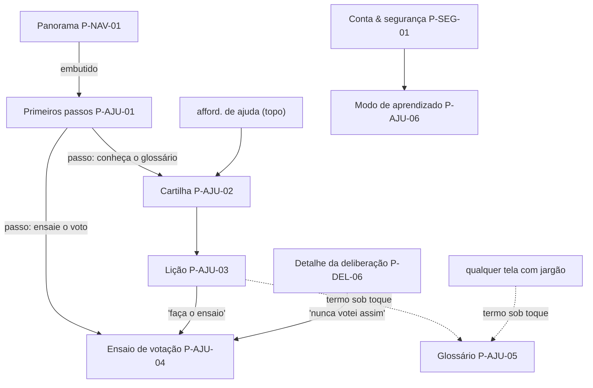

# 07/09 — Ajuda e aprendizado (AJU)

| | |
|---|---|
| **Status** | rascunho |
| **Última atualização** | 2026-08-11 |
| **Depende de** | [07 — Páginas (índice)](README.md), [00-design-system §11](00-design-system.md), [03 — Cripto §8 (voto)](../03-arquitetura-criptografica.md), [06 — Ameaças §5/§8](../06-modelo-de-ameacas.md), [GLOSSARIO](../../GLOSSARIO.md) |
| **Público** | designers e engenheiros ([técnico]) com seções [conceitual] |

> Esta é uma plataforma para **todo mundo** — não só para quem já sabe o que é uma chave pública ou por que existe voto secreto. A área de aprendizado existe para que a curva de entrada não seja um muro, **sem** mentir sobre segurança para parecer mais fácil (UX6). Regra que atravessa a área inteira: **ensinar nunca pode enfraquecer nem simular falsamente a proteção**. A cartilha diz na cara que ler não dá proteção nova; o ensaio de voto não toca a rede nem gera cédula real; o glossário explica sem prometer o que o sistema não entrega. O gabarito de 9 pontos ([README §5](README.md)) rege cada página.

---

## Por que uma área só para isto [conceitual]

Três problemas concretos que a auditoria de usabilidade levantou, e a resposta de cada um:

1. **"Não sei nem por onde começar."** → **Primeiros passos** (P-AJU-01): uma lista curta de 3–4 gestos que se marcam sozinhos quando você os faz, embutida no Panorama. Não é um tutorial que bloqueia a tela; é um trilho opcional que some quando você não precisa mais.
2. **"O app usa palavras que eu não conheço" — jargão como *época*, *urna*, *credencial*.** → duas defesas: a interface **traduz** o jargão no ponto de uso (o design system troca "época" por **"fechadura"**, por exemplo), e todo termo técnico remanescente vira um **termo sob toque** (P-AJU-05) — sublinhado pontilhado que abre uma explicação de uma frase sem tirar você da tela.
3. **"Tenho medo de errar numa coisa séria como votar."** → **Ensaio de votação** (P-AJU-04): praticar todos os passos do voto secreto **sem cédula real, sem rede, nada vale**. Aprende-se o gesto sem risco de estragar uma decisão real.

E um princípio que não é página, mas rege todas: a honestidade **não pode virar paisagem**. Avisos que aparecem sempre iguais deixam de ser lidos (a "cegueira a banners", [design system §11](00-design-system.md)). Por isso o **modo de aprendizado** (P-AJU-06) mostra os avisos por extenso para quem chega e os encolhe para quem já os viu — a proteção não muda, só a verbosidade.

## Onde isto vive na navegação [técnico]

A área de aprendizado é **transversal e pessoal** (§3.1 do README): não pertence a nenhum compartimento, é escopada à pessoa e ao aparelho, e é alcançada de vários pontos.

Princípios de fluxo: **nada aqui é obrigatório e nada bloqueia** o uso real (você pode ignorar a cartilha para sempre); o aprendizado é **acessível do ponto de dúvida** (o ensaio nasce ao lado do botão de votar de verdade, não escondido num menu); e o material é **local** — o que você leu, marcou ou ensaiou fica no aparelho, o servidor não sabe que você é novata (isso seria um metadado de vulnerabilidade; ver [Restrições](#restrições-transversais-da-área)).

---

## P-AJU-01 — Primeiros passos (checklist de integração)

1. **Objetivo.** Dar à pessoa recém-admitida um trilho curto e opcional para os primeiros gestos, sem tomar conta da tela.
2. **Quem chega.** Membro recém-admitido (vindo de P-ON-07 → Panorama), em modo *recém-chegada* (P-AJU-06).
3. **Funcionalidades.** Lista de 3–4 itens acionáveis, cada um levando ao lugar certo: *conheça os organismos* (abre o seletor P-NAV-03), *veja o que o sistema não esconde* (abre Exposição P-SEG-06), *ensaie o voto secreto* (abre P-AJU-04), *entenda o que o servidor vê no mural* (abre a divulgação de metadados do mural). Botão **dispensar**.
4. **Dinâmica.** Cada item se marca **sozinho** quando o gesto é concluído (voltar do ensaio marca "ensaie o voto"). Concluídos ou dispensados todos, o cartão some do Panorama e não volta (estado local). Contador "0 de 4".
5. **Experiência e layout.** Cartão no topo do Panorama, **acima** dos organismos, com a mesma linguagem sóbria (D1) — sem confete, sem gamificação. Cada linha: caixa de marcação + título curto + uma dica de uma linha ("toque no nome do grupo, no alto"). Alvos ≥ 44 px; a marcação anuncia "passo concluído" na região `aria-live`.
6. **Estados.** *Recém-chegada* (visível) × *veterana* (oculto, P-AJU-06); parcialmente concluído; dispensado (permanente até reset de app). Offline: todos os itens que levam a superfícies locais funcionam.
7. **Restrições.** [Design system §11](00-design-system.md) (anti-cegueira: some quando cumprido); UX1 (agrega só o que é seu, não é feed). **Não** persiste no servidor (Restrições da área).
8. **Aberto.** Conjunto final e ordem dos itens; se algum passo deve ser por-organismo (ex.: "faça sua primeira correspondência") — hoje ficam os genéricos.

## P-AJU-02 — Cartilha (índice de lições)

1. **Objetivo.** Reunir num só lugar as lições curtas que explicam **por que** o sistema é do jeito que é — foco em modelo mental, não em manual de botões.
2. **Quem chega.** Qualquer pessoa, a qualquer momento, por uma afford. de ajuda persistente (topo) ou por um passo dos Primeiros passos.
3. **Funcionalidades.** Lista de lições L1–Ln, cada uma com título em linguagem comum e tempo estimado ("1 min"). Atalho para o **Glossário** (P-AJU-05). Lições do MVP: *por que o app te chama por nomes diferentes* (handles por-organismo), *sua chave-mestra de papel e sua senha do dia* (o que é conta × o que é desbloqueio), *como funciona o voto secreto (e do que ele não protege)*, *o que o sistema não esconde* (ponte para Exposição).
4. **Dinâmica.** Toque abre a Lição (P-AJU-03). Sem trava, sem ordem obrigatória, sem "conclua para avançar".
5. **Experiência e layout.** Abre com um **aviso de honestidade** no topo — *"Ler aqui **não** te dá proteção nova: as proteções são iguais para quem nunca leu. O que muda é você decidir sabendo."* — o oposto do teatro de segurança. Cartões de lição sóbrios; serifada só nos títulos de leitura longa se o DS permitir.
6. **Estados.** Nenhuma lição lida × algumas lidas (marca discreta, local); offline (todo o conteúdo é embutido no cliente — D7 — logo funciona sem rede).
7. **Restrições.** UX6 (honestidade primeiro); D7 (conteúdo local, zero dependência externa). Linguagem sem jargão não-linkado ([conceitual]).
8. **Aberto.** Curadoria e número de lições; se há trilhas por papel (secretário, tesoureiro) — evolução futura.

## P-AJU-03 — Lição (leitor)

1. **Objetivo.** Explicar **um** conceito de cada vez, curto, com o limite honesto embutido, não em nota de rodapé.
2. **Quem chega.** Vindo da Cartilha (P-AJU-02).
3. **Funcionalidades.** Texto curto; **termos sob toque** (P-AJU-05) para o jargão que sobrar; ao menos um **par de callouts** por lição — *"Na prática:"* (o gesto concreto) e *"O que isto não faz:"* (o limite honesto). Quando faz sentido, um botão que leva à prática (ex.: a lição de voto oferece **"faça o ensaio"** → P-AJU-04). Voltar para a Cartilha.
4. **Dinâmica.** Rolagem simples; os termos sob toque abrem folhas sem perder a posição de leitura.
5. **Experiência e layout.** Coluna de leitura confortável; título de seção em caixa-alta discreta; os dois callouts com as cores de confiança do DS (protegido / exposto) para amarrar o modelo mental à linguagem visual do resto do app.
6. **Estados.** Fim da lição (com atalho para a próxima ou para a prática); offline (embutido).
7. **Restrições.** UX6; o callout "O que isto não faz" é **obrigatório** em toda lição que descreva uma proteção (voto, chave, mural) — nenhuma lição pode terminar com a impressão de proteção absoluta (doc 06 §5).
8. **Aberto.** Formato final dos callouts (ver "tabela única de honestidade", [design system §12](00-design-system.md)).

## P-AJU-04 — Ensaio de votação (modo de prática)

1. **Objetivo.** Deixar a pessoa **praticar todos os passos do voto secreto** para chegar confiante à votação real — sem nenhum risco de afetar uma decisão.
2. **Quem chega.** De três portas: um passo dos Primeiros passos, a lição de voto, e — a mais importante — o **próprio detalhe da deliberação** (P-DEL-06), pelo botão *"Nunca votei assim — ensaiar antes"*, ao lado de *"Votar em segredo"*.
3. **Funcionalidades.** Reproduz a `Ceremony` de voto ([P-DEL-06/07](03-deliberacao-voto.md)) — lacre da cédula, carimbo da mesa, mistura, depósito na urna — em **modo de prática**. Um selo persistente **"ENSAIO — nada disto vale de verdade"** cobre a cerimônia inteira.
4. **Dinâmica.** É a mesma cerimônia, com um estado `practice` que a torna inofensiva. Ao terminar, oferece votar de verdade ou sair.
5. **Experiência e layout.** Contorno visual distinto (não a cor de um compartimento) + o selo de ensaio no topo, sempre visível, para **nunca** haver dúvida se o voto foi real. **Esc** aborta e volta ao detalhe da deliberação.
6. **Estados.** Em prática; concluído; abortado. **Independe de rede** por construção — funciona offline e não muda de comportamento se a rede cair (ao contrário do voto real).
7. **Restrições — as seis proibições do modo de prática (invariantes de segurança):** o modo `practice` (a) **não gera cédula criptográfica real**; (b) **não abre conexão de rede** (nem Tor nem servidor); (c) **não credencia** perante a mesa nem consome credencial de voto; (d) **não deposita** nada em urna alguma; (e) **não conta** para o censo nem para a apuração; (f) **não registra** que a pessoa "votou" em lugar nenhum. Um ensaio que violasse qualquer uma destas seria pior que não existir — por isso são invariantes, não preferências. (No protótipo, o *fail-closed* de rede é **suprimido** só no ramo de prática justamente porque não há rede envolvida.)
8. **Aberto.** Se o ensaio deve espelhar também a votação **aberta** (commit-reveal, P-DEL-05) — hoje cobre o voto secreto, o mais intimidante.

## P-AJU-05 — Glossário / termo sob toque

1. **Objetivo.** Explicar qualquer termo técnico **no ponto exato onde ele aparece**, sem exigir que a pessoa saia da tarefa e procure.
2. **Quem chega.** Qualquer pessoa, de **qualquer tela**, ao tocar um termo sublinhado (pontilhado); ou navegando o glossário inteiro pela Cartilha.
3. **Funcionalidades.** Termo sob toque → folha com uma explicação de 1–2 frases em linguagem comum, alinhada ao [GLOSSARIO](../../GLOSSARIO.md) canônico (fonte única — a folha não pode divergir do glossário do repositório). Navegação do glossário completo como lista.
4. **Dinâmica.** A folha abre por cima sem descarregar a tela de baixo; fecha com toque fora, no X, ou **Esc**.
5. **Experiência e layout.** Sublinhado pontilhado discreto (não parece link de navegação — é "saiba o que é isto"), cursor de ajuda; folha curta, uma ideia só. Sem "leia mais" que leve para fora do app.
6. **Estados.** Termo com verbete × termo ainda sem verbete (não deve acontecer — checagem de consistência); offline (embutido).
7. **Restrições.** Fonte única de verdade = GLOSSARIO.md (o [checklist de consistência do README](README.md) deve incluir: todo termo sob toque tem verbete no glossário). D7 (local).
8. **Aberto.** Geração automática das folhas a partir do GLOSSARIO no *build* (evita divergência manual).

## P-AJU-06 — Modo de aprendizado (recém-chegada × veterana)

1. **Objetivo.** Ajustar **quanta** ajuda e honestidade aparece por extenso — muita para quem chega, discreta para quem já domina — **sem** jamais remover a proteção, só a verbosidade.
2. **Quem chega.** Definido automaticamente como *recém-chegada* na admissão; ajustável pela pessoa em Conta & segurança (P-SEG-01), e demonstrado no protótipo por um alternador no topo.
3. **Funcionalidades.** Alterna entre *recém-chegada* (Primeiros passos visível; callouts de honestidade por extenso; primeira vez de cada aviso sempre completa) e *veterana* (checklist oculto; callouts encolhidos para uma linha; avisos que a pessoa já viu ficam compactos).
4. **Dinâmica.** Governa a política de **primeira vez** dos `HonestyCallout` ([design system §11](00-design-system.md)): um aviso aparece **completo na primeira vez** que a pessoa o encontra e **compacto** depois — para *veterana*, já entra compacto se ela já o viu. A proteção descrita é idêntica nos dois modos.
5. **Experiência e layout.** Um controle de dois estados (`aria-pressed`), com anúncio na região `aria-live` ao trocar ("modo veterana"). Nada de "nível 3 desbloqueado" — não é progressão, é preferência de densidade.
6. **Estados.** Os dois modos; e o rastreamento local de "avisos já vistos".
7. **Restrições.** [Design system §11](00-design-system.md) (a defesa contra cegueira-a-avisos); UX6 (a redução é de verbosidade, **nunca** de veracidade — a versão compacta continua verdadeira). Estado **local** (Restrições da área).
8. **Aberto.** Se "avisos já vistos" deve poder ser resetado ("me explique tudo de novo"); granularidade do rastreamento.

---

## Restrições transversais da área

- **O aprendizado é local, o servidor não sabe que você é novata.** Nada nesta área (passos concluídos, lições lidas, modo recém-chegada/veterana, ensaios feitos) é enviado ao servidor. Motivo de segurança, não só de privacidade: "esta conta acabou de entrar e ainda não sabe usar" é um **metadado de vulnerabilidade** que um servidor malicioso (A5) ou um grafo apreendido (A3) poderiam explorar para escolher alvos. Por construção, esse sinal não existe fora do aparelho.
- **Ensinar nunca enfraquece a proteção.** Consolidação das regras acima: a cartilha declara que ler não dá proteção nova; a lição obriga o callout "o que isto não faz"; o ensaio obedece às seis proibições; o modo de aprendizado reduz verbosidade, nunca veracidade. Qualquer material de ajuda que, para simplificar, sugira proteção que o sistema não entrega **viola UX6** e é um defeito, não uma licença didática.
- **Zero dependência externa (D7).** Todo o conteúdo de aprendizado é embutido no cliente: funciona offline, não chama CDN, não carrega vídeo remoto, não telemetriza leitura. Um "tutorial" que buscasse recurso externo vazaria justamente o metadado que o item anterior proíbe.
- **Acessível (WCAG 2.2 AA).** Toda superfície desta área herda as obrigações do design system: foco visível e retornável, `aria-live` para marcações e trocas de modo, **Esc** para fechar folhas e abortar o ensaio, alvos ≥ 44 px, contraste AA. A área que ensina a usar o sistema **não pode** ser a menos acessível dele.

## Referências

- [07 — Páginas (índice) §11 do design system](00-design-system.md) — anti-cegueira-a-avisos, `HonestyCallout` de primeira-vez.
- [03 — Deliberação e voto](03-deliberacao-voto.md) — a cerimônia real que o Ensaio (P-AJU-04) espelha.
- [08 — Conta e segurança](08-conta-seguranca.md) — onde o Modo de aprendizado (P-AJU-06) é ajustável, e a Exposição (P-SEG-06) para onde os passos apontam.
- [Modelo de ameaças §5](../06-modelo-de-ameacas.md) — a base do "o que não protege" que toda lição deve honrar.
- [GLOSSARIO](../../GLOSSARIO.md) — fonte única dos termos sob toque (P-AJU-05).
