# 07/10 — Conversas: tópicos, ordem do dia e moderação

| | |
|---|---|
| **Status** | rascunho de rota (síntese de 8 análises independentes; em validação adversarial) |
| **Última atualização** | 2026-08-12 |
| **Depende de** | [07 — Páginas (índice)](README.md), [00-design-system](00-design-system.md), [02 — Domínio](../02-modelo-de-dominio.md), [03 — Cripto §6–7](../03-arquitetura-criptografica.md), [06 — Ameaças](../06-modelo-de-ameacas.md), DEP-08, **DEP-13 (nova, §8)** |
| **Público** | todos ([conceitual]) com seções [técnico] |

> O pedido: um espaço de **debate dinâmico, moderado e fácil de usar** — tópicos pinados que abrem conversas, recursivamente; toda mensagem respondível e capaz de originar conversa (Reddit como referência); o campo de escrever como rodapé fixo. Esta rota entrega o **espírito inteiro do pedido** recusando as topologias que degeneram: a árvore profunda do Reddit só é legível acoplada ao ranking por votos de multidão — que [D1 e os não-objetivos](../00-visao.md) proíbem e que células de 5–9 pessoas não sustentam (ramos de 2 pessoas + latência de Tor = threads fantasma; as próprias plataformas tratam profundidade como patologia — Reddit corta a renderização, Telegram nem oferece tópicos abaixo de ~100 membros). O que se rouba de cada um: do Reddit, o **gesto** ("toda mensagem pode originar conversa"); do Zulip, o tópico nomeado barato — e a lição do recuo (nem toda fala merece tópico); do Discourse, a disciplina de pin (teto + expiração); do Signal, o linear-com-citação que basta na sala pequena; da tradição do próprio projeto ([doc 01](../01-fundamentos-leninistas.md)), a gramática que nenhuma plataforma tem: **tópico é ponto de pauta em formação; pin é ordem do dia; escalar é inscrever na ordem do dia; a resolução é a ata.**

---

## 1. O modelo em uma tela [conceitual]

- **O mural continua sendo o mural** (P-ORG-02): conversa corrente, cronológica — a conversa-raiz do organismo. Nenhuma mensagem exige tópico.
- **Toda mensagem é respondível.** Responder = citação no mesmo fio, com salto ao original.
- **Toda mensagem pode virar conversa própria**: "abrir desdobramento" cria um **Tópico** — conversa nomeada, permanente, com trilha de origem nos dois sentidos ("→ virou o tópico X" / "veio de: mensagem de Camarada Baliza"). Tópicos podem ter sub-tópicos (profundidade limitada, §2.3); no limite, o desdobramento nasce como tópico-irmão com elo de proveniência — **a recursividade é ilimitada na linhagem, disciplinada na árvore**.
- **Pins são a ordem do dia**: poucos (teto 3), com prazo, fixados por papel com proveniência à vista, contestáveis por deliberação (§3).
- **A conversa que amadurece escala**: qualquer membro elegível transforma um tópico em proposta (P-DEL-02 pré-preenchida) com proveniência imutável nos dois sentidos — o debate que importa **vira decisão** (§5). O gradiente completo: **resposta → tópico → deliberação.**
- **O campo de escrever é um rodapé fixo** acima das abas, em toda superfície de conversa (§9.1).
- **Nada disso aparece para o servidor** (§8): tópicos, títulos, pins, respostas e atos de moderação viajam cifrados como qualquer mensagem.

## 2. A entidade Tópico [técnico]

**Natureza (decisão estruturante): tópico é conteúdo, não compartimento.** Não tem membros, não tem época, não entra na árvore (I2), não congela censo — é estrutura cifrada dentro do grupo MLS do organismo, da família da Deliberação (doc 02 §2.5), não do Organismo (§2.2). Dentro de um organismo, todos leem tudo (doc 01 A.11): se uma conversa precisa de **outra fronteira de leitura**, ela não é tópico — é organismo novo (P-ORG-05). Essa é a linha nítida entre "criar tópico" e "criar compartimento".

### 2.1 Atributos e relações

`id` · `organismo` (exatamente um — I14) · `titulo` (cifrado) · `ancora` (referência tipada opcional: mensagem do mural, publicação descida, resolução descida, correspondência recebida, emenda; default 1 tópico por objeto ancorado) · `pai` (nulo = filho da raiz; profundidade §2.3) · `desdobrado_de` (elo de linhagem quando nasce como irmão) · `estado` (`ativo → escalado → arquivado`) · `pin` (marcação ortogonal com autor/papel/prazo — §3) · `escalado_para` ↔ `Deliberacao.origem_topico` (I16) · `criado_por`/`criado_em`/`ultima_atividade` (autoria por handle interno; perante o servidor, nada).

No doc 02, isto entra como **§2.9 (entidade Tópico)**, **§4.4 (ciclo de vida)** e nó no diagrama §5 — emendas na §12.

### 2.2 Ciclo de vida

```mermaid
stateDiagram-v2
    [*] --> Ativo: criado (de mensagem, de âncora, ou do zero)
    Ativo --> Ativo: respostas e sub-tópicos (profundidade ≤ teto)
    Ativo --> Escalado: escalação → P-DEL-02 pré-preenchida (I16)
    Escalado --> Ativo: deliberação arquivada sem quórum (o elo permanece)
    Escalado --> Arquivado: resolução desce ao tópico (ata ligada)
    Ativo --> Arquivado: inatividade (default 90d, avisado antes) ou ato de papel — "soft", responder reabre
    Arquivado --> Ativo: reabertura (livre se soft; por deliberação se arquivado por deliberação)
```

O **pin não é estado** — é destaque ortogonal com prazo (um tópico escalado pode estar pinado); expira sozinho (I15). Distinção: `arquivado` (sai das listas ativas, reabrível) ≠ **Arquivo durável** (P-ORG-08): a promoção à memória re-cifrada é ato explícito — o default é arquivar com a ata um **sumário de proveniência** (título, âncora, elo, período, contagem), nunca o fio inteiro (FS, apreensão, LGPD — [revisao-critica-2 §4](../revisao-critica-2.md)); fio completo só por deliberação. **Congresso encerrado leva os tópicos junto** (o grupo dissolve): ficam resoluções e sumários de proveniência.

### 2.3 Recursividade: o limite é de domínio, não só visual

- **Respostas**: ilimitadas (aninhamento é apresentação — §9.2).
- **Tópicos**: profundidade é parâmetro do estatuto — **default 2, teto 3** (mural raiz → tópico → sub-tópico[→ sub-sub]). Politicamente: tópico = ponto de pauta; sub-tópico = desdobramento do ponto; além disso o significado dissolve, e debate fragmentado é sinal de **escalar** ou recomeçar.
- **No teto, "desdobrar" continua existindo**: nasce tópico-irmão na raiz com `desdobrado_de` — a genealogia é rastreável para sempre; a atenção coletiva tem forma de pauta, não de fractal.

### 2.4 Need-to-know e épocas

Tópico atravessa épocas indiferentemente para quem permanece; quem sai perde o futuro (PCS). **Quem entra na fechadura N** vê de um tópico antigo ativo: existência, título, estado e pin — **sim** (a ordem do dia que um recém-chegado à reunião recebe); conteúdo anterior a N — **não** (EmptyState canônico `fechadura.need-to-know`). O índice de tópicos ativos é **reemitido na época corrente** após admissão — mecânica em aberto na **DEP-13** (§8.3).

## 3. Ordem do dia: a governança do pin

- **Quem pina/despina:** papel do buro definido no `estatuto_local` (default: **secretário**; agitprop para tópicos ancorados em publicações) — capacidade que só existe na tela para quem detém o papel (UX3), como convites (P-ORG-10). Pin é curadoria de atenção (análoga à curadoria editorial P-JOR-05), **não** exige deliberação por ato — mas é **sempre revertível por deliberação** do organismo (UX4), e qualquer membro pode contestar por **questão de ordem** (§4.2).
- **Proveniência obrigatória:** "Fixado por Camarada Pórtico — secretário, eleito em [ata], até 20/08". Pin sem autoria identificável é inválido por construção. O log de pin/despin vive dentro do compartimento (padrão P-ORG-10).
- **Teto e prazo (I15):** default **3 pins simultâneos**, prazo declarado na pinagem (default 14 dias, renovável). Escassez é o ponto: ordem do dia longa não é ordem do dia (D1); expiração automática combate a cegueira de banner (DS §11).
- **Slot de sistema inegociável:** a **resolução descida** (DEP-01/I13) e a **convocação de congresso** (P-MAN-06) ocupam o topo **por direito, não por curadoria** — destaque institucional automático, com visual próprio (`ResolutionAta`), não despinável por papel. As duas classes de destaque nunca se confundem.
- Ao fixar, nada reordena e nada pisca (D1): pin não é notificação.

## 4. Moderação: três camadas, nenhuma palavra "moderador"

A régua para classificar qualquer ato: **restringe o que alguém pode dizer ou ver? → Camada 2. Reorganiza onde as coisas estão, sem esconder nada? → Camada 1. Não depende de juízo humano sobre conteúdo? → Camada 0.**

| Camada | O quê | Natureza |
|---|---|---|
| **0 — Estrutura** | prazos e máquinas de estado; censo congelado (I12); arquivamento por inatividade **com aviso prévio**; limites de tamanho; rate limit **grosso por organismo** no servidor (anti-flood A6) | automática, neutra, **cega a conteúdo**, igual para todos |
| **1 — Organização** | pinar/despinar (§3), **mover conversa para tópico próprio**, fechar/arquivar tópico, **recolhimento cautelar** de mensagem, modo do tópico (informe/livre) | gesto humano **com mandato**: leve, reversível, sempre assinado e visível — organiza o espaço, não restringe direito |
| **2 — Restrição** | remoção durável de exibição, censura com prazo, afastamento, desligamento | **só deliberação** (I11/ADR-0009/P-DEL-10), com defesa e apelação — nunca botão |

O que **não se traduz** de nenhuma plataforma: **shadow ban** (violaria UX6/D6 — e a arquitetura já o trata como ataque: supressão seletiva é equivocação do servidor, que a transcrição DEP-08 detecta; o sistema alarmaria a própria moderação-sombra); **automod de conteúdo** (o servidor não lê — P2; no cliente seria lista de bloqueio invisível); **trust levels por antiguidade/atividade** (poder sem mandato, gamificação); **karma e votos em mensagens** (§10); **fila de revisão oculta** (denúncia vira **questão de ordem**, visível à sala).

### 4.1 Recolhimento cautelar e tombstone

- **Retratação** (sem mandato): o autor colapsa/edita a própria mensagem, com histórico de versões (padrão do diff de emendas).
- **Recolhimento cautelar** (Camada 1): o papel colapsa a mensagem — conteúdo acessível sob toque ("ver mesmo assim"), com **tombstone assinada** (quem, papel, quando, motivo curto, como contestar) e **ratificação obrigatória por deliberação em prazo estatutário** (default: 7 dias ou a próxima reunião) — **sem ratificação, reverte sozinho**. O default é a liberdade; o ônus é de quem recolhe (protege também o papel de boa-fé: errar é barato e reversível).
- **Remoção durável** (Camada 2): só por deliberação, tombstone permanente apontando a resolução (I10).
- **Honestidade dura em todos os regimes:** em E2E, "apagar" não existe — todo cliente membro já recebeu. Remover é convenção de exibição; a tombstone diz isso ("recolhida da exibição; quem já leu, leu" — string `remocao.aparelhos`, §12.4). Nada apaga da cadeia (lacuna = indistinguível de censura do servidor); nenhum ato de Camada 1 reduz a legibilidade de conteúdo já entregue; contagem e posição no fio nunca somem; a busca escopada (P-NAV-04) indexa fechados e arquivados. **A cadeia de atos legítimos não pode produzir remoção de fato**: redirects de "mover" são permanentes e bidirecionais, e a trilha do tópico (de onde veio, para onde foi, por ato de quem) é navegável.

### 4.2 Questão de ordem e recurso

**Questão de ordem** = gesto de primeira classe: sinalização assinada, visível a todo o organismo, que entra na pauta — contesta um ato de Camada 1 (deliberação simples reverte ou confirma), levanta conduta (pode escalar a P-DEL-10). Degraus de recurso: (1) contestar ato de Camada 1 — barato por desenho; (2) recolhimento cautelar — recurso embutido (ratificação + reversão automática); (3) sanção — o rito de P-DEL-10 com defesa e apelação à instância superior (**com efeito suspensivo sobre a exclusão criptográfica quando a instância aceitar o exame** — evita que a expulsão consumada esvazie o recurso); (4) contra o detentor do papel — recall (P-MAN-05) e, no limite, a apelação **sai da sala** (correspondência à instância superior, DEP-04; congresso extraordinário como válvula terminal, P-MAN-06).

**O infiltrado com mandato (A2) — o cenário central, dito:** ele consegue curar agenda, fechar no timing certo, recolher críticos (chilling mesmo quando revertido), abrir disciplinares frívolos. Ele **não** consegue: apagar de verdade (tombstones + E2E + DEP-08), sancionar sozinho (I11), impedir escalação de qualquer membro, agir sem assinatura, reter mandato sob recall. O desenho acrescenta: ratificação obrigatória (o abuso **expira**; o ato correto sobrevive), **contagem de atos de Camada 1 na prestação de contas do mandato** (P-MAN-04 — captura vira número), fechamento de discussão de deliberação **só pela máquina de estados** (nunca por papel — não se encerra o debate na véspera do voto), custo de abertura do disciplinar (proponente + subscritores, por estatuto) e apelação que sai da sala. Limite honesto (doc 06 A2): é problema social; o desenho reduz o raio e torna o abuso **visível, contável e revogável** — não o impede. E a prosa normativa que nenhum invariante técnico garante, registrada aqui: **crítica política não é matéria disciplinar; tendências são legítimas até a decisão (P4, doc 01 C.1).**

**Rate limit honesto:** limite fino por membro no servidor contradiz a autoria anônima ("um dos N"). Caminho: limite grosso por organismo no servidor + limite por membro **no cliente** conforme estatuto (visível: "o estatuto limita a X/hora") — nunca fingir que o servidor sabe quem inunda.

## 5. Escalação: da conversa ao rito (I16)

Num tópico maduro, membro **elegível a propor** (a elegibilidade de P-DEL-02 — escalação não cria poder novo) aciona "abrir uma decisão a partir daqui": P-DEL-02 nasce pré-preenchida — título derivado + **texto-semente escrito pelo proponente** (assistido por citação; nunca cópia automática do fio: a proposta que vai a censo congelado precisa ser texto dono de si) + elo `origem_topico`. Regras:

- **Proveniência bidirecional imutável** (I16): a ata exibe "nasceu do tópico X"; o tópico exibe "virou a decisão Y"; o elo sobrevive ao arquivamento. Deliberação arquivada sem quórum devolve o tópico a `ativo` — com o elo ("tentamos e não houve quórum" é história política).
- **O censo congela na abertura da deliberação, nunca na do tópico** (I12 literal). Participar do tópico não dá voto.
- **Escalação nunca atravessa a árvore**: tópico da célula escala para deliberação **da célula**. O caminho "conversa da célula → pauta do congresso" já tem gramática: deliberação local → tese/correspondência que **sobe** (M10, DEP-04) → pauta pré-congresso — o tópico é o substrato natural das teses.
- **Debate da deliberação (P-DEL-03) = mesmo componente, regime distinto:** censo congelado governa **voz e voto juntos** (esclarecimento a I12, §12.1 — quem entra depois lê dali em diante, não escreve nem vota); ramificação só pelas formas do rito (**emendas** — o `AmendmentThread` de P-DEL-04 é este mesmo componente ancorado na emenda — e **tendências**); prazo de fase; ao encerrar a discussão, a conversa congela em leitura. No mural ramifica-se livremente; na deliberação, pelas formas do rito — a "liberdade de discussão" antes, a formalização depois (P4).
- **Outras escaladas da folha de ações:** "propor como emenda" (na fase certa), "mandar para cima" (P-JOR-06, recado com trecho citado — DEP-04).

## 6. Jornal e correspondência

- **Publicação descida ganha tópico de discussão local — um por organismo, sob demanda** ("discutir no meu organismo", no leitor P-JOR-03): o jornal-organizador-coletivo (P5/A.1) discutido em cada célula, compartimentadamente. **Nunca** seção de comentários global; **P-ON-12 (leitor público) não tem comentários** — explicitado.
- **Resolução descida** idem: pode ancorar o tópico de execução local ("como cumprimos isto aqui?").
- **Correspondência NÃO vira conversa** (os dois lados não compartilham grupo; um chat cross-organismo é a superfície que UX1/§3.4 proíbem): ela pode **ancorar tópico local no organismo receptor** (a redação discute o informe no tópico da redação); a resposta é outra correspondência.

## 7. Convocação: presença com o mínimo de informação

Pedido do usuário, com a análise de risco dele próprio incorporada: *"segurança é gestão de risco, nunca ausência de risco"*.

- **O que é:** um tipo de tópico — **título + data/hora, e nada mais por desenho**. O quê/onde viajam por fora (de boca, ou no fio cifrado). Minimização voltada à **superfície do aparelho** (A4): uma tela vazada diz só "algo acontece quinta, 19h".
- **Emissão:** papel com proveniência (default: secretário; estatuto configura). **Auto-pin até o horário** — a Convocação é ordem do dia por natureza e o pin expira sozinho em T (caso particular elegante de I15).
- **Confirmação de presença:** botão "confirmo"; a confirmação é **evento cifrado indistinguível de mensagem comum** (mesmo bucket de padding), visível **só na sala** pelos handles internos ("4 de 6 confirmaram"), **nunca ao servidor**. Confirmações viajam na cadência normal de *polling* (P-NAV-05) — sem rajada síncrona.
- **Lembrete:** **local no aparelho** (alarme do cliente; nada agendado no servidor); notificação de sistema discreta — opcionalmente só "lembrete", sem título (modo discreto).
- **O residual, dito sem eufemismo:** o servidor não vê título nem hora — mas **vê ritmo**. Muitas salas confirmando presença na mesma época elevam o tráfego agregado; coordenação em massa **sempre** deixa sombra temporal (A1/A3). Mitigações: confirmações no ciclo normal de polling (espalhadas por natureza), nenhum tráfego gerado **no** horário T (o lembrete é local), padding comum. O que sobra vai declarado no Painel de Exposição (strings §12.4).
- **Limite de escopo:** a Convocação **não modela a Reunião** (entidade pendente — revisao-critica-2 §2); é lembrete mínimo com confirmação. Quando a Reunião existir, a Convocação aponta para ela.

## 8. Criptografia e metadados [técnico]

**Decisão: Opção B — a estrutura conversacional vive inteiramente no corpo cifrado.** O cabeçalho do envelope (doc 03 §6.1) **não ganha nenhum campo**: `ref_pai`, criação de tópico, título, pin, mover, fechar, tombstone e confirmação de convocação são payload CBOR dentro de mensagens de aplicação MLS (`tipo=mensagem`). O servidor segue vendo o que vê hoje: destino, quando, tamanho, posição na sequência. Rejeitadas com nome: **(A)** `thread_id`/`parent_id` em claro — o servidor ganharia a árvore do dissenso (quantas frentes de debate, tamanho, ritmo por tópico; A3 recebe a história estrutural dos debates; A5 pode atrasar seletivamente um tópico); **(C)** id opaco — a partição plana ainda entrega ritmo por tópico. O benefício que A/C venderiam (sync por tópico no servidor) é **anulado pela cadeia anti-censura**, que exige o feed inteiro — e "baixar só o tópico X" entregaria o **grafo de interesse por membro**, exatamente o que a `prova_membro` nega.

1. **Cadeia por organismo, nunca por tópico** (senão a partição vira visível e a detecção de censura enfraquece — suprimir um tópico inteiro abriria lacuna imediata para todos na cadeia única). Threads **dependem de DEP-08 resolvido antes** (ordem total por feed + checkpoints assinados via MLS; o contador por remetente morre): sem ordem total, a projeção de tópicos e o estado de moderação ficam ambíguos.
2. **Projeção determinística:** tópicos, pins e remoções são um *fold* dos eventos na ordem total — dois clientes honestos com a mesma cadeia veem o mesmo estado; equivocação de moderação reduz-se à equivocação de cadeia, já coberta. "Tópico fechado" não é imposto pelo servidor (ele não vê tópicos): cliente adulterado que poste em tópico fechado é marcado inválido **pelos demais clientes** (mesmo regime das resoluções).
3. **Custos da B, ditos como custos:** todo membro baixa e guarda o feed inteiro do organismo (da sua admissão em diante) — sync parcial por tópico **nunca existirá**, nem como otimização; paginação/índice/busca de tópicos são 100% do cliente; ~10 mil mensagens em buckets de 1–4 KiB ≈ dezenas de MiB por organismo (tolerável; anexos continuam sendo o único fetch sob demanda que revela interesse — já verdade hoje, a Exposição diz). Mitigações que não vazam: corte de need-to-know, retenção local (P-SEG-04), poda pós-checkpoint com memória no Arquivo (DEP-12).
4. **Fora por custo de metadado, com o porquê:** **reações** (evento mínimo em rajada 1–5s após o alvo: padding iguala tamanho, não tempo — e em sala de 5–9 vira votação informal visível ao servidor; quem quiser apoiar escreve "subscrevo", mensagem normal com tempo humano); **recibos de leitura/"visto por N"**; **indicador de digitação/presença** (quebra "um dos N" por eliminação); **assinatura/entrega/paginação por tópico no servidor**; **push por tópico**; **busca/índice server-side**; **ordenação por engajamento**.
5. **Notificação de resposta = filtro local** sobre o polling existente (P-NAV-05), **cadência independente do conteúdo** (proibido polling adaptativo por interesse — o tráfego viraria função do conteúdo cifrado). O aviso chega na próxima consulta — minutos, não segundos — e a string diz isso.
6. **O que piora em qualquer opção, dito primeiro:** threads intensificam o **ritmo** — vai-e-vem rápido é assinatura temporal de par conversante, e em N=5–9 corrói o "um dos N". Nenhum padding resolve (doc 03 §9: só mistura resolve tempo, e mistura mataria a conversa). A string do mural passa a confessar o ritmo (§12.4).

**DEP-13 (linha nova para o README §7):** *Conversas cifradas no mural* — fixo: árvore/títulos/pins/remoções **não aparecem no cabeçalho** (servidor vê fluxo plano); todo ato de moderação com proveniência intra-grupo; cadeia única por organismo. Pode mudar: formato exato dos eventos; regras de projeção; reemissão do índice de tópicos por época (quem emite, formato — §2.4); competência de remoção no estatuto (junto do item 1.8 da revisao-critica-2); poda local × Arquivo (com DEP-12). Páginas: P-ORG-02, P-ORG-11/12, P-NAV-04/05, P-SEG-06, DS §11.1.

## 9. UX: os componentes da conversa [técnico]

### 9.1 `ComposerFooter` — o rodapé de escrever

Fixo entre o fim do scroll e a barra de abas (irmão de `.screen` e `.tabs`; **sem z próprio** — folhas/cerimônia/bloqueio continuam cobrindo). Campo de 1 linha (min 44px) que expande até 5; **chip de destino sempre visível** ("Escrever em: Célula Gráfica › [tópico]", na cor da espinha — o erro nº 1 dos benchmarks é postar no lugar errado; o destino é fronteira de segurança, D2); botão enviar 44×44 (vazio ⇒ `aria-disabled` + anúncio, nunca `disabled` mudo); Enter quebra linha, enviar só no botão (mobile; Ctrl/Enter no desktop); rascunho persistente por tópico — **trocar de compartimento limpa o rascunho** (conteúdo não atravessa fronteira, UX1, com anúncio); fila offline com selo (contrato do ciclo 5); em rekey, trava breve explicada. **`ReplyContextBar`** só ao responder mensagem específica ("Respondendo a Camarada Baliza · 'trecho…'" + ✕; 1º Esc cancela a resposta). **Onde não existe, por regra:** superfícies de leitura/registro (Panorama, ata, apuração, leitor de publicação, membros, finanças, estatuto, arquivo, busca, cartilha, cerimônias); em fase de votação/apuração o composer do debate é **substituído pela explicação da fase** ("O debate encerrou — agora é a hora do voto"), nunca campo cinza mudo; membro afastado vê a explicação com a resolução de origem. **No debate da deliberação: existe com convicção** — é onde escrever deve custar zero (P4).

### 9.2 `ThreadTree` — a árvore legível em 400px

Indentação 20px/nível, **máximo 2 níveis visuais**; do 3º em diante, **"Continuar esta conversa (N) →"** empilha a mesma tela re-ancorada (a mensagem vira raiz local; recursão ilimitada nos dados, janelada no visual; breadcrumb "← conversa de Camarada Baliza" + cartão "Em resposta a…" tocável com destaque da origem). Fio de 2px em `color-mix(spine 36%, border)` — **decorativo e `aria-hidden`**; nunca alvo de toque; **fios coloridos por nível (Reddit) rejeitados**: aqui cor é linguagem reservada (confiança + compartimento). Colapso por **botão textual** 44px ("[−] ocultar 4 respostas", `aria-expanded`/`aria-controls` + anúncio); padrão expandido até nível 2 — em organismos com censo > 20 (congresso), nível 2 nasce recolhido. Dentro do tópico a ordem é **só cronológica** (debate se lê na ordem em que aconteceu). A11y: **listas aninhadas semânticas** (`ul[aria-label] > li > article`), não `role="tree"`; alvos ≥ 44px; mensagem-alvo de permalink destacada 2s (respeitando `prefers-reduced-motion`).

### 9.3 `PinRow`, `SortControl`, `TopicCard`

- **PinRow**: faixa fixa entre o contexto do mural e o fluxo; até 2 itens visíveis + "+N fixados" (folha); item de 44–48px com rótulo em 1 linha + "12 respostas · há 2h"; fundo `color-mix(spine 7%, bg-1)`, fio esquerdo na espinha — **nunca cores de confiança** (pin é navegação, não aviso). Some inteira sem pins.
- **SortControl**: segmentado "Em ordem" (cronológico, padrão) × "Por atividade" (raiz com resposta mais nova primeiro), com a regra **dita em 1 linha na tela** (D6: nada de ranking opaco); preferência local ao aparelho (o servidor não sabe como você usa).
- **TopicCard**: a mensagem-raiz com rodapé "↳ 12 respostas · ativa há 2h · Responder"; **o que nunca mostra**: placar, votos, "melhor resposta", visualizações.
- Linha de contexto do mural vira **fixa** (TrustChip + DEP + SortControl + busca — o chip de honestidade não rola mais para fora).

### 9.4 Reuso por superfície

| Superfície | ThreadTree | ComposerFooter | PinRow | Escalação |
|---|---|---|---|---|
| Mural (P-ORG-02) + Tópico (P-ORG-11) | sim | "Escrever no mural…" / "Responder…" | **sim** | decisão · recado p/ cima · fixar (papel) |
| Debate da deliberação (P-DEL-03) | sim | "Falar no debate…" — trava por fase | não (a proposta é o topo natural) | **virar emenda** (na fase) |
| Emendas (P-DEL-04) | cada emenda é raiz (`AmendmentThread`) | modo emenda ("Apresentar") | não | — |
| Congresso (P-MAN-07/09) | denso: nível 2 recolhido | no debate; nunca em voto/apuração | pauta fixada pela mesa | — |
| Frente (P-FED-04) | leitura | **condicional a mandato** (base lê o espelho sem composer: "quem fala pela organização é a delegação") | do comitê da frente | — |
| Publicações (P-JOR-03) / ata (P-DEL-09) / apuração / Panorama | não | não — "discutir no meu organismo" cria tópico local; leitor público sem comentários | — | — |

## 10. Saúde do debate sem karma

Medir **processo e poder, nunca pessoas** — tudo agregado, local ao compartimento, computado no cliente (membros já recebem tudo; zero telemetria), exibido em linguagem comum: amplitude ("7 de 9 se manifestaram"), concentração ("as 2 vozes mais ativas somam 70%" — sinal para chamar quem não falou, sem nomes no indicador), **debate girando em falso** ("40 mensagens, nenhuma proposta" → sugerir escalação), **saúde dos atos de moderação** (recolhimentos ratificados × revertidos, atos por mandato — entram na **prestação de contas** P-MAN-04: quem modera presta contas do moderar), cobertura da pauta (pins sem resposta). **Guarda-corpos:** nada por pessoa, nada comparativo entre pessoas, sem streak/badge/curtida/visualização; indicadores **não sobem sozinhos** a comitê nenhum — agregados só sobem como correspondência/prestação deliberada (dashboard ascendente automático seria telemetria gerencial). Tendências (P-DEL-03) seguem sendo o mapa de pluralismo — e o **abrigo coletivo da divergência** na sala pequena (aderir a posição nomeada expõe menos que discordar sozinho; a divergência final tem o voto secreto).

## 11. Páginas novas (área C — o tópico vive no compartimento, I14)

**P-ORG-11 — Tópico (fio).** 1. Ler e participar de uma conversa nomeada. 2. Membro do organismo (need-to-know por época). 3. ThreadTree + ComposerFooter + folha de ações (responder, desdobrar, escalar, fixar/arquivar conforme papel, questão de ordem); trilha de origem; sub-tópicos e "continuar conversa". 4. Projeção client-side da cadeia (§8). 5. Breadcrumb; contagens neutras; tombstones com proveniência. 6. Truncado por fechadura; arquivado (banner + reabrir); escalado (banner "em deliberação — discuta lá" + elo). 7. I14–I16, DEP-08/13, §11.1. 8. Aberto: DEP-13; competência de remoção (revisao-critica-2 1.8).

**P-ORG-12 — Tópicos do organismo (índice).** 1. Ver a ordem do dia e as conversas por estado. 2. Membro. 3. Pinados; ativos por atividade; escalados (com elo); arquivados (reabríveis); busca local. 4/5. Lista sóbria com contagens; sem ranking. 6. Vazio ("nenhuma conversa nomeada — o mural corrente é a conversa"). 7. I15, D1. 8. Aberto: DEP-13 (reemissão por época).

*(A Convocação não cria página: é tipo de tópico em P-ORG-02/11 com confirmação embutida — §7.)*

## 12. Emendas propostas

### 12.1 Invariantes (texto pronto para o doc 02 §3)

- **I14 — Tópico é conteúdo de um único compartimento.** Todo tópico pertence a exatamente um organismo e vive no seu grupo MLS. Tópico não é organismo: sem membros, época ou lugar na árvore (I2); existência, título e estrutura são corpo cifrado (I7) — o cabeçalho de roteamento não ganha campo de tópico. O que atravessa organismos é proveniência assinada (escalação intra-organismo; correspondência sobe; resolução/publicação desce), nunca a conversa.
- **I15 — Destaque é temporário e proveniente.** Todo pin tem autor com papel/proveniência visível e prazo finito; expira sozinho e é revertível por deliberação do próprio organismo. Pin governa atenção, nunca validade ou direito (I8/I11 intocadas). O destaque institucional (resolução descida, convocação de congresso) é automático e não despinável por papel.
- **I16 — Escalação preserva proveniência nos dois sentidos.** Deliberação aberta de um tópico registra `origem_topico`; o tópico registra `escalado_para`; o elo é imutável e sobrevive ao arquivamento. Escalação não confere poder novo (elegibilidade de P-DEL-02) e o censo congela na abertura da deliberação (I12), nunca na do tópico.
- **Esclarecimento a I12 (emenda de texto):** o censo congelado governa também a **escrita** na fase de discussão (voz e voto congelam juntos); leitura segue o need-to-know. *(Interage com a "terceira via" pendente — revisao-critica-2 1.4: reabertura de censo reabriria voz e voto juntos.)*

### 12.2 Impactos em P-IDs existentes

P-ORG-02 (mural = tópico-raiz; PinRow; desdobrar; linha de contexto fixa; DEP-13) · P-DEL-02 (modo pré-preenchido por escalação) · P-DEL-03 (hospeda o componente com regime próprio) · P-DEL-04 (`AmendmentThread` = o componente ancorado na emenda) · P-DEL-09 (ata exibe origem I16; descida ancora tópico local) · P-JOR-03/07 (discutir no organismo; tópico da redação; **P-ON-12 sem comentários**) · P-NAV-01 (cartões ganham contagens de tópicos — **sem títulos**: título é texto livre do debate; a exceção §3.4 fica estreita) · P-NAV-04 (tópicos buscáveis) · P-NAV-05 (aviso "responderam a você" — filtro local, string própria) · P-ORG-08 (promoção: sumário de proveniência; fio inteiro só por deliberação) · P-MAN-07 (tópicos escalados como substrato das teses da pauta pré-congresso) · DS §8 (família "Conversa": TopicCard, ThreadTree, ThreadCollapse, ThreadContinue, ComposerFooter, ReplyContextBar, PinRow, SortControl, EscalateSheet, QuestionOfOrder).

### 12.3 GLOSSARIO (verbetes a criar no mesmo commit da aplicação)

**Tópico** · **Escalação** · **Pin (ordem do dia)** · **Sub-tópico (desdobramento)** · **Questão de ordem** · **Recolhimento cautelar** · **Tombstone** · **Convocação**.

### 12.4 Strings novas/alteradas para a tabela única (DS §11.1)

`mural.metadados` **(alterada)**: "…o servidor vê: para qual grupo, quando, tamanho **e o ritmo da conversa** — não o conteúdo, não qual membro escreveu (vê 'um dos N'), **não como a conversa se divide em tópicos**." · `mural.sala-pequena` **(nova)**: "Numa sala pequena, o vai-e-vem rápido pode sugerir **quem fala com quem**, pelo horário — para o servidor e para quem observa a rede. É aritmética e comportamento, não falha." · `topico.privacidade`: "A divisão em tópicos, os títulos e o que está fixado são cifrados: ficam entre os membros." · `moderacao.registro`: "Fixar, fechar, mover ou recolher fica registrado: quem, sob qual papel, quando — visível à sala, para sempre. Moderação anônima não existe aqui." · `remocao.aparelhos`: "Remover esconde a mensagem nos aparelhos e marca o registro. Não prova que cópias sumiram — quem leu pode ter guardado." · `aviso.resposta`: "O aviso de resposta nasce no seu aparelho, da consulta periódica de sempre — o servidor não sabe quais tópicos você segue. Chega na próxima consulta: minutos, não segundos." · `mural.citar-antigo`: "Citar republica, na fechadura de hoje, algo de antes da entrada de N membros — decisão sua." · `convocacao.minimo`: "A convocação carrega **só título e hora** — o quê e onde viajam por fora. Se esta tela vazar, vaza que 'algo acontece quinta às 19h'." · `convocacao.presenca`: "Sua confirmação fica na sala — os camaradas veem; o servidor, não." · `convocacao.ritmo`: "Muitas salas confirmando presença na mesma época elevam o tráfego — quem observa a rede pode notar **o ritmo**, não o conteúdo. Coordenar muita gente sempre deixa essa sombra."

## 13. Decisões em aberto (do usuário) e defaults cravados

**Para o usuário decidir** (recomendações marcadas ★): (1) profundidade de tópicos: default **2** ★ ou 3 (teto de estatuto 3); (2) voz do admitido tardio no debate da deliberação: **congela com o voto** ★ ou voz livre; (3) tópico escalado: **continua aberto com banner** ★ ou congela até a apuração; (4) publicação descida ancora tópico **sob demanda** ★ ou automaticamente; (5) memória: **sumário de proveniência** ★ ou fio inteiro ao Arquivo; (6) pins: teto **3** e prazo default **14 dias** ★ — confirmar números.

**Cravados (fundamento nos docs):** tópico é conteúdo, nunca grupo MLS próprio (I14); estrutura 100% no corpo cifrado — zero metadado novo (§8); sem upvote/karma/ranking/reações/recibos/digitação (doc 00 §5, D1/D6, §8.4); pin por papel com proveniência+prazo+teto, contestável (I15); escalação com elegibilidade de P-DEL-02, nunca cross-árvore (I16); correspondência não vira chat; P-ON-12 sem comentários; congresso leva os tópicos, ficam ata+proveniência; moderação em 3 camadas com tombstones e ratificação obrigatória; cadeia por organismo (nunca por tópico); notificação por filtro local com cadência fixa; ComposerFooter com chip de destino; ThreadTree visual ≤ 2 + re-ancoragem.

## Referências

[README §3.4/§7](README.md) · [DS §8/§11/§11.1](00-design-system.md) · [doc 02 §2.5/§4.1](../02-modelo-de-dominio.md) · [doc 03 §6–7/§9](../03-arquitetura-criptografica.md) · [doc 06 A2/A5](../06-modelo-de-ameacas.md) · [doc 01 A.1/A.8/A.11/C.1](../01-fundamentos-leninistas.md) · [revisao-critica-2 §1.4/§1.8/§1.10/§2/§3/§4](../revisao-critica-2.md) · [07/02 P-ORG](02-navegacao-organismos.md) · [07/03 P-DEL](03-deliberacao-voto.md) · [07/05 P-JOR](05-jornal-publicacoes.md).
