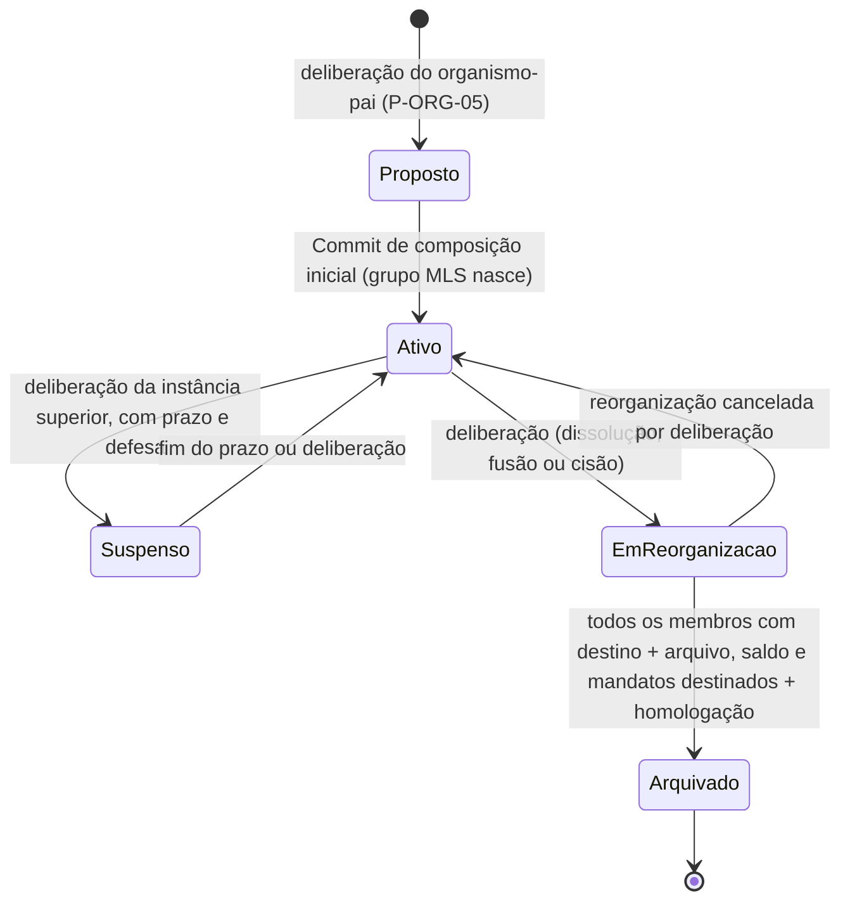

# 07/11 — Gestão orgânica: ciclo de vida, realocação, acessos e Balanço

| | |
|---|---|
| **Status** | rascunho de rota (síntese de 8 análises independentes; em validação adversarial) |
| **Última atualização** | 2026-08-12 |
| **Depende de** | [07 — Páginas (índice)](README.md), [02 — Domínio](../02-modelo-de-dominio.md), [03 — Cripto §4/§7](../03-arquitetura-criptografica.md), [05 — Financiamento §4–5](../05-financiamento.md), [06 — Ameaças](../06-modelo-de-ameacas.md), DEP-04, DEP-05, [revisao-critica-2 §1.9/§1.11/§2](../revisao-critica-2.md) |
| **Público** | todos ([conceitual]) com seções [técnico] |

> O pedido: fluxos de **criar e arquivar** organismos, hierarquia territorial (do comitê central à célula de bairro), **proposta de composição e realocação**, o secretário confiado para **resolver acessos perdidos e remover acessos mortos** — com justificativa que sobe, sem virar "processo de RH" — e um **dashboard de insights navegável** com terminologia leninista e estilo simples. A tese que organiza tudo: o pedido mistura, num mesmo gesto, **três planos que o desenho mantém separados** — o **político** (filiação: só deliberação toca, I11 intocada), o **orgânico** (composição: comitê propõe, **militante consente**, célula destino admite) e o **técnico** (chave/acesso: o secretário age sozinho, cercado de salvaguardas). **Perder as chaves não é ser expulso** — e nenhuma tela pode deixar essas duas coisas se parecerem.

---

## 1. Ciclo de vida do organismo

### 1.1 Estados e donos

O enum atual (`ativo/suspenso/dissolvido`, doc 02 §2.2) não tem dono para nenhuma transição (pendência registrada — revisao-critica-2 §2). Proposta: `proposto → ativo → suspenso → em_reorganizacao (modo: dissolucao|fusao|cisao) → arquivado`.

| Transição | Quem decide |
|---|---|
| criar | deliberação do pai (P-ORG-05 — já é assim: cerimônia que abre decisão, nunca botão) |
| suspender | instância superior, **com prazo máximo e defesa do organismo** (suspensão sem prazo seria dissolução disfarçada) |
| dissolver célula | **duas vias com contraditório**: autodissolução (a célula delibera com quórum qualificado + **homologação do pai**, que garante destino aos militantes) ou dissolução pelo pai (**com fase de defesa da célula**, espelhando P-DEL-10) |
| fusão / cisão | deliberação do comitê pai comum + aceite por deliberação de cada célula envolvida; cisão por estouro do teto (doc 06 §8.3) abre pendência automática, executada pelo mesmo rito |
| arquivar | **o sistema executa** quando I17 (§7.1) está satisfeita; homologação final é do pai — ninguém "arquiva no botão" |

**Congresso não muda:** nasce por P-MAN-06, encerra pelo `periodo` previsto na criação (caso DEP-07 segue fora daqui).

### 1.2 O que acontece com cada coisa no arquivamento

- **Membros — nenhum é "arquivado junto".** A resolução de dissolução contém o **plano de destino**: cada militante é realocado (§3, em lote — a resolução de dissolução **é** a proposta; o consentimento individual continua obrigatório) ou registra **saída voluntária** (emenda a I11, §7.1). A transição final **trava enquanto houver membro sem destino**.
- **Grupo MLS:** saídas por `Commit Remove` (I9/PCS); o último ato registra a época final e **desativa o verificador de credenciais** do organismo (o servidor rejeita envelopes novos). Material de transporte pode ser expurgado — a memória não vive nele.
- **Arquivo durável (P-ORG-08):** a memória **sobrevive ao organismo** — a resolução registra a transferência de custódia da chave de arquivo ao pai (ou ao sucessor). Acesso posterior: concessão por deliberação do custodiante; ex-membros não carregam acesso automático. Mecânica presa a DEP-12.
- **Mandatos:** os exercidos *no* organismo expiram com ele; os conferidos *pelo* organismo (mandante dissolvido) **encerram na resolução** (`data_fim_efetiva` = arquivamento), salvo transferência explícita de mandante registrada nela (fusão: o sucessor herda o papel de mandante de recall — nunca herança implícita, I4 exige mandante identificável).
- **Cotização e saldo:** prestação **final** coassinada (P-FIN-06), conferida acima (P-FIN-07); destino do saldo registrado na resolução (default de estatuto: sobe ao pai); vales não resgatados valem contra o sucessor pelo prazo do estatuto (`vale.portador`).

### 1.3 Fusão e cisão: mesma primitiva, proveniência própria

Sem verbo criptográfico novo: **transações nomeadas** de três primitivas (criar + realocar em lote + arquivar). O que justifica spec própria é a **sucessão**: `sucessor_de`/`cindido_de` no organismo novo, apontando as resoluções de origem — resolve custódia de arquivo, mandante de recall herdado, destino de saldo e a leitura na árvore ("Célula C, sucessora de A+B"). Fusão simétrica (cria C, A e B arquivam) ou absorção (B arquiva em A — quem chega **não lê o passado de A**: need-to-know padrão, desejável). Cisão: cria A′, realoca o subconjunto, A continua — quem parte perde o futuro de A (PCS) e leva só a memória que a resolução conceder via Arquivo.

## 2. Território: atributo, não subtipo

**`nivel` e `territorio` são atributos declarativos do organismo — não subtipos, não invariantes.** Nenhuma invariante depende do nível (o que muda entre níveis é política — quóruns, proporção de delegados — e política vive no `estatuto_local`); hardcodear `central/estadual/…/bairro` gravaria a geografia brasileira como universal (o erro "russo demais" que o doc 01 A.5 manda evitar) — o **estatuto da organização define a `escala_territorial`** (preset: `central > estadual > regional > municipal > bairro > base`) e cada organismo aponta um item. Regra de coerência declarativa (não dura): na criação, o nível do filho ≤ nível do pai — validação com aviso; comissões e frações fogem legitimamente da escala. **Segurança (A3): território é geografia — metadado agravado.** `nivel`/`territorio` são **cifrados no perfil do organismo** (visíveis a quem já vê o nó pela política de P-ORG-07), nunca cabeçalho: o servidor segue vendo topologia, não geografia (a string `estrutura.servidor` permanece verdadeira). Superfícies: P-ORG-07/P-NAV-02 agrupam a árvore pela escala; P-ORG-05 ganha os campos com validação.

## 3. Composição e realocação

No leninismo histórico o comitê **distribui as forças** (doc 01 A.2/A.7); no desenho atual a admissão é da célula (P-ORG-04). A **Realocação** une os dois sem quebrar nenhum: **o comitê propõe** (deliberação do menor comitê ancestral comum, com motivo e ata), **o militante consente** (ato assinado — sem consentimento não move; ver §8), **a célula B admite** (Commit Add), **a célula A executa a saída** (Commit Remove).

Entidade: `militante · celula_origem · celula_destino · motivo (mudanca_territorio | reforco_de_frente | fundacao_de_celula | divisao_por_teto | dissolucao_de_origem) · resolucao_de_origem · consentimento · estado (proposta → aceita → em_transferencia → concluida | recusada | expirada) · prazo`.

**A ordem que preserva I1 (exatamente 1 célula-base): Add antes de Remove, nunca o inverso.** Remove-primeiro cria a janela de 0 células e o órfão em falha parcial. A filiação (`celula_base`) muda **atomicamente no Add**; a sobreposição transitória é de **acesso** de leitura (janela curta e controlada — a pessoa coordena a mudança nos dois lados), não segunda filiação. Need-to-know já cobre os dois lados por época (não lê o passado de B; não lê o futuro de A — PCS): **nenhuma mecânica nova**. Falha segura: B não executa no prazo → `expirada`, nada mudou; A não executa o Remove → pendência visível escalada ao comitê (descumprimento é matéria política, ADR-0009), e o domínio já garante que novas deliberações de A não contam o realocado.

- **Censo (I12): sem emenda.** Deliberações abertas em A mantêm o caderno congelado; novas de A não o incluem; novas de B o incluem a partir do Add.
- **Mandatos da origem: encerram, nunca transferem** (o mandato representa aquela base eleitora — I3). `data_fim_efetiva` = conclusão, proveniência = a Realocação; papéis de buro caem no mesmo ato (P-ORG-03 já tem "papel vago → abrir eleição"); tesoureiro só conclui após prestação do período coassinada (A8).
- **Cotização:** a cota do período conta na célula-base da data de vencimento; sem pró-rata.
- **Proveniência tripla:** ata no comitê + evento nas duas células. **Custo declarado (DEP-05):** o registro cruza compartimentos ligando handle-em-A a handle-em-B — mesmo regime dos atestados (P-MAN-08); o identificador entra na matriz do ADR de identidade; até lá, o Painel de Exposição declara o residual.
- **Realocações de dissolução/cisão/fusão:** em lote, com a resolução da reorganização como `resolucao_de_origem` — mesma entidade.

## 4. Acessos: filiação × acesso (a parte mais delicada)

**Dois planos que o pedido do usuário funde e o domínio separa:**

- **FILIAÇÃO (político):** `estado` do membro (`ativo/afastado/desligado/censura`) — **só deliberação toca (I11), sem exceção nova.**
- **ACESSO (técnico):** novo sub-estado `acesso: ativo | suspenso_aguardando_recuperacao` + participação MLS + validade de chave. Chave perdida, aparelho morto, silêncio prolongado são eventos técnicos: mantê-los reféns de quórum não protege ninguém — uma chave possivelmente apreendida **continua lendo a célula** enquanto se agenda reunião (dano direto de A4).

### 4.1 Reconvite de recuperação

Camarada perdeu chave, backup e aparelho → o secretário emite **reconvite de recuperação**: um convite (mecânica P-ORG-10 → P-ORG-04) com campo `recupera_filiacao_de`, vinculando o registro **à filiação existente**. A pessoa volta como **a mesma militante** (mesma filiação, data de entrada, trajetória; handle-na-célula se desejado) com **par de chaves novo**. O que vale hoje: `user_id` novo é inevitável (deriva da chave); a continuidade é **de domínio**, atestada pelo vínculo assinado + Commit Add. Chaves novas não leem nada de antes (`recuperacao.historico` já cobre); mandatos/papéis **não regridem automaticamente** (chave nova não prova eleição antiga — a célula reconfirma por deliberação). O que espera ADR: P-ON-11 (recuperação social — o caminho **forte**, por quórum, que dará continuidade criptográfica; o reconvite é o caminho **rápido**, e coexistem), DEP-05 (qual identificador no vínculo), revogação da credencial anônima antiga (doc 03 §10).

### 4.2 Revogação de acesso morto

O secretário marca a chave como morta → **Commit Remove** (época avança, I9; PCS: quem detiver a chave antiga não lê mais — a mitigação que A4 pede). **A filiação NÃO muda**: o membro fica `ativo` no plano político e `suspenso_aguardando_recuperacao` no técnico — não é afastamento, não perde antiguidade, não é sanção (nenhum direito político foi restringido; restringiu-se o poder de uma **chave** que, por hipótese declarada, não está com a pessoa). **Censo:** sai do censo de **novas** deliberações só **após a janela de contestação** (default 14 dias, estatuto); deliberações abertas seguem I12 congeladas. (Sem a janela, o secretário manipula quórum; sem a saída, a célula acumula fantasmas e nunca mais atinge quórum.)

### 4.3 Salvaguardas contra o secretário infiltrado (A2) — spec, não cortesia

1. **Visibilidade estrutural:** o ato **é** um Commit (a época muda diante de todos, I9) e o evento no mural (P-ORG-02/09) carrega a **justificativa escrita** ("acesso perdido relatado pessoalmente", "sem sinal há 90 dias") + o alvo. Commit de remoção **sem** evento justificado é anomalia que o cliente alerta (família DEP-08).
2. **Notificação compulsória à instância superior:** toda revogação e todo reconvite geram **correspondência automática ao pai** (assinada: ato + justificativa + data) — caso novo na lista da DEP-04. Não é pedido de permissão; é trilha que chega **antes** de qualquer padrão se formar.
3. **Contestação de 1 toque:** o afetado (ao reaparecer) — ou **qualquer membro em nome dele** — contesta; abre deliberação na célula com o secretário respondendo (rito P-DEL-10) e apelação acima. Contestação pendente **trava** novas revogações do mesmo alvo pelo mesmo secretário.
4. **Alerta de série:** defaults de estatuto — **>2 revogações/trimestre, ou >20% da célula em 90 dias, ou 2ª revogação do mesmo alvo em 12 meses** → alerta automático à instância superior + selo visível na célula. Não bloqueia; expõe.
5. **Trava dura para detentores de poder:** revogação unipessoal **não se aplica a quem tem mandato ou papel em exercício** (senão o secretário "descredencia" o tesoureiro que ia denunciá-lo, A8, ou um delegado eleito) — para estes, só deliberação; em emergência declarada, coassinatura de um segundo papel do buro, nunca sozinho.
6. **Anti-reset:** revogar-e-reconvidar o mesmo alvo zera o histórico de leitura da pessoa (need-to-know) — o par de atos pelo mesmo secretário deixa marca visível permanente no registro do membro.
7. **A defesa final já existe:** secretário é eleito e revogável (I11, P-MAN-05) — e os itens 1–4 produzem exatamente a evidência para acionar isso.

### 4.4 Nunca parecer disciplina

Em **toda** superfície, nas três dimensões: **vocabulário** ("revogação/suspensão de acesso", "reconvite" — os termos "censura/afastamento/desligamento" ficam reservados a I11; usar um pelo outro é defeito de texto, regra da §11.1); **cor/ícone** (estado de acesso usa ícone de **chave** em tinta neutra — jamais o vermelho de sanção; ícones nunca se reutilizam entre as duas semânticas); **proveniência exibida** (sanção: "por resolução nº X"; acesso: "ato do secretário em DATA · justificativa · notificado ao [pai]" + caminho de contestação). String canônica nova (§7.4): `acesso.suspenso`.

## 5. Balanço: o dashboard que o produto comporta sem se trair

**Cinco regras citáveis:** **B1 — nenhuma consulta nova**: toda métrica deriva de documento E2E que o comitê **já recebe** (prestações P-FIN-06/07, informes P-JOR-06/07 via DEP-04, relatórios de mandato P-MAN-04, credenciamentos P-MAN-08, atas próprias), **calculada no aparelho** — é proibido alimentar o painel com metadado do servidor (epoch, roster, timing); **B2 — organismos, nunca pessoas**; **B3 — identidade só um nível abaixo** (need-to-know hierárquico); **B4 — apoio, não pódio** (fila por antiguidade de pendência; ranking recusado — a emulação socialista existiu e seu custo registrado foi inflar número e punir o último da fila; extraímos da tradição a forma, não cada prática); **B5 — declarado ≠ medido** (número auto-declarado é palavra política assinada, rotulada assim; só finanças têm conferência mecânica — vales ↔ agregado, A8).

### 5.1 Catálogo de métricas (fonte legítima linha a linha)

| Métrica (rótulo) | Termo (doc 01) | Fonte legítima | Decisão |
|---|---|---|---|
| Informes em dia | correspondência/informe (A.1/A.5/M10) | remetente + data das correspondências recebidas (nunca o corpo) | **MVP condicionado**: "previstos" exige **periodicidade de informes no estatuto** (emenda doc 02 §2.3); sem ela, só o fato ("último informe em 12/07") |
| Células em silêncio | idem | ausência de documento (o destinatário legítimo já sabe) | **MVP condicionado** (N do estatuto) — com a moldura obrigatória: silêncio pode ser sobrecarga **ou segurança** (`balanco.silencio`) |
| Cotização | cotização/prestação (A.12/M14) | prestação agregada coassinada + selo da conferência (P-FIN-06/07) | **MVP** — nada novo |
| Crescimento da base (proxy) | M6/M14 | nº de cotizações da prestação | **MVP**, com a distorção declarada (mede cotizantes, não filiação) |
| Crescimento pleno (efetivo, entradas−saídas) | o "censo partidário" | **não existe** — usar o roster violaria B1 | **Redesenho**: campo estruturado **opcional** no informe (`efetivo, admitidos, desligados` — números, sem nomes), adotado **por deliberação/ADR**, nunca default |
| Ritmo deliberativo dos filhos | A.4 | interno ao compartimento do filho — o pai não vê | **Recusada como coleta**; aceitável só auto-declarada no mesmo campo opcional |
| Execução de resoluções ("leu/executou") | — | recibo de leitura = rastreamento | **Recusada.** Substituto: referência opcional "em resposta à resolução R" declarada no informe |
| Mandatos e contas | A.4(3)/M9 | P-MAN-03 + relatórios recebidos (P-MAN-04) | **MVP** |
| Credenciamento | A.7/M13 | mandatos próprios + atestados (P-MAN-08; residual DEP-05) | **MVP** (quando há congresso) |
| Distribuição de forças | A.2/A.7/A.8 | árvore autorizada (P-ORG-07) + inferência documental (prestação coassinada chegou ⇒ tesoureiro+secretário em exercício) | **MVP** — como fato documental ("sem 2ª assinatura"), nunca juízo |
| Frentes ativas | A.10/M12 | acordos + estado do espelho (P-FED-01/03/04) | **MVP** (organismo custodiante) |
| Presença/horários/atividade individual, pessoa→valor, comparação nominal | — | sem fonte, por construção | **Recusada em qualquer hipótese** |

### 5.2 Agregação em cascata e drill-down

> Cada nível **recebe** dos filhos diretos, **confere** (P-FIN-07), **consolida** num documento **coassinado** e **sobe** ao pai com o **selo da conferência** ("recebi 12, conferi 12, 1 em apreciação"). Para cima sobem totais e contagens — nunca as parcelas nem os nomes dos netos. A identidade circula **um nível por vez**.

O central **não vê** a célula de bairro — nem o nome ("Estadual SP: 240 células declaradas, 91% de informes em dia"). Exceções tipadas já existentes: congresso (atestados) e limiar de congresso extraordinário. **Válvula de escalação:** discrepância que o nível não resolve sobe como **apreciação** (deliberação, com o mínimo necessário) — o superior passa a ver aquele caso por decisão com quórum, nunca por padrão. **Navegação:** o Balanço de um filho é **vista do compartimento do pai** (a espinha não muda — você não "entra" na célula; se for membro, há um segundo botão com a cor dela passando pelo seletor); o drill termina onde o dado consolidado para, e a tela diz ("quem confere célula a célula é o Comitê Oeste"); máximo 3 telas (Balanço → indicador → ficha do filho); **toda ação vira ato coletivo** — "pedir informe" compõe correspondência, "levar ao comitê" abre apreciação; não existe cobrança 1-para-1. **Simetria anti-vigilância:** a célula vê no P-ORG-01 dela o espelho exato do que o comitê vê dela ("Em dia com a instância superior") — prestação de contas nos dois sentidos. **Anatomia:** cartão = número grande + 1 linha de contexto + TrendChip ("↑ 6 pts · vs. tri anterior", tinta neutra — direção não é juízo) + toque = drill; período do estatuto; **idade do dado sempre visível** ("prestação de T3 · recebida há 12 dias" — o painel nunca finge tempo real: o pipeline é o próprio centralismo democrático); SparkBar (4–6 barras SVG inline, D7) só na ficha; zero configuração além do período; rótulos sem jargão de BI (a tela chama-se **Balanço**, o gesto, **conferir**).

### 5.3 Riscos e mitigações

**A3/A4 no aparelho do dirigente** (o Balanço concentra o mapa vivo): painel derivado e recomputável (nenhum arquivo novo), retenção recortada à janela do estatuto (histórico longo só no Arquivo, por deliberação), app-lock, modo discreto, `FLAG_SECURE` opcional, string `balanco.captura`. **Métrica falsa:** rótulo permanente "declarado — não medido"; cruzamentos visíveis (efetivo declarado × cotizações × delegados pela proporção) viram **apreciação deliberada**, nunca sanção automática (I11); números auto-declarados **nunca alimentam efeito mecânico** (quórum/proporção usam registros verificados). **Vigilância interna:** sem ranking, sem pessoas, toda ação coletiva e registrada, silêncio como sinal ambíguo, simetria, granularidade grossa. **Goodhart:** campos estruturados poucos/opcionais/por deliberação; o corpo livre continua sendo o informe; o software prepara a pauta da reunião — não a substitui. **Regressão "o servidor podia pré-agregar":** recusa registrada (violaria P2/I7 e consolidaria A3).

## 6. UX dos atos graves (padrões, DEP-condicionados)

A confirmação mais forte do sistema **já existe e não é modal: é o quórum** — as telas ou *abrem* deliberação ou *executam* resolução votada; `ConfirmDestructive` cobre só o degrau final. A justificativa obrigatória **é** o documento que sobe (o formulário já é a prestação de contas; a tela diz quem vai ler, antes do botão).

- **Encerrar célula** (executa resolução): **cerimônia** com os destinos ditos antes — militantes (trava enquanto houver alguém sem destino, com checklist que se marca), arquivo (custódia), caixa (coassinada) — e o degrau final "escreva o nome da célula" + "reversível até aqui; depois deste toque, não".
- **Propor realocação** (abre deliberação): formulário de 3 campos (quem · para onde · por quê, com "este texto vai para: a camarada, o buro daqui e a decisão no destino") + stepper com o **aceite do militante como estado de primeira classe** ("sem o aceite dela, nada anda; recusou: encerrada, sem registro contra ela").
- **Trancar acesso perdido** (ato do papel): 1 tela — situação + justificativa ("fica registrado nesta sala, à vista de todos") + "o que isto faz" (fechadura avança; o que ele já leu, já leu) + **"o que isto NÃO é"** (não é afastamento — isso é processo com quórum, defesa e recurso) + confirmação em dois toques.

## 7. Emendas propostas

### 7.1 Invariantes (numeração contínua a I14–I16 do [doc 10](10-conversas.md))

- **I17 — Ciclo de vida com destino.** Criação, suspensão e arquivamento de organismo são desfechos de deliberação registrada (criação e homologação pelo pai; dissolução de célula pela própria célula com homologação do pai, ou pelo pai com defesa da célula). Nenhum organismo passa a `arquivado` enquanto houver membro sem destino registrado, nem sem destinação registrada de arquivo durável, saldo e mandatos na resolução correspondente.
- **I18 — Acesso ≠ filiação.** Acesso criptográfico (validade de chave e participação em grupo MLS) é distinto de filiação política. O papel autorizado pelo estatuto pode, sem deliberação, suspender o acesso de uma chave declarada perdida/morta e emitir reconvite de recuperação vinculado à filiação existente — sempre com justificativa escrita, evento visível no organismo, notificação automática à instância superior e contestação de 1 toque que escala a deliberação; **nunca sobre detentor de mandato ou papel em exercício**. Suspensão de acesso jamais altera o `estado` político do membro.
- **Emenda a I1** (célula-base única, com transferência definida): a mudança de célula-base ocorre exclusivamente pela Realocação; o ponteiro de filiação atualiza atomicamente no `Commit Add` do destino; em nenhum estado observável o militante tem 0 ou 2 células-base; a sobreposição transitória de **acesso** entre Add e Remove é participação de transferência, não segunda filiação.
- **Emenda a I11** (dois acréscimos): (a) a **saída voluntária** por ato registrado do próprio militante não é sanção e não exige deliberação alheia — implica a mesma limpeza de filiações e mandatos, com avanço de época; (b) a suspensão/restauração de acesso técnico (I18) não altera o estado político nem restringe direito; qualquer efeito além do corte criptográfico de uma chave declarada perdida recai nesta invariante.
- *(Nível territorial não vira invariante — atributo + validação de estatuto, §2. I9/I12/I13 não precisam de emenda.)*

### 7.2 Páginas novas (área C; regime `⛔ ADR` — reserva de ID, spec final após as emendas)

| ID | Página | Regime |
|---|---|---|
| **P-ORG-13** | Ciclo de vida do organismo (propor dissolução/fusão/cisão; acompanhar `em_reorganizacao`; homologação; plano de destino) | ⛔ ADR (I17) |
| **P-ORG-14** | Realocações (vista do comitê: propor/acompanhar; vistas das células: pendências com proveniência) | ⛔ ADR (I1) |
| **P-ORG-15** | Consentimento de realocação (cerimônia pessoal: proposta, motivo, ata, aceitar/recusar com registro) | ⛔ ADR (I1) |
| **P-ORG-16** | Acessos da célula (revogar com justificativa; reconvite; série/limiares; notificações enviadas — **separada de P-ORG-10** para o vocabulário nunca se misturar com convite de entrada) | ⛔ ADR (I18) |
| **P-ORG-17** | Balanço do território (comitês/direção; cartões-síntese + fila de apoio + "nosso organismo" + consolidar-e-subir) | ✔ (condicionada a DEP-04) |
| **P-ORG-18** | Organismo subordinado (ficha documental: linha do tempo do que **ele nos enviou** contra as réguas do estatuto; ações coletivas) | ✔ (condicionada a DEP-04) |

*(P-ORG-11/12 são do [doc 10](10-conversas.md). A numeração resolve a colisão das análises independentes — quatro delas propuseram "P-ORG-11".)*

### 7.3 Impactos em P-IDs existentes e DEP

P-ORG-03 (badge "acesso suspenso" distinto do sancionado; marca anti-reset; contestar) · P-ORG-04 (admissão distingue entrada nova × reconvite × chegada por realocação) · P-ORG-05 (`nivel`/`territorio`; `sucessor_de` na criação por reorganização) · P-ORG-06 (estatuto: escala territorial, periodicidade de informes, prazos de realocação, janela de contestação, limiares de alerta, destino-padrão de saldo/arquivo, teto/prazo de pins do doc 10) · P-ORG-07/P-NAV-02 (árvore por nível/território; selos `em_reorganizacao`/`arquivado`; sucessão) · P-ORG-08 (custódia transferida — com DEP-12) · P-ORG-09/02 (eventos de época com **causa**: admissão, realocação, revogação justificada, sanção — distinções §4.4) · P-ORG-10 (tipo novo: reconvite de recuperação, contado à parte) · P-DEL-10 (contestação escalada; rito com organismo como sujeito) · P-MAN-03/05 (encerramento por realocação/dissolução do mandante) · P-ON-07/09/11 (estado "pendente de readmissão por recuperação"; P-ON-11 como caminho forte coexistente) · P-FIN-06/07 (prestação final; selo de conferência alimentando o Balanço) · P-ORG-01 da célula (bloco-espelho "Em dia com a instância superior") · P-SEG-06 (residuais DEP-05 declarados) · **DEP-04** (dois casos novos na lista enumerada: notificação compulsória de ato de acesso ao pai; proposta/consentimento de realocação).

### 7.4 GLOSSARIO e strings

**Verbetes:** Realocação · Reconvite de recuperação · Revogação de acesso · Suspensão de acesso · Nível territorial · Arquivamento (de organismo) · Sucessão (fusão/cisão) · Balanço · Distribuição de forças · Apreciação.

**Strings novas (§11.1):** `acesso.suspenso` ("A chave desta pessoa foi desativada — perda, roubo ou silêncio — e ela **continua militante**. Filiação só muda por deliberação, com defesa." / nunca prometer: que suspensão de acesso seja sanção) · `balanco.origem` ("Estes números nascem dos informes e prestações que este comitê **já recebe** — calculados **neste aparelho**. O servidor não vê nenhum deles." / "visão total"; tempo real; cálculo no servidor) · `balanco.escopo` ("Você vê os organismos que prestam contas a este comitê — um nível abaixo. Do resto, só números consolidados: é desenho." / drill até célula de outro nível) · `balanco.captura` ("Esta tela concentra o mapa do território deste mandato — uma foto dela o entrega de uma vez." / que agregar seja sem custo) · `balanco.declarado` ("Número declarado é palavra da célula, assinada — não medição. Só a prestação financeira tem conferência mecânica." / "o sistema detecta informe falso") · `balanco.silencio` ("Célula sem informe não é célula em falta: pode ser sobrecarga — pode ser **segurança**. O primeiro passo é contato, decidido pelo comitê." / que silêncio implique negligência; sanção automática) · `balanco.pessoas` ("Aqui não aparece pessoa alguma: nem nome, nem horário, nem quem pagou quanto — por desenho." / qualquer visão pessoa→dado).

## 8. Decisões em aberto (do usuário) e defaults cravados

**Para o usuário** (recomendações ★): (1) **Consentimento na realocação**: absoluto ★ (o sistema jamais move conta sem ato assinado; a recusa é registrada e o comitê, se entender indisciplina, abre P-DEL-10 — o polo centralista já existe pela ADR-0009, sem botão de mover gente) ou exceção por deliberação qualificada; (2) **Dissolução de célula**: duas vias com contraditório ★ (autodissolução + homologação / dissolução pelo pai + defesa) ou palavra final de um lado só; (3) **Censo do membro sem acesso**: sai de novas deliberações após a janela de contestação de 14 dias ★; confirmar janela e limiares de série (>2/trimestre, >20%/90d).

**Cravados:** três planos separados (filiação/composição/acesso); Add antes de Remove; mandatos não transferem; revogação nunca sobre detentor de mandato; notificação compulsória ao pai; anti-reset; vocabulário/cor/proveniência sempre distintos de disciplina; nível territorial como atributo cifrado; Balanço regido por B1–B5 (client-side, um nível, sem pessoas, sem ranking, declarado≠medido); idade do dado sempre visível; pré-agregação server-side recusada.

## Referências

[doc 02 §2.2–2.3](../02-modelo-de-dominio.md) · [doc 03 §4/§7/§10](../03-arquitetura-criptografica.md) · [doc 05 §4–5](../05-financiamento.md) · [doc 06 A2/A3/A4/A8/§8.3](../06-modelo-de-ameacas.md) · [doc 01 A.2/A.5/A.7/A.12](../01-fundamentos-leninistas.md) · [ADR-0009](../decisoes/adr-0009-disciplina-como-deliberacao.md) · [revisao-critica-2 §1.8/§1.9/§1.11/§2/§4/§6](../revisao-critica-2.md) · [07/02](02-navegacao-organismos.md) · [07/06](06-financas.md) · [07/10 — Conversas](10-conversas.md).
