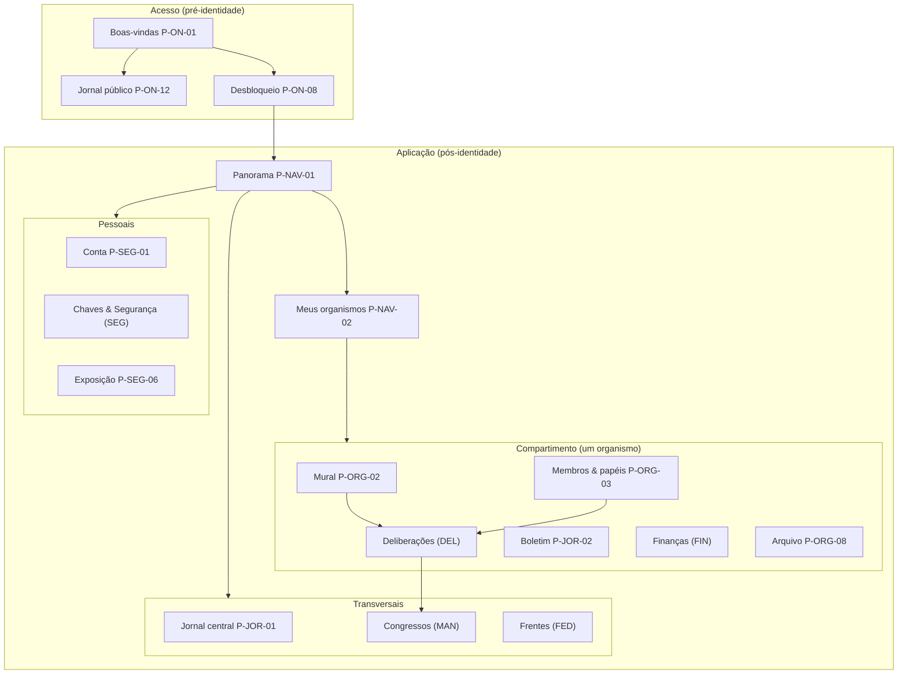

# 07 — Páginas e experiência do usuário

| | |
|---|---|
| **Status** | rascunho |
| **Última atualização** | 2026-08-11 |
| **Depende de** | [00 — Visão](../00-visao.md), [01 — Fundamentos](../01-fundamentos-leninistas.md), [02 — Modelo de domínio](../02-modelo-de-dominio.md), [03 — Arquitetura criptográfica](../03-arquitetura-criptografica.md), [04 — Federação](../04-federacao.md), [05 — Financiamento](../05-financiamento.md), [06 — Modelo de ameaças](../06-modelo-de-ameacas.md) |
| **Alimenta** | fase de implementação (UI/UX) |
| **Público** | todos ([conceitual]) + engenheiros/designers ([técnico]) |

> Este é o documento-índice da **camada de produto**: transforma o sistema desenhado nos docs 00–06 em **páginas concretas** que uma pessoa usa. O doc 00 §4 marcava explicitamente "Design de interface (UI/UX)" como **fora de escopo** da fase de desenho — esta pasta abre essa fase. Aqui está o **mapa**: visão de produto, personas, arquitetura de informação, o inventário completo de páginas e o roadmap. O **design system** está em [00-design-system.md](00-design-system.md); cada **área funcional** tem seu documento detalhando página a página.
>
> Convenção de leitura (herdada dos docs 00–06): seções **[conceitual]** são para militantes e dirigentes sem formação técnica; **[técnico]** são especificação para engenheiros e designers. Termos do projeto: [GLOSSARIO.md](../../GLOSSARIO.md).

---

## 1. O que este produto é — e o que ele recusa ser [conceitual]

Em uma frase de produto: **um aplicativo de organização — não de socialização — em que cada tela pertence a um compartimento (organismo), cada pessoa é um pseudônimo com uma chave, e a interface é honesta, o tempo todo, sobre o que protege e o que não protege.**

O sistema tem três documentos que fixam princípios (P1–P8, doc 00), invariantes (I1–I13, doc 02) e adversários (A1–A9, doc 06). A camada de produto **não pode contradizê-los** — ela os torna visíveis e operáveis. Os oito compromissos de produto abaixo são a tradução direta desses princípios para a experiência, e são citáveis como **UX1..UX8**:

- **UX1 — Navegação por compartimento, não por pessoa** (P1, P2, M5). A unidade de navegação é o **organismo** (célula, comissão, comitê, fração, congresso). Não há perfil público de indivíduo, feed global, seguidores nem métricas de engajamento (doc 00 §5). Você entra num compartimento e vê o que aquele compartimento vê — nada além.
- **UX2 — Pseudônimo por construção; a interface não correlaciona compartimentos** (P3). Duas camadas, ditas separadamente para não superprometer: **(garantia atual, de interface)** cada pessoa aparece por um **handle local ao organismo**, e a interface não oferece caminho para ligar "esta pessoa aqui" a "aquela ali" em outro organismo — nem exibe os handles do próprio usuário de modo que uma captura os vincule; sem foto de perfil; avatares são identicons derivados do handle. **(Propriedade pretendida, ainda não entregue)** não-vinculabilidade *criptográfica* perante o servidor — hoje o login usa um `user_id` global, o `pseudonimo` é único no servidor, o roster dos grupos MLS é visível ao serviço de entrega, e os **atestados de mandato cruzam compartimentos pelo pseudônimo**; a reconciliação (matriz de identificadores: o que aparece onde, para quem) é o **ADR de identidade — [DEP-05](#7-dependências-abertas-dep-técnico)**. Até lá, o painel de Exposição declara o residual.
- **UX3 — Poder é mandato, nunca privilégio de sistema** (I3, I6). Não existe "painel de administrador" nem superusuário. Uma capacidade aparece na tela **porque você detém um papel ou mandato** — e a tela sempre mostra a **fonte** desse poder (qual eleição, qual organismo) e seu **prazo**. Operar o servidor não dá poder nenhum na interface.
- **UX4 — Disciplina e vínculo são decisão registrada, não botão** (I8, I11, [ADR-0009](../decisoes/adr-0009-disciplina-como-deliberacao.md)). Não há botão "remover membro", "afastar" ou "publicar como decisão". Sanção e força vinculante são **desfecho de uma deliberação com quórum**; a interface conduz à deliberação, e o sistema apenas **executa** o que ela decidiu.
- **UX5 — Discussão precede o voto; a decisão desce; a conta sobe** (P4, P5). A máquina de estados da deliberação (discussão → emendas → votação → apuração → resolução) é um fluxo de primeira classe. O **jornal** é bidirecional: correspondência sobe da base, publicação assinada desce. A resolução vinculante aparece no feed dos organismos subordinados (dentro do `escopo_vinculacao`, I13).
- **UX6 — Honestidade embutida, não em letra miúda** (P8, doc 06 §5/§8). O que o sistema **não** protege é dito **no ponto de uso**, em linguagem clara: antes de um voto secreto ("isto não protege contra coação"), antes de uma contribuição ("neste regime, o modo anônimo é ilegal"), ao ver metadados expostos. Um painel dedicado de exposição ("o que este sistema não esconde") é sempre acessível.
- **UX7 — Segurança de rede é *fail-closed* e sempre visível** (doc 06 §8.2). O estado de anonimato de rede (Tor/onion) está permanentemente à vista. Sem canal anônimo confirmado, operações sensíveis — sobretudo depositar voto — são **recusadas** com aviso não-dispensável, nunca rebaixadas para clearnet em silêncio.
- **UX8 — Duas camadas de leitura: conceitual e técnica** (herdado dos docs). A superfície fala a língua do militante; o detalhe técnico (epoch, prova de credencial, fingerprint) está a um toque de distância, por divulgação progressiva — nunca imposto, nunca escondido.

**Não-objetivos de produto** (doc 00 §5), reafirmados porque moldam o que **não** desenhamos: sem feed global, sem perfis, sem seguidores, sem curtidas/visualizações, sem notificação por engajamento, sem gamificação, sem descoberta de pessoas, sem push que ligue pseudônimo a conta real (doc 06 §5/§9 — notificação é por *polling* sobre Tor, ver [SEG](08-conta-seguranca.md)).

## 2. Personas e tarefas [conceitual]

As personas **não são cargos fixos de pessoas** — são **papéis e mandatos** (I3) que a mesma pessoa acumula e perde no tempo. A interface é a mesma; o que muda é o que cada papel **habilita**.

| Persona (papel/mandato) | Quem é | Tarefas centrais | Páginas-chave |
|---|---|---|---|
| **Leitor público** | Externo, sem conta (simpatizante no MVP é leitor anônimo — doc 02 §2.1) | Ler o jornal público assinado | P-ON-12, P-JOR-03 |
| **Militante** | Membro de uma célula | Ler o mural, discutir, votar, pagar cotização, corresponder-se | ON, NAV, ORG, DEL, FIN |
| **Secretário** (buro) | Coordena a célula, mantém vínculo com a instância superior, emite convites | Convidar, conduzir admissão, coassinar prestação de contas, convocar reuniões | P-ORG-10, P-ORG-04, P-FIN-06, P-MAN-* |
| **Tesoureiro** (buro) | Coleta cotização, presta contas | Emitir/registrar voucher, fechar agregado, prestar contas | FIN (todo) |
| **Agitprop** (buro) | Distribui o jornal, produz boletim, organiza correspondência | Editar publicação, curar a fila editorial, encaminhar correspondência | JOR (todo) |
| **Delegado** (mandato) | Eleito para representar num organismo superior/congresso | Credenciar-se, deliberar no destino, prestar contas ao mandante | P-MAN-*, DEL |
| **Dirigente** (mandato no comitê/direção) | Eleito pela instância superior/congresso | Convocar congresso, emitir resolução vinculante (por deliberação), coordenar frentes | MAN, JOR, FED |
| **Escrutinador / mesa** (mandato eleitoral) | Detém *share* da urna / coassina emissão de credenciais | Constituir a mesa/urna (cerimônia DKG), operar apuração distribuída, publicar bulletin board | P-DEL-11, P-DEL-08 |

Nenhuma dessas personas é "admin". Cada capacidade extra é **mandato eleito, temporário e revogável** (UX3).

## 3. Arquitetura de informação e navegação [técnico]

### 3.1 O princípio estruturante: o compartimento

A árvore de organismos (doc 02 §1, I2) **é** a arquitetura de informação. Diferente de um app social (onde a raiz é "você" e seu feed), aqui a raiz da navegação é **o conjunto de compartimentos a que você pertence**. Você nunca "navega pela organização inteira" — navega pelos organismos de que é membro, mais as visões públicas/agregadas a que tem direito.

Três escopos de navegação, e nada os atravessa sem uma ação deliberada:

1. **Compartimento (organismo)** — o contexto dominante. Tudo dentro de uma tela pertence a **um** organismo: seu mural, suas deliberações, seus membros, seu boletim, suas finanças, seu arquivo.
2. **Transversais** — seções que agregam **apenas o que você tem direito de ver**: o Jornal central (publicações descidas), os Congressos em que você tem mandato, as Frentes que envolvem seus organismos.
3. **Pessoais** — Conta, Chaves & Segurança, e o painel de Exposição. Tudo local ao dispositivo e à sua identidade.

### 3.2 O shell da aplicação (chrome persistente)

Quatro elementos estão **sempre** presentes, em qualquer tela (detalhados no [design system](00-design-system.md) §6):

- **Seletor de compartimento** — mostra em qual organismo você está e permite a troca **deliberada** (UX1). A troca é um gesto explícito, com transição visual clara, porque cruzar compartimentos é a ação de segurança mais importante da navegação.
- **Barra de estado de rede/identidade** — o indicador *fail-closed* (UX7): anonimato de rede (Tor on/off), estado de bloqueio da chave (travada/destravada), e época corrente do organismo (rekey em andamento).
- **Acesso ao painel de Exposição** (UX6) — sempre a um toque: "o que este sistema não esconde, aqui e agora".
- **Avisos locais** — central de notificações **locais** (não push), alimentada por *polling* sobre Tor.

### 3.3 Mapa de navegação

Linha cheia = navegação direta. Os três blocos internos (compartimento, transversais, pessoais) são os escopos de §3.1. Repare que **não há** aresta que ligue um compartimento a outro sem passar pelo seletor (P-NAV-03) — a compartimentação é topológica, não só visual.

### 3.4 Regras de navegação que a interface impõe [técnico]

- **Sem vazamento de conteúdo entre compartimentos** (UX1, UX2). Nenhuma tela mistura **conteúdo** de dois organismos (mensagens, correspondência, texto de deliberação). **Exceção formal — superfícies agregadoras** (análoga à exceção I7 da publicação pública): as superfícies transversais e pessoais do §3.1 — Panorama (P-NAV-01), Meus organismos (P-NAV-02), Seletor (P-NAV-03), Avisos locais (P-NAV-05), Jornal central (P-JOR-01), Congressos, Frentes e a lista local de handles (P-SEG-01) — podem **enumerar** organismos e agregar **resumos acionáveis** (identidade do organismo, contagens, tipos, prazos e o título mínimo de uma pendência), **nunca** trecho de conteúdo de mural/correspondência nem handles de terceiros lado a lado. O custo assumido: uma captura dessas telas expõe o mapa de filiações *do próprio usuário* (risco A4-adjacente — mitigado por app-lock, retenção local e um modo discreto opcional). *Deep links* e buscas são **escopados** ao compartimento atual; não há busca global de pessoas nem de conteúdo cross-organismo.
- **Handles são locais ao organismo** (UX2, ADR-0008). O mesmo indivíduo tem handles distintos em organismos distintos; a UI não os correlaciona. Ver [design system §4](00-design-system.md).
- **Need-to-know por padrão** (doc 03 §7.2). Ao entrar num organismo, você **não** recebe o histórico anterior à sua admissão; o acesso ao [arquivo durável](02-navegacao-organismos.md) é concessão explícita por deliberação (P-ORG-08).
- **Capacidades seguem mandato** (UX3). Botões de ação (convidar, emitir voucher, abrir deliberação disciplinar) só existem na tela para quem detém o papel/mandato correspondente, e sempre com a proveniência à vista.

## 4. Inventário completo de páginas [técnico]

Cada página tem um **identificador citável** `P-AREA-NN` (o mesmo espírito de P#/I#/A#). **Legenda da coluna "MVP?"**: `✔` entra na primeira versão; `Fut.` evolução planejada (alinhada às decisões em aberto dos docs 03/06); `Fut.→MVP` fora do MVP, mas prioritária para entrar (doc 06 §8.6); `✔/Fut.` página no MVP com parte futura declarada; `✔ cond.` no MVP apenas sob condição declarada (ex.: regime financeiro); `⛔ ADR` página **bloqueada por decisão de arquitetura pendente** ([§7](#7-dependências-abertas-dep-técnico)) — consta do inventário para reservar o ID, sem spec final. A ordem dos IDs é histórica e **não** implica ordem de fluxo. Cada área tem um documento próprio com o detalhe página a página (layout, componentes, fluxos, microcopy, casos de borda).

### A. Acesso, identidade e onboarding — [`01-onboarding-identidade.md`](01-onboarding-identidade.md)

| ID | Página | Propósito | MVP? | Honra |
|---|---|---|---|---|
| P-ON-01 | Boas-vindas / primeira execução | Escolher: criar identidade, restaurar, ou ler jornal público | ✔ | P3 |
| P-ON-02 | Verificação de convite | Colar/ler código de convite; validação **cega** ao servidor | ✔ | doc 03 §4, A6 |
| P-ON-03 | Geração de identidade | Gerar seed no cliente; escolher pseudônimo; educar pseudonimato | ✔ | P3, doc 03 §3 |
| P-ON-04 | Cerimônia de backup mnemônico | Exibir/confirmar frase; guia de backup seguro | ✔ | doc 03 §3.2, doc 06 §8.6 |
| P-ON-05 | Definição de passphrase | Argon2id; medidor de entropia (diceware); âncora em keystore de hardware | ✔ | doc 03 §2/§3.2 |
| P-ON-06 | Configuração de rede/anonimato | Tor/onion; *fail-closed*; *bridges* | ✔ | doc 06 §8.2, UX7 |
| P-ON-07 | Pendente de admissão | Estado de espera até a célula admitir (Commit `Add`) | ✔ | doc 03 §4, §7.2 |
| P-ON-08 | Desbloqueio / login | Destravar a seed local; desafio-resposta por assinatura | ✔ | doc 03 §5 |
| P-ON-09 | Restauração por frase | Recriar identidade em novo dispositivo | ✔ | doc 03 §3.3 |
| P-ON-10 | Emparelhamento de dispositivo | Transferir seed via QR entre dispositivos do próprio usuário | ✔ | doc 03 §3.3 |
| P-ON-11 | Recuperação social | Re-atestação por quórum da célula | Fut.→MVP | doc 06 §8.6, doc 03 §10 |
| P-ON-12 | Leitor do jornal público | Ler publicações de escopo `publico` **sem conta** | ✔ | I7, doc 02 §2.1 |
| P-ON-13 | Fundação da organização | Cerimônia de gênese: chave da organização, estatuto inicial, célula fundadora | ⛔ ADR | DEP-06, I3/I6 |

### B. Panorama e navegação — [`02-navegacao-organismos.md`](02-navegacao-organismos.md)

| ID | Página | Propósito | MVP? | Honra |
|---|---|---|---|---|
| P-NAV-01 | Panorama | Agregado **só do que você tem direito**: seus organismos + jornal descido. Não é feed social | ✔ | UX1 |
| P-NAV-02 | Meus organismos | Lista/árvore dos compartimentos a que pertenço | ✔ | I1, I2 |
| P-NAV-03 | Seletor de compartimento | Troca **deliberada** de organismo | ✔ | UX1 |
| P-NAV-04 | Busca escopada | Buscar dentro do compartimento atual; sem busca global de pessoas | ✔ | UX1, UX2 |
| P-NAV-05 | Avisos locais | Notificações locais por *polling*; nunca push | ✔ | doc 06 §5/§9 |

### C. Organismo — [`02-navegacao-organismos.md`](02-navegacao-organismos.md)

| ID | Página | Propósito | MVP? | Honra |
|---|---|---|---|---|
| P-ORG-01 | Visão geral do organismo | Mural + atalhos para deliberações, membros, finanças, boletim | ✔ | doc 02 §2.2 |
| P-ORG-02 | Mural / feed do organismo | Mensageria corrente (MLS); autoria por handle **interno** | ✔ | doc 03 §6/§7 |
| P-ORG-03 | Membros & papéis | Buro; papel atribuído **por deliberação**; proveniência do mandato | ✔ | UX3, I11 |
| P-ORG-04 | Admissão de membro | Efetivar entrada (Commit `Add`; em lote) | ✔ | doc 03 §4/§7.2, I9 |
| P-ORG-05 | Criar organismo | Célula/comissão/fração; herança de estatuto; posição na árvore | ✔ | I1, I2 |
| P-ORG-06 | Configuração do organismo | Estatuto local (quórum, maioria, tamanho); escopos | ✔ | doc 02 §2.3 |
| P-ORG-07 | Árvore da organização | O que você pode ver da estrutura (sem vazar filiação alheia) | ✔ | I2, A3 |
| P-ORG-08 | Arquivo durável | Memória (atas, resoluções); acesso concedido por deliberação | ✔ | doc 03 §7.3 |
| P-ORG-09 | Estado de época / rekey | Feedback quando a composição muda (Commit, PCS) | ✔ | I9, doc 03 §7 |
| P-ORG-10 | Convites do organismo | Emitir/revogar/expirar convites conforme a política do estatuto; log **dentro do compartimento** | ✔ | doc 03 §4, A6, DEP-03 |

### D. Deliberação e voto — [`03-deliberacao-voto.md`](03-deliberacao-voto.md)

| ID | Página | Propósito | MVP? | Honra |
|---|---|---|---|---|
| P-DEL-01 | Lista de deliberações | Por estado (discussão, votação, apuração, resolvida, arquivada) | ✔ | doc 02 §4.1 |
| P-DEL-02 | Nova proposta | Tipo, modo de voto, quórum/maioria herdados do estatuto | ✔ | doc 02 §2.5, I8 |
| P-DEL-03 | Fase Discussão | Debate; **agrupamento de tendências/plataformas** | ✔ | P4, doc 01 C.1 |
| P-DEL-04 | Fase Emendas | Apresentar/versionar emendas; novo turno | ✔ | doc 02 §4.1 |
| P-DEL-05 | Votação aberta (commit-reveal) | Voto nominal simultâneo; não-reveal = abstenção | ✔ | doc 03 §8.1 |
| P-DEL-06 | Voto secreto — preparo da cédula | Blinding; **gate fail-closed** | ✔ | doc 03 §8.2, UX7 |
| P-DEL-07 | Voto secreto — depósito na urna | Depositar via Tor, após atraso/mistura | ✔ | doc 03 §8.2 |
| P-DEL-08 | Apuração & bulletin board | Nº de credenciais vs. censo congelado; decifração limiar | ✔ | I5, I12, A9 |
| P-DEL-09 | Resolução (ata) | Ata assinada, imutável; encadeamento `substitui` | ✔ | I10, doc 02 §2.6 |
| P-DEL-10 | Deliberação disciplinar | Censura/afastamento/desligamento **por quórum**, com devido processo | ✔ | I11, ADR-0009 |
| P-DEL-11 | Constituição da mesa e da urna | Eleger mesa/escrutinadores; cerimônia DKG/VSS; estados de falha | ✔ | A9, doc 03 §8.2, DEP-09 |

### E. Mandatos, eleições e congresso — [`04-mandatos-congresso.md`](04-mandatos-congresso.md)

| ID | Página | Propósito | MVP? | Honra |
|---|---|---|---|---|
| P-MAN-01 | Eleição de delegado | Deliberação `eleicao` que produz mandato | ✔ | I3, doc 02 §2.7 |
| P-MAN-02 | Meus mandatos | Mandatos que exerço (prazo, prestação de contas) | ✔ | I4 |
| P-MAN-03 | Mandatos do organismo | Quem nos representa; prazo; recall | ✔ | I4, I6 |
| P-MAN-04 | Prestação de contas | Relatórios vinculados ao mandato | ✔ | P4, doc 02 §2.7 |
| P-MAN-05 | Recall / revogação | Deliberação do mandante que revoga | ✔ | I4 |
| P-MAN-06 | Convocação de congresso | Ordinário (direção) e **extraordinário** (limiar de células — recall do CC) | ✔ | doc 02 §2.7 (recall de congresso) |
| P-MAN-07 | Painel do congresso | Pauta, credenciamento, deliberações | ✔ | doc 02 §6, M13 |
| P-MAN-08 | Credenciamento de delegados | Em **lote** (um Commit); atestado assinado sem expor a célula | ✔ | I9, doc 02 §6 |
| P-MAN-09 | Votação nominal em congresso | Registro de quem votou o quê (tradição) | ✔ | doc 03 §8.1 |

### F. Jornal, publicações e correspondência — [`05-jornal-publicacoes.md`](05-jornal-publicacoes.md)

| ID | Página | Propósito | MVP? | Honra |
|---|---|---|---|---|
| P-JOR-01 | Jornal central | Visão das publicações da redação (descem) | ✔ | P5, M2 |
| P-JOR-02 | Boletim do organismo | Publicações do próprio organismo | ✔ | doc 02 §2.4 |
| P-JOR-03 | Leitor de publicação | Ler com escopo e **assinatura verificável** do órgão editor | ✔ | I7, doc 02 §2.4 |
| P-JOR-04 | Editor de publicação | Rascunho→aprovada→publicada→arquivada; assinatura do órgão | ✔ | doc 02 §4.2 |
| P-JOR-05 | Fila editorial | Aprovação pela redação | ✔ | doc 02 §4.2 |
| P-JOR-06 | Correspondência — compositor | Informe que **sobe** da base | ✔ | P4, M10 |
| P-JOR-07 | Correspondência — caixa da redação | Informes recebidos, para curadoria | ✔ | M2, M10 |

### G. Finanças e cotização — [`06-financas.md`](06-financas.md)

| ID | Página | Propósito | MVP? | Honra |
|---|---|---|---|---|
| P-FIN-01 | Painel de finanças | Agregados por organismo; **nunca** pessoa→valor | ✔ | doc 05 §3/§4 |
| P-FIN-02 | Minha cotização | Estado do período; pagar | ✔ | M14 |
| P-FIN-03 | Pagamento transparente (PIX) | Modo **default** para partido registrado | ✔ | doc 05 §2/§4 |
| P-FIN-04 | Emissão de voucher | Tesoureiro; série por época; log append-only | ✔ (só fora do regime de partido) | doc 05 §5, A8 |
| P-FIN-05 | Resgate de voucher | Membro marca cota paga | ✔ | doc 05 §5 |
| P-FIN-06 | Prestação de contas | Agregado **coassinado** tesoureiro+secretário; sobe como correspondência | ✔ | doc 05 §4, A8 |
| P-FIN-07 | Conferência | Instância superior confere nº de vouchers ↔ agregado | ✔ | doc 05 §5, A8 |
| P-FIN-08 | Regime financeiro | Declara enquadramento; **bloqueia o modo anônimo** se partido registrado | ✔ | doc 05 §2 |

### H. Federação e frentes — [`07-federacao-frentes.md`](07-federacao-frentes.md)

| ID | Página | Propósito | MVP? | Honra |
|---|---|---|---|---|
| P-FED-01 | Frentes | Lista e estado das frentes | ✔ | doc 04 §3 |
| P-FED-02 | Propor frente | Escopo, prazo, nível (1–3; MVP 1–2) | ✔ | doc 04 §5 |
| P-FED-03 | Acordo da frente | Coassinatura pela **chave da organização**; verificação de fingerprint fora da banda | ✔ | doc 04 §2/§3, A5 |
| P-FED-04 | Painel da frente | Jornal da frente + comitê da frente | ✔ | doc 04 §3/§4 |
| P-FED-05 | Delegados externos | Atestados de delegado credenciado; sem expor a base | ✔ | doc 04 §4 |
| P-FED-06 | Identidade federativa | `.well-known`; rotação de chave da organização | ✔ | doc 04 §2 |

### I. Conta, chaves e segurança — [`08-conta-seguranca.md`](08-conta-seguranca.md)

| ID | Página | Propósito | MVP? | Honra |
|---|---|---|---|---|
| P-SEG-01 | Conta & pseudônimo | Pseudônimo mutável; handles por-organismo | ✔ | P3, ADR-0008 |
| P-SEG-02 | Chaves & rotação | Rotacionar chave de cifra; versão monotônica; revogação | ✔ | doc 03 §3.1 |
| P-SEG-03 | Dispositivos | Multi-dispositivo; sub-chaves revogáveis (Fut.) | ✔/Fut. | doc 03 §3.3 |
| P-SEG-04 | Segurança de rede | Tor/*fail-closed*; retenção local de histórico | ✔ | doc 06 §8.2 |
| P-SEG-05 | Verificação do cliente | Build reprodutível / binary transparency (A7) | ✔ | doc 06 A7 |
| P-SEG-06 | Exposição ("o que não protege") | Painel de honestidade contextual | ✔ | doc 06 §5, UX6 |
| P-SEG-07 | Coação / negação plausível | Passphrase de coação | Fut. | doc 06 §8, doc 03 §10 |
| P-SEG-08 | Verificação de chaves de terceiros | Key transparency (CONIKS) | Fut. | doc 03 §3.1, A5 |

### J. Ajuda e aprendizado — [`09-ajuda-aprendizado.md`](09-ajuda-aprendizado.md)

| ID | Página | Propósito | MVP? | Honra |
|---|---|---|---|---|
| P-AJU-01 | Primeiros passos | Checklist de integração acionável, embutida no Panorama; some quando cumprida | ✔ | §11, UX1 |
| P-AJU-02 | Cartilha | Índice de lições curtas sobre **por que** o sistema é assim | ✔ | UX6, D7 |
| P-AJU-03 | Lição | Leitor de um conceito por vez, com callout "o que isto não faz" obrigatório | ✔ | UX6, doc 06 §5 |
| P-AJU-04 | Ensaio de votação | Praticar o voto secreto **sem cédula real, sem rede, nada vale** (6 proibições) | ✔ | doc 03 §8, UX7 |
| P-AJU-05 | Glossário / termo sob toque | Explicar jargão no ponto de uso; fonte única = GLOSSARIO | ✔ | GLOSSARIO, D7 |
| P-AJU-06 | Modo de aprendizado | Recém-chegada × veterana: ajusta verbosidade dos avisos, nunca a proteção | ✔ | §11, UX6 |

**Total:** 10 áreas, **83 páginas** — 79 no MVP, 3 futuras (P-ON-11, P-SEG-07, P-SEG-08) e 1 bloqueada por ADR (P-ON-13). O detalhe de cada uma vive no documento da área. A área **J (aprendizado)** é resposta direta à auditoria de usabilidade: a plataforma é para todo mundo, e a curva de entrada não pode ser um muro — sem que ensinar vire teatro de segurança (UX6).

## 5. Modelo de especificação de cada página [técnico]

Para uniformidade, cada página nos documentos de área é descrita pelo mesmo gabarito:

1. **Identificador e nome** (`P-AREA-NN`).
2. **Objetivo** — o *job* que a pessoa realiza aqui (uma frase).
3. **Quem chega aqui** — persona/mandato e por qual caminho.
4. **Funcionalidades** — o que a página faz, em lista.
5. **Dinâmica** — o fluxo passo a passo (com diagrama quando há máquina de estados).
6. **Experiência e layout** — descrição do arranjo, componentes do design system usados, microcopy-chave.
7. **Estados** — vazio, carregando, offline, *fail-closed*, pendente, rekey, erro, revogado.
8. **Restrições que honra** — os P#/I#/A#/UX# que a página não pode violar (e o que **não** deve mostrar).
9. **Decisões em aberto** — o que depende de um item ainda não resolvido nos docs 02/03/06, citando o identificador **[DEP-nn]** do registro canônico (§7) em vez de prosa livre.

## 6. Roadmap: o que é MVP [conceitual]

O MVP entrega o **ciclo operacional de uma organização já fundada**: entrar (ON), pertencer a uma célula e ler seu mural (ORG), deliberar e votar (DEL), eleger e revogar delegados (MAN), publicar e corresponder-se (JOR), cotizar e prestar contas (FIN), e — no **nível 1** — formar frentes (FED), tudo sobre a base de segurança de ON/SEG. Duas honestidades de escopo: (a) a **fundação** da organização (dia zero) está bloqueada pelo ADR de gênese (P-ON-13, DEP-06) — o ciclo "completo" começa numa organização existente; (b) a **frente nível 2** (organismo conjunto vinculante) sai do MVP por decisão registrada da revisão ([revisao-critica.md](../revisao-critica.md) §3, achado 12): depende de prova de completude do espelho e revogação tempestiva de credencial, ambas em aberto (doc 04 §8). Nota assumida: um MVP de ~73 páginas **não é mínimo** — a estratificação interna (o que é o primeiro ciclo de verdade) é decisão de fase de implementação, registrada em [revisao-critica-2.md](../revisao-critica-2.md). Ficam para depois do MVP, alinhados aos docs de origem:

- **Recuperação social** (P-ON-11) — trazida para perto do MVP (doc 06 §8.6), mas depende do protocolo de re-atestação.
- **Verificabilidade E2E do voto** (evolução de P-DEL-08) — Helios/Belenios (doc 03 §8.3).
- **Sub-chaves por dispositivo e passphrase de coação** (P-SEG-03/P-SEG-07) — doc 03 §3.3/§10.
- **Key transparency** de terceiros (P-SEG-08) — doc 03 §3.1.
- **Frente nível 2** (organismo conjunto vinculante) — condicionada a espelho com prova de completude + revogação de credencial (revisao-critica §3, achado 12); **nível 3** — doc 04 §5/§8.

## 7. Dependências abertas (DEP) [técnico]

Registro **canônico** das decisões de arquitetura ainda em aberto que afetam a UI — a união dos campos "Decisões em aberto" das áreas, com identificador citável `DEP-nn`. A camada de produto desenha o **resultado** acordado e marca a **mecânica** como dependente — não inventa o que o desenho ainda não fixou. No protótipo, cada dependência vira um selo `OpenDependencyTag` ("DESENHO EM ABERTO · DEP-nn") com visual **fora** da linguagem de confiança (contorno tracejado neutro; nunca as cores/ícones do design system §2), tocável para a folha "fixo / pode mudar / onde se decide". O selo não existe no build final. O detalhe de cada decisão vive em [revisao-critica-2.md](../revisao-critica-2.md).

| DEP | Decisão pendente | O que está **fixo** (a tela desenha) | O que **pode mudar** | Páginas afetadas |
|---|---|---|---|---|
| **DEP-01** | Propagação descendente de resoluções (relay; doc 02 §2.6, revisao-critica §2-A) | a ata desce e aparece no feed dos vinculados | mecânica de reembalagem/relay, latência, estados | P-DEL-09, P-ORG-02, P-NAV-01, P-JOR-01 (`interno_organizacao`) |
| **DEP-02** | Assinatura do organismo (esquema coletivo, ex.: FROST RFC 9591) | existe cerimônia de coassinatura, agnóstica ao esquema | esquema, número de cossignatários, UX da coleta | P-DEL-09, P-JOR-04, P-FED-03/06 |
| **DEP-03** | Convite cegado (doc 03 §4) | convite existe, com emissão/validade/revogação | validação cega vs. nominal; metadado residual exposto | P-ON-02, P-ORG-10, P-SEG-06 |
| **DEP-04** | **Mensageria entre organismos** (ascendente + variante cross-servidor; ADR a escrever) | compositor/caixas existem; "quem lê" declarado por chip honesto | mecanismo (chave caixa-postal etc.); escopo mínimo: correspondência, prestação de contas de mandato e financeira, limiar do congresso extraordinário entre células, recuperação social, atestados, escrita de delegado externo na sede | P-JOR-06/07, P-MAN-04/06/08, P-FIN-06/07, P-ON-11, P-FED-04 |
| **DEP-05** | **ADR de identidade** (matriz de identificadores: `user_id` global × pseudônimo único × handles por-organismo × roster do MLS-DS; atestados que cruzam compartimentos) | a interface não correlaciona (garantia atual); handles locais na exibição | não-vinculabilidade criptográfica; onde aparece pseudônimo vs. handle; normalização/unicidade (NFKC, confusables — norma no domínio) | P-ON-03/08, P-SEG-01/06, P-MAN-08, P-FED-05, DS §4 |
| **DEP-06** | **ADR de gênese** (fundação: chave da org, estatuto inicial, célula fundadora, papéis provisórios com prazo — exceção desenhada de I3/I6) | o produto só cobre organização já fundada | cerimônia de fundação, salvaguardas (nº mínimo de fundadores, convite-gênese, limites do estado provisório) | P-ON-01, **P-ON-13 (bloqueada)**, P-FED-06 |
| **DEP-07** | **Congresso × I13** (árvore ORG→Congresso→CC, fiel ao doc 01 A.7, ou exceção tipada; frente = readoção interna; emendas I13/I4) | resoluções do congresso obrigam a organização; resoluções de frente vinculam por readoção de cada organização | forma da emenda; caso do pai dissolvido | P-MAN-07, P-DEL-09, P-FED-04 |
| **DEP-08** | **Envelope: transcrição × autoria anônima** (contador "por remetente" em claro contradiz a `prova_membro`; ambiguidade interna do doc 03 §6.1 a resolver — cadeia por-feed/log assinado) | o cliente detecta adulteração do feed e alerta | o que exatamente é detectável, e quando; enumeração do metadado exposto | P-ORG-02 (mural), MetadataDisclosure/ExposurePanel |
| **DEP-09** | Voto: esquema de emissão k-de-n (coassinatura cega — ex.: k assinaturas RFC 9474 independentes, conjunto de signatários uniforme por eleição) + bibliotecas DKG/VSS + parâmetros de mistura | fluxo do eleitor (cegar → credencial → depositar via Tor) e da mesa | esquema exato, estados "coletando k de n", números do bulletin board | P-DEL-06/07/08/11 |
| **DEP-10** | **Lista canônica de operações fail-closed** (pertence ao doc 06 emendado; 3 classes: voto = recusa inegociável; operações de membro = recusa por padrão com *bridges*; leitura pública = permitida com aviso) | fail-closed existe e o voto nunca degrada | fronteiras exatas das classes; existência de modo degradado por operação | P-ON-06, P-SEG-04, DS §7 (FailClosedBlocker), todas as páginas com ação sensível |
| **DEP-11** | Key transparency (log de chaves estilo CONIKS) | rotação de chave com versão monotônica local | detecção plena de rollback (MVP: só monotonicidade local) | P-SEG-02, P-SEG-08 |
| **DEP-12** | Arquivo durável sobre MLS (doc 03 §7.3) | superfície de arquivo com acesso por deliberação | camada de chave de arquivo, rotação, concessão | P-ORG-08 |

## 8. Plano de prototipagem [conceitual]

Com o pacote de correções aplicado, a prototipagem pode começar. Ordem proposta (critério: valor político do produto × risco de UX inédito × cobertura dos componentes-assinatura):

**12 telas prioritárias:** 1. Panorama (P-NAV-01 — testa a exceção de agregadores); 2. Mural (P-ORG-02); 3. Seletor + transição de espinha (P-NAV-03 — o gesto de segurança central; se for penoso, o conceito falha); 4. Onboarding completo (P-ON-02→07, na ordem passphrase→backup); 5. Emissão de convite (P-ORG-10); 6. Discussão com tendências (P-DEL-03 — componente sem precedente); 7. Cerimônia de voto secreto (P-DEL-06+07, com queda de Tor simulada); 8. Apuração/bulletin board (P-DEL-08); 9. Resolução + descida no mural do filho (P-DEL-09); 10. Membros & papéis (P-ORG-03); 11. Painel de Exposição (P-SEG-06, geral + contextual); 12. Cotização + voucher (P-FIN-02+05).

**4 fluxos ponta a ponta:** F1 Entrada (emissão do convite → onboarding → admissão → panorama vazio com need-to-know); F2 Ciclo de decisão (proposta → discussão/tendências → emendas → voto secreto **com queda de Tor no meio** → apuração → resolução → mural do filho); F3 Jornal bidirecional (correspondência sobe → caixa → vira matéria → aprovação → leitura interna e pública); F4 Poder e contas (eleição → mandatos → prestação → recall).

**Lacunas do design system para alta fidelidade** (registradas em [00-design-system.md §12](00-design-system.md)): tema claro com valores, estados interativos/focus ring, breakpoints e larguras, anatomia dos ~10 componentes-chave, medidas da espinha — a fixar na primeira semana de prototipagem.

**Protótipo (ciclos 1–4): [/prototipo/index.html](../../prototipo/index.html)** — bancada clicável autocontida cobrindo as telas acima, com o fail-closed demonstrável (queda de Tor no meio do voto), os selos `DEP-nn` tocáveis e as decisões de primeira semana declaradas ([/prototipo/README.md](../../prototipo/README.md)). O **ciclo 3** aplica a auditoria multi-agente de usabilidade/acessibilidade: dados isolados por compartimento, tradução de jargão ("época" → "fechadura"), cota com valor e "como pagar", a camada de aprendizado da **área J** (Primeiros passos, Cartilha, Ensaio de votação, termo sob toque) e acessibilidade WCAG 2.2 AA (foco, `aria-live`, Esc, alvos de 44 px). O **ciclo 4** fecha a cobertura: emendas com versão de texto (P-DEL-04), regime financeiro × PIX identificado (P-FIN-03/08, com a Exposição ramificando por regime), minhas salas + árvore da organização (P-NAV-02/P-ORG-07) e o acesso — destravar, recuperar pela chave-mestra, emparelhar aparelho (P-ON-08/09/10); as strings de honestidade passam a citar a **tabela única** ([design system §11.1](00-design-system.md)).

## 9. Referências

- Princípios e invariantes: [doc 00](../00-visao.md), [doc 02](../02-modelo-de-dominio.md).
- Restrições de segurança/UX: [doc 03](../03-arquitetura-criptografica.md), [doc 06](../06-modelo-de-ameacas.md).
- [Design system](00-design-system.md) — tokens, componentes e estados usados por todas as páginas.
- Documentos de área (A–J) listados na §4.
